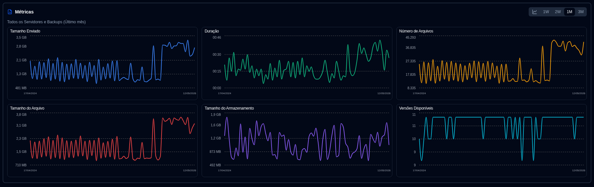

# Métricas de Backup {#backup-metrics}

Um gráfico de métricas de backup ao longo do tempo é mostrado tanto no Painel (visualização de tabela) quanto na página de Detalhes do Servidor.

- **Painel**, o gráfico mostra o número total de backups registrados no banco de dados **duplistatus**. Se você usar o layout de Cards, pode selecionar um servidor para ver suas métricas consolidadas (quando o painel lateral está exibindo métricas).
- **Página de Detalhes do Servidor**, o gráfico mostra métricas para o servidor selecionado (para todos os seus backups) ou para um backup específico individual.

## Controles Inline do Gráfico {#inline-chart-controls}

Controles de acesso rápido estão disponíveis diretamente nos cabeçalhos do painel de gráficos para configuração fácil sem navegar para Configurações de Exibição:

### Seletor de Intervalo de Tempo {#time-range-selector}

Botões em pílula aparecem no cabeçalho do gráfico para seleção rápida de intervalo de tempo: **1S | 2S | 1M | 3M**

- **1S**: Últimos 7 dias (janela móvel)
- **2S**: Últimos 14 dias (janela móvel)
- **1M**: Últimos 30 dias (janela móvel, padrão)
- **3M**: Últimos 90 dias (janela móvel)

Alterações feitas aqui são sincronizadas com suas Configurações de Exibição, para que sua preferência seja lembrada entre atualizações de página.

### Alternador de Estilo do Gráfico {#chart-style-toggle}

Um botão de alternância no cabeçalho do gráfico permite alternar entre:

- **Linhas suaves**: Exibir pontos de dados conectados com curvas suaves
- **Gráfico de Barras**: Exibir dados como barras discretas para cada período de tempo

Ambos os modos usam agregação por intervalos de tempo para exibição ideal. Períodos vazios no modo de barras não renderizam barra. Sua preferência persiste entre atualizações de página e é sincronizada com Configurações de Exibição.

## Consolidação de Dados do Gráfico {#chart-data-consolidation}

Quando múltiplos backups ocorrem no mesmo dia, **duplistatus** consolida os dados antes de exibi-los nos gráficos:

- **SUM**: Usado para métricas cumulativas (Duração, Número de Arquivos, Tamanho do Arquivo, Tamanho Enviado)
- **LAST**: Usado para Tamanho do Armazenamento (o valor mais recente do dia)
- **MAX**: Usado para Versões Disponíveis (a contagem mais alta do dia)

Essa consolidação acontece antes da aplicação de agrupamento por tempo, garantindo métricas agregadas precisas. Por exemplo, dois backups em 5/12/26 produzirão um único ponto de dados consolidado no gráfico.

## Definições de Métricas {#metric-definitions}

- **Tamanho Enviado**: Quantidade total de dados enviados/transmitidos durante os backups do servidor Duplicati para o destino (armazenamento local, FTP, provedor de nuvem, ...) por dia.
- **Duração**: Duração total de todos os backups recebidos por dia no formato HH:MM.
- **Contagem de Arquivos**: Soma do contador de quantidade de arquivos recebido para todos os backups por dia.
- **Tamanho do Arquivo**: Soma do tamanho do arquivo informado pelo servidor Duplicati para todos os backups recebidos por dia.
- **Tamanho do Armazenamento**: Soma do espaço de armazenamento utilizado no destino de backup informado pelo servidor Duplicati por dia.
- **Versões Disponíveis**: Soma de todas as versões disponíveis para todos os backups por dia.

:::note
Você pode usar o controle [Configurações de exibição](settings/display-settings.md) para configurar o intervalo de tempo do gráfico.
:::
