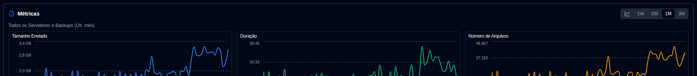

# Métricas de Backup {/* #backup-metrics */}

Um gráfico de métricas de backup ao longo do tempo é mostrado tanto no painel (visualização em tabela) quanto na página de detalhes do servidor.

- **Painel**, o gráfico mostra o número total de backups registrados no banco de dados **duplistatus**. Se você usar o layout de Cartões, poderá selecionar um servidor para ver suas métricas consolidadas (quando o painel lateral estiver mostrando métricas).
- Página de **Detalhes do Servidor**, o gráfico mostra métricas para o servidor selecionado (para todos os seus backups) ou para um único backup específico.

## Controles de Gráfico Embutidos {/* #inline-chart-controls */}

Controles de acesso rápido estão disponíveis diretamente nos cabeçalhos dos painéis de gráfico para fácil configuração sem necessidade de navegar até Configurações de Exibição:

### Seletor de Intervalo de Tempo {/* #time-range-selector */}

Botões em formato de cápsula aparecem no cabeçalho do gráfico para seleção rápida de intervalo de tempo: **1S | 2S | 1M | 3M**

- **1S**: Últimos 7 dias (janela móvel)
- **2S**: Últimos 14 dias (janela móvel)
- **1M**: Últimos 30 dias (janela móvel, padrão)
- **3M**: Últimos 90 dias (janela móvel)

As alterações feitas aqui são sincronizadas com suas Configurações de Exibição, então sua preferência é lembrada durante atualizações da página.

### Alternador de Estilo do Gráfico {/* #chart-style-toggle */}

Um botão de alternância no cabeçalho do gráfico permite alternar entre:

- **Linhas Suaves**: Exibe pontos de dados conectados com curvas suaves
- **Gráfico de Barras**: Exibe dados como barras discretas para cada período de tempo

Ambos os modos utilizam agregação por intervalos de tempo para exibição otimizada. Períodos vazios no modo de barras não renderizam nenhuma barra. Sua preferência persiste durante atualizações da página e é sincronizada com Configurações de Exibição.

## Consolidação de Dados do Gráfico {/* #chart-data-consolidation */}

Quando múltiplos backups ocorrem no mesmo dia, o **duplistatus** consolida os dados antes de exibi-los nos gráficos:

- **SOMA**: Usado para métricas cumulativas (Duração, Número de Arquivos, Tamanho do Arquivo, Tamanho Enviado)
- **ÚLTIMO**: Usado para Tamanho do Armazenamento (o valor mais recente do dia)
- **MÁX**: Usado para Versões Disponíveis (a contagem mais alta do dia)

Esta consolidação acontece antes da aplicação do agrupamento por intervalos de tempo, garantindo métricas agregadas precisas. Por exemplo, dois backups em 12/05/26 produzirão um único ponto de dados consolidado no gráfico.

## Definições de Métrica {/* #metric-definitions */}

- **Tamanho Enviado**: Quantidade total de dados enviados/transmitidos durante backups do servidor Duplicati para o destino (armazenamento local, FTP, provedor de nuvem, ...) por dia.
- **Duração**: A duração total de todos os backups recebidos por dia em HH:MM.
- **Número de Arquivos**: A soma do contador de número de arquivos recebido para todos os backups por dia.
- **Tamanho do Arquivo**: A soma do tamanho de arquivo reportado pelo servidor Duplicati para todos os backups recebidos por dia.
- **Tamanho do Armazenamento**: A soma do tamanho de armazenamento usado no destino do backup relatado pelo servidor Duplicati por dia.
- **Versões Disponíveis**: A soma de todas as versões disponíveis para todos os backups por dia.

:::note
Você pode usar o controle [Configurações de Exibição](settings/display-settings.md) para configurar o intervalo de tempo para o gráfico.
:::
