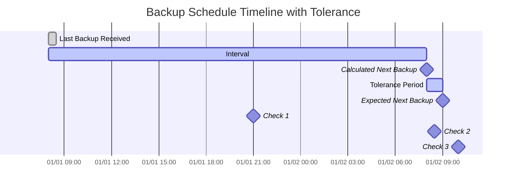

import { ZoomMermaid } from '@site/src/components/ZoomMermaid';

# Monitoramento de Backup {#backup-monitoring}

O recurso de monitoramento de backup permite rastrear e alertar sobre backups que estão atrasados. As notificações podem ser via NTFY ou E-mail.

Na interface do usuário, os backups atrasados são exibidos com um ícone de aviso . Passar o mouse sobre o ícone exibe os detalhes do backup atrasado, incluindo a última hora do backup, a hora esperada do backup, o período de tolerância e a hora esperada do próximo backup.

## Processo de Verificação de Atraso {#overdue-check-process}

**Como funciona:**

| **Etapa** | **Valor**                  | **Descrição**                                   | **Exemplo**        |
|:--------:|:---------------------------|:--------------------------------------------------|:-------------------|
|    1     | **Última Backup**            | A data e hora do último backup bem-sucedido.      | `2024-01-01 08:00` |
|    2     | **Intervalo esperado**      | A frequência de backup configurada.                  | `1 day`            |
|    3     | **Próximo Backup Calculado** | `Última Backup` + `Intervalo esperado`               | `2024-01-02 08:00` |
|    4     | **Tolerância**              | O período de tolerância configurado (tempo extra permitido). | `1 hour`           |
|    5     | **Próximo Backup Esperado**   | `Próximo Backup Calculado` + `Tolerância`            | `2024-01-02 09:00` |

Um backup é considerado **atrasado** se a hora atual é posterior à hora do `Próximo Backup Esperado`.

<ZoomMermaid>

</ZoomMermaid>

**Exemplos baseados na linha do tempo acima:**

- Em `2024-01-01 21:00` (🔹Verificação 1), o backup está **no prazo**.
- Em `2024-01-02 08:30` (🔹Verificação 2), o backup está **no prazo**, pois ainda está dentro do período de Tolerância.
- Em `2024-01-02 10:00` (🔹Verificação 3), o backup está **atrasado**, pois isso é após o tempo de `Próximo Backup Esperado`.

## Verificações Periódicas {#periodic-checks}

**duplistatus** realiza verificações periódicas de backups atrasados em intervalos configuráveis. O intervalo padrão é 20 minutos, mas você pode configurá-lo em [Configurações → Monitoramento de Backup](settings/backup-monitoring-settings.md).

## Configuração Automática {#automatic-configuration}

Quando você coleta logs de backup de um servidor Duplicati, **duplistatus** automaticamente:

- Extrai o agendamento de backup da configuração do Duplicati
- Atualiza os intervalos de monitoramento de backup para corresponder exatamente
- Sincroniza dias da semana permitidos e horários agendados
- Preserva suas preferências de notificação

:::tip
Para obter os melhores resultados, colete logs de backup após alterar os intervalos de trabalho de backup no seu servidor Duplicati. Isso garante que **duplistatus** permaneça sincronizado com sua configuração atual.
:::

Revise a seção [Configurações de Monitoramento de Backup](settings/backup-monitoring-settings.md) para opções de configuração detalhadas.
