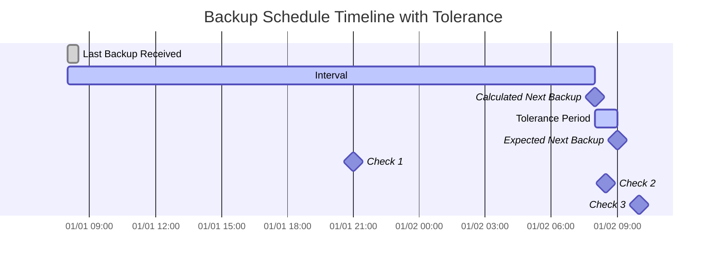

import { ZoomMermaid } from '@site/src/components/ZoomMermaid';

# Monitoramento de Backup {/* #backup-monitoring */}

O recurso de monitoramento de backup permite rastrear e alertar sobre backups que estão atrasados. As notificações podem ser via NTFY ou E-mail.

Na interface do usuário, os backups atrasados são exibidos com um ícone de aviso . Passando o mouse sobre o ícone, são exibidos os detalhes do backup atrasado, incluindo a hora do último backup, a hora esperada do backup, o período de tolerância e a hora esperada do próximo backup.

## Processo de Verificação de Atraso {/* #overdue-check-process */}

**Como funciona:**

| **Etapa** | **Valor**                  | **Descrição**                                   | **Exemplo**        |
|:---------:|:---------------------------|:------------------------------------------------|:-------------------|
|     1     | **Último Backup**          | O timestamp do último backup bem-sucedido.      | `2024-01-01 08:00` |
|     2     | **Intervalo Esperado**     | A frequência configurada do backup.             | `1 day`            |
|     3     | **Próximo Backup Calculado** | `Last Backup` + `Expected Interval`               | `2024-01-02 08:00` |
|     4     | **Tolerância**             | O período de carência configurado (tempo extra permitido). | `1 hour`           |
|     5     | **Próximo Backup Esperado**| `Calculated Next Backup` + `Tolerance`            | `2024-01-02 09:00` |

Um backup é considerado **atrasado** se a hora atual for posterior à hora do `Expected Next Backup`.

<ZoomMermaid>

```mermaid
gantt
    title Backup Schedule Timeline with Tolerance
    dateFormat  YYYY-MM-DD HH:mm
    axisFormat %m/%d %H:%M

    Last Backup Received    :done, last-backup, 2024-01-01 08:00, 0.5h

    Interval                :active, interval, 2024-01-01 08:00, 24h
    Calculated Next Backup                :milestone, expected, 2024-01-02 08:00, 0h
    Tolerance Period        :active, tolerance period, 2024-01-02 08:00, 1h

    Expected Next Backup               :milestone, adjusted, 2024-01-02 09:00, 0h

    Check 1 : milestone, deadline, 2024-01-01 21:00, 0h
    Check 2 : milestone, deadline, 2024-01-02 08:30, 0h
    Check 3 : milestone, deadline, 2024-01-02 10:00, 0h

```

</ZoomMermaid>

**Exemplos baseados na linha do tempo acima:**

- Em `2024-01-01 21:00` (🔹Verificação 1), o backup está **em dia**.
- Em `2024-01-02 08:30` (🔹Verificação 2), o backup está **em dia**, pois ainda está dentro do período de tolerância.
- Em `2024-01-02 10:00` (🔹Verificação 3), o backup está **atrasado**, pois é após a hora do `Expected Next Backup`.

## Verificações Periódicas {/* #periodic-checks */}

O **duplistatus** realiza verificações periódicas de backups atrasados em intervalos configuráveis. O intervalo padrão é de 20 minutos, mas você pode configurá-lo em [Configurações → Monitoramento de Backup](settings/backup-monitoring-settings.md).

## Configuração Automática {/* #automatic-configuration */}

Quando você coleta logs de backup de um servidor Duplicati, o **duplistatus** automaticamente:

- Extrai o agendamento do backup da configuração do Duplicati
- Atualiza os intervalos de monitoramento de backup para corresponder exatamente
- Sincroniza os dias permitidos e horários programados
- Preserva suas preferências de notificação

:::tip
Para melhores resultados, colete os logs de backup após alterar os intervalos de tarefas de backup no seu servidor Duplicati. Isso garante que o **duplistatus** permaneça sincronizado com sua configuração atual.
:::

Revise a seção [Configurações de Monitoramento de Backup](settings/backup-monitoring-settings.md) para obter opções detalhadas de configuração.
