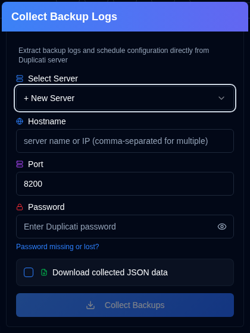
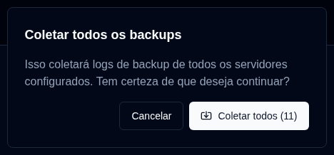

# Coletar logs de backup {#collect-backup-logs}

**duplistatus** pode recuperar logs de backup diretamente de servidores Duplicati para popular o banco de dados ou restaurar dados de log ausentes. A aplicação automaticamente ignora qualquer log duplicado que já exista no banco de dados.

## Etapas para Coletar Logs de Backup {#steps-to-collect-backup-logs}

### Coleta Manual {#manual-collection}

1.  Clique no ícone <IconButton icon="lucide:download" /> `Coletar Logs de Backup` na [Barra de Ferramentas da Aplicação](overview#application-toolbar).

2.  Selecionar servidor

Se você tiver endereços de servidores configurados em `Settings → Server Settings`, selecione um na lista suspensa para coleta instantânea. Se você não tiver nenhum servidor configurado, poderá inserir os detalhes do servidor Duplicati manualmente.

3.  Digite os detalhes do servidor Duplicati:
    - **Nome do host**: O nome do host ou endereço IP do servidor Duplicati. Você pode inserir vários nomes de host separados por vírgulas, por exemplo `192.168.1.23,someserver.local,192.168.1.89`
    - **Porta**: O número da porta usado pelo servidor Duplicati (padrão: `8200`).
    - **Senha**: Digite a senha de autenticação se obrigatório.
    - **Baixar dados JSON coletados**: Ative esta opção para baixar os dados coletados pelo duplistatus.
4.  Clique em `Collect Backups`.

***Notas:***
- Se você inserir vários nomes de host, a coleta será realizada usando a mesma porta e senha para todos os servidores.
- **duplistatus** detectará automaticamente o melhor protocolo de conexão (HTTPS ou HTTP). Ele tenta HTTPS primeiro (com validação SSL apropriada), depois HTTPS com certificados autoassinados e, finalmente, HTTP como fallback.

:::tip
<IconButton icon="lucide:download" /> botões estão disponíveis em `Configurações → Monitoramento de Atrasos` e `Configurações → Configurações do Servidor` para coleta de servidor único.
:::

 

### Coleta em Massa {#bulk-collection}

_Clique com o botão direito_ no botão <IconButton icon="lucide:download" /> `Coletar Logs de Backup` na barra de ferramentas da aplicação para coletar de todos os servidores configurados.

:::tip
Você também pode usar o botão <IconButton icon="lucide:import" label="Coletar todos"/> nas páginas `Configurações → Monitoramento de Atrasos` e `Configurações → Configurações do Servidor` para coletar de todos os servidores configurados.
:::

## Como o Processo de Coleta Funciona {#how-the-collection-process-works}

- **duplistatus** detecta automaticamente o melhor protocolo de conexão e se conecta ao servidor Duplicati especificado.
- Recupera histórico de backups, informações de logs e configurações de backup (para monitoramento de backups atrasados).
- Qualquer log já presente no banco de dados do **duplistatus** é ignorado.
- Novos dados são processados e armazenados no banco de dados local.
- A URL utilizada (com o protocolo detectado) será armazenada ou atualizada no banco de dados local.
- Se a opção de baixar for selecionada, ela baixará os dados JSON coletados. O nome do arquivo estará neste formato: `[serverName]_collected_[Timestamp].json`. A data e hora utiliza o formato de data ISO 8601 (YYYY-MM-DDTHH:MM:SS).
- O painel é atualizado para refletir as novas informações.

## Solução de Problemas de Coleta {#troubleshooting-collection-issues}

A coleta de log de backup requer que o servidor Duplicati seja acessível a partir da instalação do **duplistatus**. Se você encontrar problemas, verifique o seguinte:

- Confirmar que o nome do host (ou Endereço IP) e número da porta estão corretos. Você pode testar isso acessando a interface do usuário do servidor Duplicati no seu navegador (por exemplo, `http://hostname:port`).
- Verificar que **duplistatus** pode se conectar ao servidor Duplicati. Um problema comum é a resolução de nomes DNS (o sistema não consegue encontrar o servidor pelo seu nome do host). Veja mais na [seção de solução de problemas](troubleshooting.md#collect-backup-logs-not-working).
- Garantir que a senha fornecida está correta.
