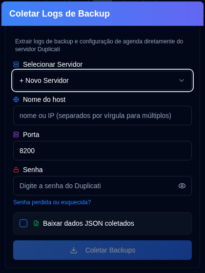
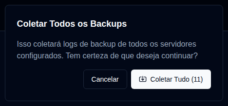

# Coletar logs de backup {#collect-backup-logs}

**duplistatus** pode recuperar logs de backup diretamente de servidores Duplicati para popular o banco de dados ou restaurar dados de log ausentes. A aplicação automaticamente ignora qualquer log duplicado que já exista no banco de dados.

## Etapas para Coletar Logs de Backup {#steps-to-collect-backup-logs}

### Coleta Manual {#manual-collection}

1.  Clique no ícone <IconButton icon="lucide:download" /> **Coletar Logs de Backup** na [Barra de Ferramentas do Aplicativo](overview.md#application-toolbar).

2.  Selecionar servidor

Se você tiver endereços de servidores configurados em [Configurações → Configurações de servidor](settings/server-settings.md), selecione um na lista suspensa para coleta instantânea. Se você não tiver nenhum servidor configurado, poderá inserir os detalhes do servidor Duplicati manualmente.

3.  Insira os detalhes do servidor Duplicati:
    - **Nome do host**: O nome do host ou endereço IP do servidor Duplicati. Você pode inserir vários nomes de host separados por vírgulas, por exemplo `192.168.1.23,someserver.local,192.168.1.89`
    - **Porta**: O número da porta usado pelo servidor Duplicati (padrão: `8200`).
    - **Senha**: Insira a senha de autenticação se obrigatório.
    - **Baixar dados JSON coletados**: Ative esta opção para baixar os dados coletados pelo duplistatus.
4.  Clique em **Coletar backups**.

***Notas:***
- Se você inserir vários nomes de host, a coleta será realizada usando a mesma porta e senha para todos os servidores.
- **duplistatus** detectará automaticamente o melhor protocolo de conexão (HTTPS ou HTTP). Ele tenta HTTPS primeiro (com validação SSL apropriada), depois HTTPS com certificados autoassinados e, finalmente, HTTP como fallback.

:::tip
Os botões <IconButton icon="lucide:download" /> estão disponíveis em [Configurações → Monitoramento de backup](settings/backup-monitoring-settings.md) e [Configurações → Configurações de servidor](settings/server-settings.md) para coleta de servidor único.
:::

 

### Coleta em Massa {#bulk-collection}

_Clique com o botão direito_ no botão <IconButton icon="lucide:download" /> **Coletar logs de backup** na barra de ferramentas da aplicação para coletar de todos os servidores configurados.

:::tip
Você também pode usar o botão <IconButton icon="lucide:import" label="Coletar todos"/> nas páginas [Configurações → Monitoramento de backup](settings/backup-monitoring-settings.md) e [Configurações → Configurações de servidor](settings/server-settings.md) para coletar de todos os servidores configurados.
:::

## Como o Processo de Coleta Funciona {#how-the-collection-process-works}

- O **duplistatus** detecta automaticamente o melhor protocolo de conexão e se conecta ao servidor Duplicati especificado.
- Ele recupera o histórico de backup, informações de log e configurações de backup (para monitoramento de backup).
- Qualquer log já presente no banco de dados do **duplistatus** é ignorado.
- Novos dados são processados e armazenados no banco de dados local, incluindo a versão do Duplicati relatada em cada log de backup. A [versão do painel](dashboard.md#duplicati-server-version) é tirada do log mais recente armazenado — o **duplistatus** não lê a versão que está sendo executada no servidor no momento. Após uma atualização do Duplicati, colete ou aguarde um novo backup para que o painel possa mostrar a nova versão.
- A URL usada (com o protocolo detectado) será armazenada ou atualizada no banco de dados local.
- Se a opção de download for selecionada, ela baixará os dados JSON coletados sempre que qualquer dado for recebido do servidor Duplicati — mesmo se os logs falharem na validação ou não puderem ser importados para o banco de dados. O nome do arquivo será neste formato: `[serverName]_collected_[Timestamp].json`. O timestamp usa o formato de data ISO 8601 (AAAA-MM-DDTHH:MM:SS).
- O painel é atualizado para refletir as novas informações.

:::note Vendo servidores duplicados após a coleta?
Se o mesmo servidor aparecer mais de uma vez após coletar logs de backup (ou após uma reinstalação/atualização do Duplicati), isso geralmente é causado por um `machine_id` alterado ou por um bug da API do Duplicati que mistura o id `identity` e o `machine_id`. A solução é alinhar os ids no servidor Duplicati (editar `identity.txt`/`machineid.txt` ou definir **Duplicati → Configurações → Opções Avançadas → Machine-id**), reiniciar o Duplicati e então mesclar as entradas em **duplistatus** via [Configurações → Manutenção do Banco de Dados → Mesclar Servidores Duplicados](settings/database-maintenance.md#merge-duplicate-servers). Consulte [Servidores Duplicados no Painel](troubleshooting.md#duplicate-servers-on-the-dashboard) para obter as etapas completas.
:::

## Solução de Problemas de Coleta {#troubleshooting-collection-issues}

A coleta de log de backup requer que o servidor Duplicati seja acessível a partir da instalação do **duplistatus**. Se você encontrar problemas, verifique o seguinte:

- Confirme que o nome do host (ou endereço IP) e o número da porta estão corretos. Você pode testar isso acessando a interface do usuário do Duplicati no seu navegador (por exemplo, `http://hostname:port`).
- Verifique se o **duplistatus** pode se conectar ao servidor Duplicati. Um problema comum é a resolução de nome DNS (o sistema não consegue encontrar o servidor pelo nome do host). Veja mais na [seção de solução de problemas](troubleshooting.md#collect-backup-logs-not-working).
- Certifique-se de que a senha que você forneceu está correta.
- No Duplicati 2.4+, a coleta lê o machine-id das configurações do servidor Duplicati quando a opção systeminfo padrão está vazia.
