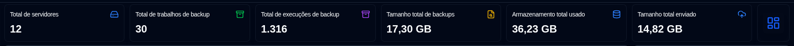
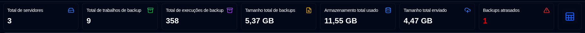
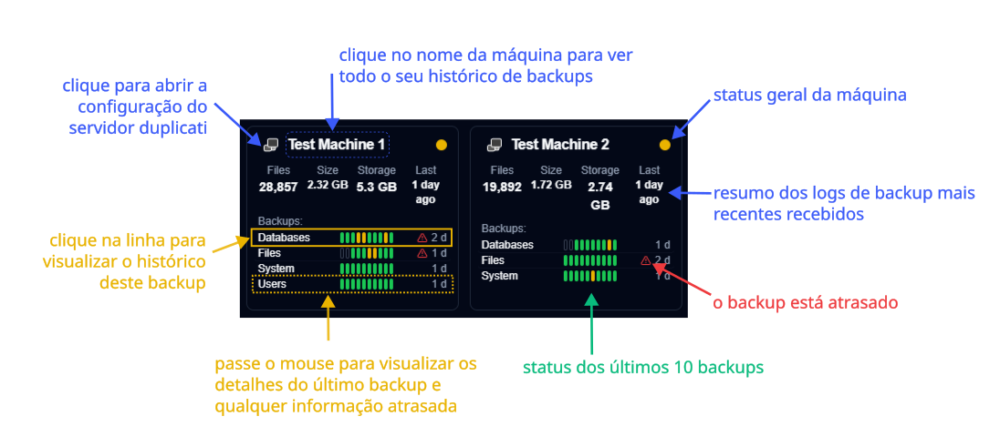
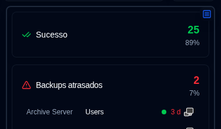
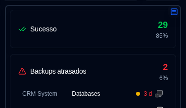
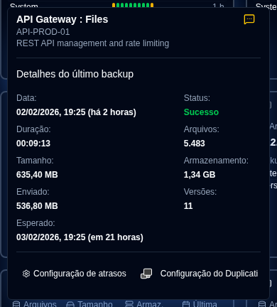
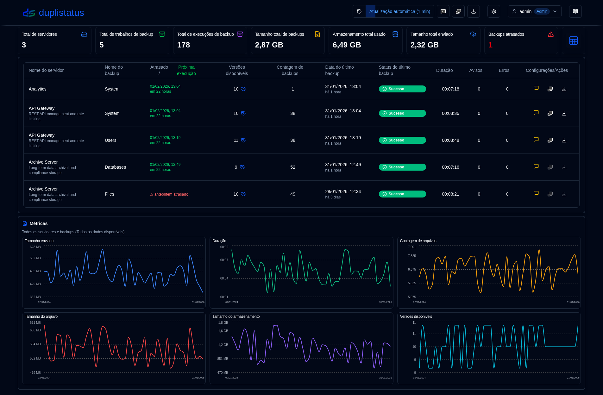
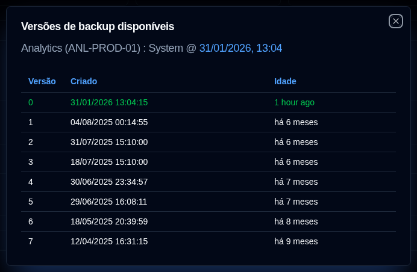

# Painel {#dashboard}

:::tip
**Acesso rápido às Configurações de exibição**: Clique com o botão direito no botão de atualização automática na barra de ferramentas da aplicação para abrir rapidamente a página [Configurações de exibição](settings/display-settings.md).
:::

## Painel Resumido {#dashboard-summary}

Esta seção exibe estatísticas agregadas para todos os backups.

- **Total de servidores**: O número de servidores sendo monitorados.
- **Total de trabalhos de backup**: O número total de trabalhos de backup (tipos) configurados para todos os servidores.
- **Total de execuções de backup**: O número total de logs de backup de execuções recebidos ou coletados para todos os servidores.
- **Tamanho total de backups**: O tamanho combinado de todos os dados de origem, com base nos logs de backup mais recentes recebidos.
- **Armazenamento total usado**: O espaço de armazenamento total usado por backups no destino de backup (por exemplo, armazenamento em nuvem, servidor FTP, unidade local), com base nos logs de backup mais recentes.
- **Tamanho total enviado**: A quantidade total de dados enviados do servidor Duplicati para o destino (por exemplo, armazenamento local, FTP, provedor de nuvem).
- **Backups atrasados** (tabela): O número de backups que estão atrasados. Consulte [Configurações de Notificações de backup](settings/backup-notifications-settings.md)
- **Alternância de layout**: Alterna entre o layout de Cartões (padrão) e o layout de Tabela.

## Layout de Cartões {#cards-layout}

O layout de cards mostra o status do log de backup mais recente recebido para cada backup.

- **Nome do servidor**: Nome do servidor Duplicati (ou o alias)
  - Passar o mouse sobre o **Nome do servidor** mostrará o nome do servidor e a nota
- **Status geral**: O status do servidor. Backups atrasados serão exibidos com status `Aviso`
- **Informações resumidas**: O número consolidado de arquivos, tamanho e armazenamento utilizado para todos os backups deste servidor. Também mostra o tempo decorrido do backup mais recente recebido (passe o mouse para mostrar a data e hora)
- **Lista de backups**: Uma tabela com todos os backups configurados para este servidor, com 3 colunas:
  - **Nome do backup**: Nome do backup no servidor Duplicati
  - **Histórico de status**: Status dos últimos 10 backups recebidos.
  - **Último backup recebido**: O tempo decorrido desde a hora atual do último log recebido. Mostrará um ícone de aviso se o backup estiver atrasado.
    - O tempo é exibido em formato abreviado: `m` para minutos, `h` para horas, `d` para dias, `w` para semanas, `mo` para meses, `y` para anos.

:::note
Você pode usar as [Configurações de exibição](settings/display-settings.md) para configurar a ordem de classificação dos cartões. As opções disponíveis são `Server name (a-z)`, `Status (error > warning > success)` e `Last backup received (new > old)`.
:::

Você pode alternar o botão no canto superior direito do painel lateral para mudar a visualização do painel:

- Status: Mostrar Estatísticas dos trabalhos de backup por Status, com uma lista de Backups atrasados e trabalhos de backup com status de Avisos/Erros.

- Métricas: Mostrar gráficos com duração, tamanho dos arquivos e tamanho de armazenamento ao longo do tempo para o servidor agregado ou selecionado.

### Detalhes do Backup {#backup-details}

Passar o mouse sobre um backup na lista exibe detalhes do último log de backup recebido e qualquer informação de atraso.

- **Nome do servidor : Backup**: O nome ou alias do servidor Duplicati e backup, também mostrará o nome do servidor e a nota.
  - O alias e a nota podem ser configurados em `Configurações → Configurações do servidor`.
- **Notificações**: Um ícone mostrando a configuração de [notificação configurada](#notifications-icons) para novos logs de backup.
- **Data**: A data e hora do backup e o tempo decorrido desde a última atualização da tela.
- **Status**: O status do último backup recebido (Sucesso, Aviso, Erro, Fatal).
- **Duração, Quantidade de arquivos, Tamanho dos arquivos, Tamanho de armazenamento, Tamanho enviado**: Valores conforme relatado pelo servidor Duplicati.
- **Versões disponíveis**: O número de versões de backup armazenadas no destino do backup no momento do backup.

Se este backup está atrasado, a dica de ferramenta também mostra:

- **Backup Esperado**: A hora em que o backup era esperado, incluindo o período de tolerância configurado (tempo extra permitido antes de marcar como atrasado).

Você também pode clicar nos botões na parte inferior para abrir `Configurações → Notificações de Backup` para configurar as definições de atraso ou abrir a interface web do servidor Duplicati.

## Layout de Tabela {#table-layout}

O layout da tabela lista os logs de backup mais recentes recebidos para todos os servidores e backups.

- **Nome do servidor**: O nome do servidor Duplicati (ou alias)
  - Sob o nome está a nota do servidor
- **Nome do backup**: O nome do backup no servidor Duplicati.
- **Versões disponíveis**: O número de versões de backup armazenadas no destino do backup. Se o ícone estiver acinzentado, informações detalhadas não foram recebidas no log. Consulte as [instruções de configuração do Duplicati](../installation/duplicati-server-configuration.md) para detalhes.
- **Contagem de backups**: O número de backups relatados pelo servidor Duplicati.
- **Data do último backup**: A data e hora do último log de backup recebido e o tempo decorrido desde a última atualização da tela.
- **Status do último backup**: O status do último backup recebido (Sucesso, Aviso, Erro, Fatal).
- **Duração**: A duração do backup em HH:MM:SS.
- **Avisos/Erros**: O número de avisos/erros relatados no log do backup.
- **Configurações**:
  - **Notificação**: Um ícone mostrando a configuração de notificação definida para novos logs de backup.
  - **Configuração do Duplicati**: Um botão para abrir a interface web do servidor Duplicati

### Ícones de Notificações {#notifications-icons}

| Icon                                                                                                                                    | Opção de Notificação | Descrição                                                                                         |
| --------------------------------------------------------------------------------------------------------------------------------------- | ------------------- | --------------------------------------------------------------------------------------------------- |
| <IconButton icon="lucide:message-square-off" style={{border: 'none', padding: 0, color: '#9ca3af', background: 'transparent'}} />     | Desativado                 | Nenhuma notificação será enviada quando um novo log de backup for recebido                                     |
| <IconButton icon="lucide:message-square-more" style={{border: 'none', padding: 0, color: '#60a5fa', background: 'transparent'}} />     | Todos                 | Notificações serão enviadas para cada novo log de backup, independentemente do seu status.                      |
| <IconButton icon="lucide:message-square-more" style={{border: 'none', padding: 0, color: '#fbbf24', background: 'transparent'}} />    | Avisos            | Notificações serão enviadas apenas para logs de backup com status de Aviso, Desconhecido, Erro ou Fatal. |
| <IconButton icon="lucide:message-square-more" style={{border: 'none', padding: 0, color: '#f87171', background: 'transparent'}} />    | Erros              | Notificações serão enviadas apenas para logs de backup com status de Erro ou Fatal.                    |

:::note
Esta configuração de notificação se aplica apenas quando **duplistatus** recebe um novo log de backup de um servidor Duplicati. As notificações de atraso são configuradas separadamente e serão enviadas independentemente desta configuração.
:::

### Detalhes de atrasos {#overdue-details}

Passar o mouse sobre o ícone de aviso de backup atrasado exibe detalhes sobre o backup atrasado.

- **Verificado**: Quando a última verificação de backup atrasado foi realizada. Configure a frequência em [Configurações de Notificações de Backup](settings/backup-notifications-settings.md).
- **Último backup**: Quando o último log de backup foi recebido.
- **Backup esperado**: A hora em que o backup era esperado, incluindo o período de tolerância configurado (tempo extra permitido antes de marcar como atrasado).
- **Última notificação**: Quando a última notificação de backup atrasado foi enviada.

### Versões de backup disponíveis {#available-backup-versions}

Clicar no ícone de relógio azul abre uma lista de versões de backup disponíveis no momento do backup, conforme relatado pelo servidor Duplicati.

- **Detalhes do backup**: Mostra o nome do servidor e alias, nota do servidor, nome do backup e quando o backup foi executado.
- **Detalhes da versão**: Mostra o número da versão, data de criação e idade.

:::note
Se o ícone estiver acinzentado, significa que nenhuma informação detalhada foi recebida nos logs de mensagens.
Consulte as [instruções de Configuração do Duplicati](../installation/duplicati-server-configuration.md) para obter detalhes.
:::
