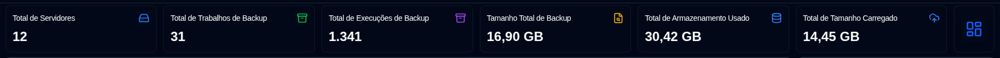
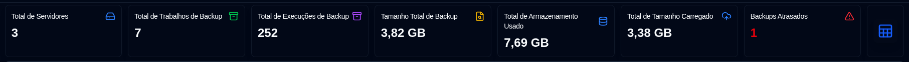
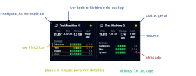
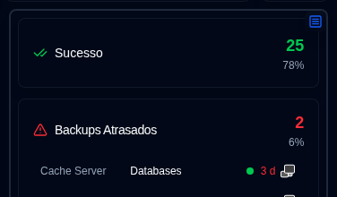
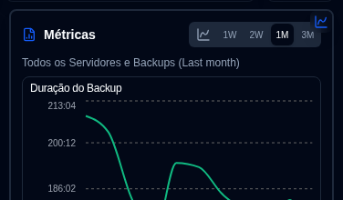
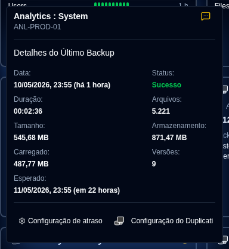
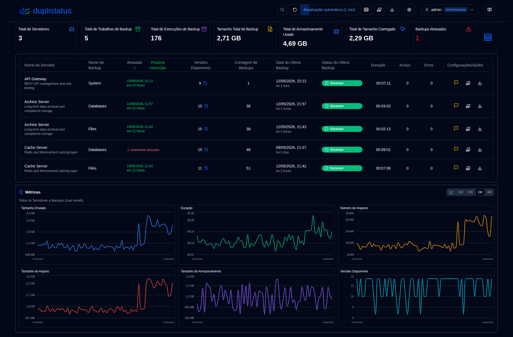
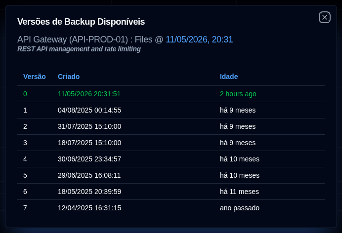

# Painel {#dashboard}

## Painel Resumido {#dashboard-summary}

Esta seção exibe estatísticas agregadas para todos os backups.

- **Total de Servidores**: O número de servidores que estão sendo monitorados.                                                                                                             
- **Total de Tarefas de Backup**: O número total de tarefas de backup (tipos) configuradas para todos os servidores.                                                                                
- **Total de Execuções de Backup**: O número total de registros de execuções de backup recebidos ou coletados para todos os servidores.                                                                   
- **Tamanho Total de Backup**: O tamanho combinado de todos os dados de origem, com base nos últimos registros de backup recebidos.                                                                    
- **Armazenamento Total Utilizado**: O espaço total de armazenamento usado pelos backups no destino do backup (por exemplo, armazenamento em nuvem, servidor FTP, unidade local), com base nos últimos registros de backup recebidos. 
- **Tamanho Total Enviado**: A quantidade total de dados enviados do servidor Duplicati para o destino (por exemplo, armazenamento local, FTP, provedor de nuvem).                       
- **Backups Atrasados** (tabela): O número de backups que estão atrasados. Veja [Configurações de Notificações de Backup](settings/backup-notifications-settings.md)                          
- **Alternar Layout**: Alterna entre o layout de Cartões (padrão) e o layout de Tabela.

:::tip Está vendo servidores duplicados?
Se o mesmo servidor aparecer mais de uma vez no painel, use [Configurações → Manutenção do Banco de Dados → Mesclar Servidores Duplicados](settings/database-maintenance.md#merge-duplicate-servers) para consolidá-los. Duplicatas podem ocorrer quando você reinstala ou atualiza o Duplicati, porque o `machine_id` do servidor pode mudar e o **duplistatus** então o trata como um novo servidor.
:::

## Filtragem de Servidores {#server-filtering}

Você pode filtrar os servidores e backups exibidos no painel usando o campo de pesquisa na barra de ferramentas do aplicativo. Clique no ícone de filtro <IconButton icon="lucide:search" /> para revelar o campo de pesquisa.

**Correspondências de Filtro:**
- ID do Servidor
- URL do Servidor
- Nomes de trabalhos de backup

**Escopo:**
- Filtra visualizações de cartão e tabela no painel
- Estado da sessão mantido pelo Provedor de Filtro de Servidor do Painel
- Limpa quando você atualiza ou sai do painel

Isso facilita a localização rápida de servidores ou backups específicos entre vários sistemas monitorados.

## Layout de Cartões {#cards-layout}

O layout de cards mostra o status do log de backup mais recente recebido para cada backup.

- **Nome do Servidor**: Nome do servidor Duplicati (ou o apelido)
  - Passar o mouse sobre o **Nome do Servidor** mostrará o nome do servidor e a observação
- **Status Geral**: O status do servidor. Backups atrasados serão exibidos com status de **Aviso**
- **Informações de resumo**: O número consolidado de arquivos, tamanho e armazenamento usado para todos os backups deste servidor. Também mostra o tempo decorrido do backup mais recente recebido (passe o mouse para mostrar a data e hora)
- **Lista de Backups**: Uma tabela com todos os backups configurados para este servidor, com 3 colunas:
  - **Nome do Backup**: Nome do backup no servidor Duplicati
  - **Histórico de Status**: Status dos últimos 10 backups recebidos.
  - **Último backup recebido**: O tempo decorrido desde a hora atual do último registro recebido. Exibirá um ícone de aviso se o backup estiver atrasado.
    - O tempo é exibido em formato abreviado: `m` para minutos, `h` para horas, `d` para dias, `w` para semanas, `mo` para meses, `y` para anos.

A ordem de classificação dos cartões e outras configurações podem ser definidas em [Configurações de exibição](settings/display-settings.md).

A visualização do painel oferece duas exibições informacionais, acessíveis clicando no botão superior direito no painel lateral:

- Status: Mostrar Estatísticas dos trabalhos de backup por Status, com uma lista de Backups atrasados e trabalhos de backup com status de Avisos/Erros.

- Métricas: Mostrar gráficos com duração, tamanho dos arquivos e tamanho de armazenamento ao longo do tempo para o servidor agregado ou selecionado.

### Detalhes do backup {#backup-details}

Passar o mouse sobre um backup na lista exibe detalhes do último log de backup recebido e qualquer informação de atraso.

- **Nome do Servidor : Backup**: O nome ou apelido do servidor Duplicati e do backup, também mostrará o nome do servidor e a anotação.
  - O apelido e a anotação podem ser configurados em [Configurações → Configurações do Servidor](settings/server-settings.md).
- **Notificações**: Um ícone que mostra a [configuração de notificação](#notifications-icons) para novos registros de backup.
- **Data**: A data e hora do backup e o tempo decorrido desde a última atualização da tela.
- **Status**: O status do último backup recebido (Sucesso, Aviso, Erro, Grave).
- **Duração, Contagem de Arquivos, Tamanho do Arquivo, Tamanho do Armazenamento, Tamanho Enviado**: Valores informados pelo servidor Duplicati.
- **Versões Disponíveis**: O número de versões de backup armazenadas no destino do backup no momento do backup.

Se este backup está atrasado, a dica de ferramenta também mostra:

- **Backup Esperado**: A hora em que o backup era esperado, incluindo o período de tolerância configurado (tempo extra permitido antes de marcar como atrasado).

Você também pode clicar nos botões na parte inferior para abrir [Configurações → Notificações de backup](settings/backup-notifications-settings.md) para configurar as configurações de monitoramento ou abrir a interface web do servidor Duplicati.

## Layout de Tabela {#table-layout}

O layout da tabela lista os logs de backup mais recentes recebidos para todos os servidores e backups.

- **Nome do Servidor**: O nome do servidor Duplicati (ou apelido)
  - Abaixo do nome está a observação do servidor
- **Nome do Backup**: O nome do backup no servidor Duplicati.
- **Versões Disponíveis**: O número de versões de backup armazenadas no destino do backup. Se o ícone estiver acinzentado, as informações detalhadas não foram recebidas no registro. Veja as [instruções de Configuração do Duplicati](../installation/duplicati-server-configuration.md) para detalhes.
- **Contagem de Backup**: O número de backups informados pelo servidor Duplicati.
- **Data do Último Backup**: O carimbo de data e hora do último registro de backup recebido e o tempo decorrido desde a última atualização da tela.
- **Status do Último Backup**: O status do último backup recebido (Sucesso, Aviso, Erro, Grave).
- **Duração**: A duração do backup no formato HH:MM:SS.
- **Avisos/Erros**: O número de avisos/erros relatados no log de backup.
- **Configurações**:
  - **Notificação**: Um ícone que mostra a configuração de notificação definida para novos logs de backup.
  - **Configuração do Duplicati**: Um botão para abrir a interface da web do servidor Duplicati

Você pode usar [Configurações de exibição](settings/display-settings.md) para configurar o tamanho da tabela e outras configurações.

### Ícones de Notificações {#notifications-icons}

| Ícone                                                                                                                               | Opção de Notificação | Descrição                                                                                         |
|------------------------------------------------------------------------------------------------------------------------------------|---------------------|-----------------------------------------------------------------------------------------------------|
| <IconButton icon="lucide:message-square-off" style={{border: 'none', padding: 0, color: '#9ca3af', background: 'transparent'}} />  | Desligado                 | Nenhuma notificação será enviada quando um novo log de backup for recebido                                     |
| <IconButton icon="lucide:message-square-more" style={{border: 'none', padding: 0, color: '#60a5fa', background: 'transparent'}} /> | Todos                 | Notificações serão enviadas para cada novo log de backup, independentemente do seu status.                      |
| <IconButton icon="lucide:message-square-more" style={{border: 'none', padding: 0, color: '#fbbf24', background: 'transparent'}} /> | Avisos            | Notificações serão enviadas somente para logs de backup com status de Aviso, Desconhecido, Erro ou Grave. |
| <IconButton icon="lucide:message-square-more" style={{border: 'none', padding: 0, color: '#f87171', background: 'transparent'}} /> | Erros              | Notificações serão enviadas somente para logs de backup com status de Erro ou Grave.                    |

:::note
Esta configuração de notificação se aplica apenas quando **duplistatus** recebe um novo log de backup de um servidor Duplicati. As notificações de atraso são configuradas separadamente e serão enviadas independentemente desta configuração.
:::

### Detalhes de atrasos {#overdue-details}

Passar o mouse sobre o ícone de aviso de backup atrasado exibe detalhes sobre o backup atrasado.

- **Verificado**: Quando a última verificação de backup atrasado foi realizada. Configure a frequência em [Configurações de Notificações de Backup](settings/backup-notifications-settings.md).
- **Último backup**: Quando o último log de backup foi recebido.
- **Backup esperado**: A hora em que o backup era esperado, incluindo o período de tolerância configurado (tempo extra permitido antes de marcar como atrasado).
- **Última notificação**: Quando a última notificação de backup atrasado foi enviada.

### Versões de backup disponíveis {#available-backup-versions}

Clicar no ícone de relógio azul abre uma lista de versões de backup disponíveis no momento do backup, conforme relatado pelo servidor Duplicati.

- **Detalhes do backup**: Mostra o nome do servidor e alias, nota do servidor, nome do backup e quando o backup foi executado.
- **Detalhes da versão**: Mostra o número da versão, data de criação e idade.

:::note
Se o ícone estiver acinzentado, significa que nenhuma informação detalhada foi recebida nos logs de mensagens.
Consulte as [instruções de Configuração do Duplicati](../installation/duplicati-server-configuration.md) para obter detalhes.
:::
