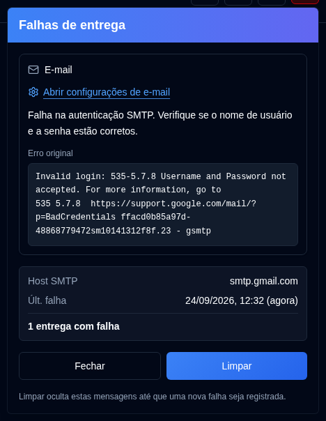

# Falhas de entrega {/* #delivery-failures */}

Um botão <IconButton icon="lucide:siren" tone="alert" /> com uma tonalidade vermelha suave aparece na [Barra de Ferramentas do Aplicativo](overview.md#application-toolbar) para administradores enquanto a entrega de e-mail ou NTFY estiver falhando. Ele permanece oculto quando ambos os canais estão íntegros e não é exibido na página de login. Usuários regulares não o veem.

Abra o botão para ver um cartão por canal com falha (E-mail, ntfy), e não uma linha para cada entrada de auditoria. Cada cartão mostra:

- O erro e um **Erro original** em espaçamento monoespaçado quando a resposta SMTP foi registrada
- O Host SMTP ou o tópico do NTFY
- A hora da últ. falha
- Quantas entregas falharam desde o último sucesso ou desde a última vez que você limpou esse canal

**Abrir configurações de e-mail** vai para [Configurações → E-mail](settings/email-settings.md). **Abrir configurações do NTFY** vai para [Configurações → NTFY](settings/ntfy-settings.md).

**Fechar** apenas dispensa o painel. **Limpar** oculta os canais listados até que uma nova falha seja registrada, mesmo quando o texto do erro for o mesmo. Uma entrega bem-sucedida posterior mantém o botão oculto. Isso inclui `email_sent`, `notification_sent` e um envio bem-sucedido do [Resumo Diário](settings/daily-summary-settings.md) para esse canal.
