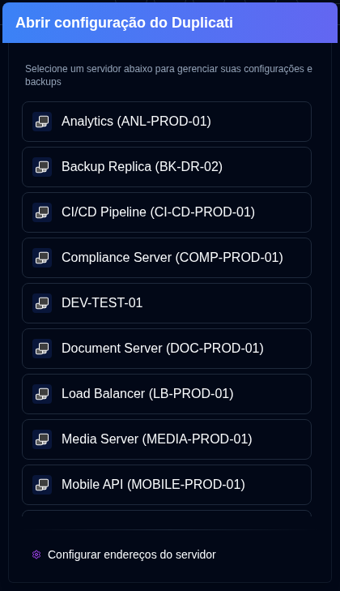

# Configuração do Duplicati {#duplicati-configuration}

O botão <SvgButton svgFilename="duplicati_logo.svg" /> na [Barra de Ferramentas da Aplicação](overview#application-toolbar) abre a interface web do Servidor Duplicati em uma nova aba.

Você pode selecionar um servidor na lista suspensa. Se você já tiver selecionado um servidor (clicando em seu cartão) ou estiver visualizando seus detalhes, o botão abrirá a Configuração do Duplicati desse servidor específico diretamente.

- A lista de servidores mostrará o `nome do servidor` ou `alias do servidor (nome do servidor)`.
- Os endereços de servidores são configurados em [`Configurações → Servidor`](settings/server-settings.md).
- A aplicação salva automaticamente a URL de um servidor quando você usa o recurso <IconButton icon="lucide:download" height="16" href="collect-backup-logs" /> [`Coletar Logs de Backup`](collect-backup-logs.md).
- Os servidores não aparecerão na lista de servidores se seu endereço não tiver sido configurado.

## Acessando a Interface Antiga do Duplicati {#accessing-the-old-duplicati-ui}

Se você tiver problemas de login com a nova interface web do Duplicati (`/ngclient/`), você pode clicar com o botão direito no botão <SvgButton svgFilename="duplicati_logo.svg" /> ou em qualquer item de servidor no popover de seleção de servidor para abrir a interface antiga do Duplicati (`/ngax/`) em uma nova aba.

  

:::note
Todos os nomes de produtos, logotipos e marcas registradas são de propriedade de seus respectivos proprietários. Ícones e nomes são usados apenas para fins de identificação e não implicam endosso.
:::
