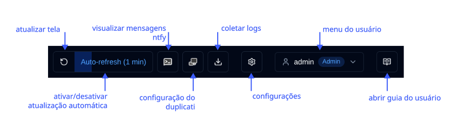
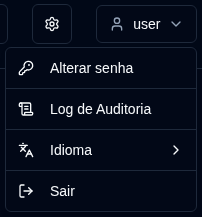

# Visão geral {#overview}

Bem-vindo ao guia do usuário duplistatus. Este documento abrangente fornece instruções detalhadas para usar duplistatus a fim de monitorar e gerenciar suas operações de backup do Duplicati em múltiplos servidores.

## O que é duplistatus? {#what-is-duplistatus}

duplistatus é um poderoso painel de monitoramento projetado especificamente para sistemas de backup Duplicati. Ele fornece:

- Monitoramento centralizado de múltiplos servidores Duplicati a partir de uma única interface
- Rastreamento em tempo real do status de todas as operações de backup
- Detecção automatizada de backup atrasado com alertas configuráveis
- Métricas abrangentes e visualização do desempenho de backup
- Sistema de notificação flexível via NTFY e e-mail
- Suporte multilíngue (Inglês, Francês, Alemão, Espanhol e Português Brasileiro).

## Instalação {#installation}

Para pré-requisitos e instruções detalhadas de instalação, consulte o [Guia de Instalação](../installation/installation.md).

## Acessando o Painel {#accessing-the-dashboard}

Após a instalação bem-sucedida, acesse a interface web do duplistatus seguindo estas etapas:

1. Abra seu navegador web preferido
2. Navegue para `http://seu-endereço-ip-do-servidor:9666`
   - Substitua `seu-endereço-ip-do-servidor` pelo endereço IP ou nome do host real do seu servidor duplistatus
   - A porta padrão é `9666`
3. Você será direcionado para uma página de login. Você pode selecionar o idioma da interface no canto superior direito da página de login, ou quando estiver conectado, através do menu do usuário (clique no seu nome de usuário → Idioma).
   Use estas credenciais para o primeiro uso (ou após uma atualização de versões pré-0.9.x):
    - nome de usuário: `admin`
    - senha: `Duplistatus09` 
4. Após o login, o painel principal será exibido automaticamente (sem dados no primeiro uso)

## Visão Geral da Interface do Usuário {#user-interface-overview}

duplistatus fornece um painel intuitivo para monitorar operações de backup do Duplicati em toda sua infraestrutura.

A interface do usuário é organizada em várias seções principais para proporcionar uma experiência de monitoramento clara e abrangente:

1. [Barra de ferramentas da aplicação](#application-toolbar): Acesso rápido a funções e configurações essenciais
2. [Resumo do Painel](dashboard.md#dashboard-summary): Estatísticas de visão geral para todos os servidores monitorados
3. Visão geral de servidores: [Layout de cartões](dashboard.md#cards-layout) ou [layout de tabela](dashboard.md#table-layout) mostrando o status mais recente de todos os backups
4. [Detalhes de atrasos](dashboard.md#overdue-details): Avisos visuais para backups atrasados com informações detalhadas ao passar o mouse
5. [Versões de backup disponíveis](dashboard.md#available-backup-versions): Clique no ícone azul para visualizar as versões de backup disponíveis no destino
6. [Métricas de backup](backup-metrics.md): Gráficos interativos exibindo o desempenho de backup ao longo do tempo
7. [Detalhes do servidor](server-details.md): Lista abrangente de backups registrados para servidores específicos, incluindo estatísticas detalhadas
8. [Detalhes do backup](server-details.md#backup-details): Informações detalhadas para backups individuais, incluindo logs de execução, avisos e erros

## Barra de Ferramentas da Aplicação {#application-toolbar}

A barra de ferramentas da aplicação fornece acesso conveniente às funções e configurações principais, organizada para um fluxo de trabalho eficiente.

| Botão                                                                                                                                           | Descrição                                                                                                                                                                  |
|--------------------------------------------------------------------------------------------------------------------------------------------------|------------------------------------------------------------------------------------------------------------------------------------------------------------------------------|
| <IconButton icon="lucide:rotate-ccw" /> &nbsp; Atualizar tela                                                                                    | Executar uma atualização manual imediata de todos os dados                                                                                                                       |
| <IconButton label="Atualização automática" />                                                                                                              | Ativar ou desativar a funcionalidade de atualização automática. Configurar em [Configurações de Exibição](settings/display-settings.md)   _Clique com o botão direito_ para abrir a página de Configurações de Exibição           |
| <SvgButton svgFilename="ntfy.svg" /> &nbsp; Abrir NTFY                                                                                            | Acessar o site ntfy.sh para o tópico de notificação configurado.   _Clique com o botão direito_ para mostrar um código QR para configurar seu dispositivo para receber notificações do duplistatus. |
| <SvgButton svgFilename="duplicati_logo.svg" href="duplicati-configuration" /> &nbsp; [Configuração do Duplicati](duplicati-configuration.md)       | Abrir a interface web do servidor Duplicati selecionado   _Clique com o botão direito_ para abrir a UI legada do Duplicati (`/ngax`) em uma nova aba                                                                                                                           |
| <IconButton icon="lucide:download" href="collect-backup-logs" /> &nbsp; [Coletar logs](collect-backup-logs.md)                                   | Conectar-se aos servidores Duplicati e recuperar logs de backup   _Clique com o botão direito_ para coletar logs para todos os servidores configurados                                                         |
| <IconButton icon="lucide:settings" href="settings/backup-notifications-settings" /> &nbsp; [Configurações](settings/backup-notifications-settings.md) | Configurar notificações, monitoramento, servidor SMTP e modelos de notificação                                                                                                 |
| <IconButton icon="lucide:user" label="nome de usuário" />                                                                                               | Mostrar o usuário conectado, tipo de usuário (`Admin`, `Usuário`), clique para abrir o menu do usuário (inclui seleção de idioma). Veja mais em [Gerenciamento de Usuários](settings/user-management-settings.md)                               |
| <IconButton icon="lucide:book-open-text" href="overview" /> &nbsp; Guia do Usuário                                                                    | Abrir o [Guia do Usuário](overview.md) para a seção relevante à página que você está visualizando. A dica de ferramenta mostra "Ajuda para [Nome da Página]" para indicar qual documentação será aberta.                                                                           |

### Menu do Usuário {#user-menu}

Clicar no botão de usuário abre um menu suspenso com opções específicas do usuário. As opções do menu diferem dependendo se você está conectado como administrador ou usuário comum. Ambos os perfis podem alterar o idioma da interface através do submenu **Idioma**. Idiomas suportados: Inglês, Francês, Alemão, Espanhol e Português Brasileiro.

<table>
  <tr>
    <th>Admin</th>
    <th>Usuário Regular</th>
  </tr>
  <tr>
    <td style={{verticalAlign: 'top'}}></td>
    <td style={{verticalAlign: 'top'}}></td>
  </tr>
</table>

## Configuração Essencial {#essential-configuration}

1. Configure seus [servidores Duplicati](../installation/duplicati-server-configuration.md) para enviar mensagens de log de backup para duplistatus (obrigatório).
2. Coletar logs de backup iniciais – use o recurso [Coletar logs de backup](collect-backup-logs.md) para popular o banco de dados com dados históricos de backup de todos os seus servidores Duplicati. Isso também atualiza automaticamente os intervalos de monitoramento de backups atrasados com base na configuração de cada servidor.
3. Configurar configurações do servidor – configure aliases de servidor e notas em [Configurações → Servidor](settings/server-settings.md) para tornar seu painel mais informativo.
4. Configurar configurações de NTFY – configure notificações via NTFY em [Configurações → NTFY](settings/ntfy-settings.md).
5. Configurar configurações de e-mail – configure notificações por e-mail em [Configurações → E-mail](settings/email-settings.md).
6. Configurar notificações de backup – configure notificações por backup ou por servidor em [Configurações → Notificações de backup](settings/backup-notifications-settings.md).

 

:::info[IMPORTANTE]
Lembre-se de configurar os servidores Duplicati para enviar logs de backup para duplistatus, conforme descrito na seção [Configuração do Duplicati](../installation/duplicati-server-configuration.md).
:::

 

:::note
Todos os nomes de produtos, logotipos e marcas registradas são de propriedade de seus respectivos proprietários. Ícones e nomes são usados apenas para fins de identificação e não implicam endosso.
:::
