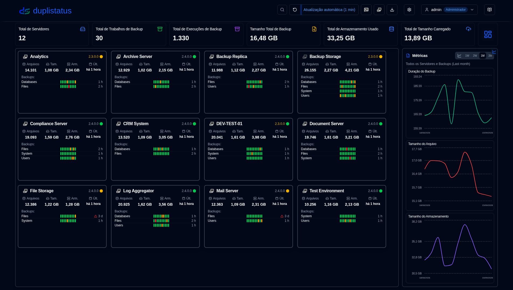
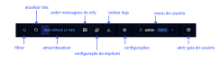
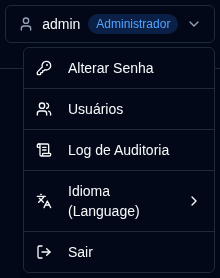
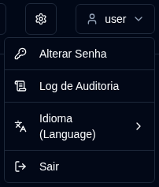

# Visão Geral {/* #overview */}

Bem-vindo ao guia do usuário do duplistatus. Este documento abrangente fornece instruções detalhadas para usar o duplistatus para monitorar e gerenciar suas operações de backup Duplicati em vários servidores.

## O que é o duplistatus? {/* #what-is-duplistatus */}

duplistatus é um painel de monitoramento poderoso projetado especificamente para sistemas de backup Duplicati. Ele fornece:

- Monitoramento centralizado de múltiplos servidores Duplicati a partir de uma única interface
- Rastreamento em tempo real do status de todas as operações de backup
- Detecção automatizada de backups atrasados com alertas configuráveis
- Métricas abrangentes e visualização do desempenho do backup
- Sistema de notificações flexível via NTFY e e-mail
- Recursos opcionais de [configuração de segurança](../installation/security-configuration.md)
- Suporte a vários idiomas (inglês, francês, alemão, espanhol, português do Brasil, hindi e chinês simplificado).

## Instalação {/* #installation */}

Para pré-requisitos e instruções detalhadas de instalação, consulte o [Guia de Instalação](../installation/installation.md).

## Acessando o Painel {/* #accessing-the-dashboard */}

Após a instalação bem-sucedida, acesse a interface web do duplistatus seguindo estes passos:

1. Abra seu navegador web preferido
2. Navegue até `http://your-server-ip:9666`
   - Substitua `your-server-ip` pelo endereço IP ou nome do host real do seu servidor duplistatus
   - A porta padrão é `9666`
3. Você será apresentado com uma página de login.

Use estas credenciais para primeiro uso (ou após atualização de versões anteriores à 0.9.x):
    - nome de usuário: `admin`
    - senha: `Duplistatus09`

Selecione o idioma da interface do usuário no canto superior direito <IconButton icon="lucide:languages" label="Idioma" />, ou em <IconButton icon="lucide:user" label="nome de usuário" /> após o login (veja abaixo).

4. Após o login, o painel principal será exibido automaticamente (sem dados na primeira utilização)

## Visão Geral da Interface do Usuário {/* #user-interface-overview */}

duplistatus fornece um painel intuitivo para monitorar operações de backup Duplicati em toda sua infraestrutura.

A interface do usuário é organizada em várias seções principais para proporcionar uma experiência de monitoramento clara e abrangente:

1. [Barra de Ferramentas do Aplicativo](#application-toolbar): Acesso rápido às funções e configurações essenciais
2. [Resumo do Painel](dashboard.md#dashboard-summary): Estatísticas gerais para todos os servidores monitorados
3. Visão Geral dos Servidores: [Layout de cartões](dashboard.md#cards-layout) ou [layout de tabela](dashboard.md#table-layout) mostrando o status mais recente de todos os backups, incluindo a [versão do servidor Duplicati](dashboard.md#duplicati-server-version) do último log de backup recebido
4. [Detalhes do Atraso](dashboard.md#overdue-details): Avisos visuais para backups atrasados com informações detalhadas ao passar o mouse
5. [Versões de Backup Disponíveis](dashboard.md#available-backup-versions): Clique no ícone azul para visualizar as versões de backup disponíveis no destino
6. [Métricas de Backup](backup-metrics.md): Gráficos interativos exibindo o desempenho do backup ao longo do tempo
7. [Detalhes do Servidor](server-details.md): Lista abrangente de backups registrados para servidores específicos, incluindo estatísticas detalhadas
8. [Detalhes do Backup](server-details.md#backup-details): Informações profundas para backups individuais, incluindo logs de execução, avisos e erros

## Barra de Ferramentas do Aplicativo {/* #application-toolbar */}

A barra de ferramentas do aplicativo fornece acesso conveniente às funções e configurações principais, organizadas para um fluxo de trabalho eficiente.

<table>
  <thead>
    <tr>
      <th style={{whiteSpace: 'nowrap'}}>Botão</th>
      <th>Descrição</th>
    </tr>
  </thead>
  <tbody>
    <tr>
      <td style={{whiteSpace: 'nowrap'}}><IconButton icon="lucide:search" /> &nbsp; Filtrar</td>
      <td>Pesquisar e filtrar servidores por ID, URL ou nome da tarefa de backup.</td>
    </tr>
    <tr>
      <td style={{whiteSpace: 'nowrap'}}><IconButton icon="lucide:rotate-ccw" /> &nbsp; Atualizar tela</td>
      <td>Executar uma atualização manual imediata da tela com todos os dados</td>
    </tr>
    <tr>
      <td style={{whiteSpace: 'nowrap'}}><IconButton label="Atualização automática" /></td>
      <td>Ativar ou desativar a funcionalidade de atualização automática. Configurar em [Configurações de Exibição](settings/display-settings.md)   _Clique com o botão direito_ para abrir a página de Configurações de Exibição</td>
    </tr>
    <tr>
      <td style={{whiteSpace: 'nowrap'}}><SvgButton svgFilename="ntfy.svg" /> &nbsp; Abrir NTFY</td>
      <td>Acesse o site ntfy.sh para o seu tópico de notificação configurado.   _Clique com o botão direito_ para mostrar um código QR para configure seu dispositivo para receber notificações do duplistatus.</td>
    </tr>
    <tr>
      <td style={{whiteSpace: 'nowrap'}}><SvgButton svgFilename="duplicati_logo.svg" href="duplicati-configuration" /> &nbsp; [Configuração do Duplicati](duplicati-configuration.md)</td>
      <td>Abrir a interface web do servidor Duplicati selecionado   _Clique com o botão direito_ para abrir a interface legada do Duplicati (`/ngax`) em uma nova aba</td>
    </tr>
    <tr>
      <td style={{whiteSpace: 'nowrap'}}><IconButton icon="lucide:download" href="collect-backup-logs" /> &nbsp; [Coletar logs](collect-backup-logs.md)</td>
      <td>Conectar aos servidores Duplicati e recuperar logs de backup   _Clique com o botão direito_ para coletar logs de todos os servidores configurados</td>
    </tr>
    <tr>
      <td style={{whiteSpace: 'nowrap'}}><IconButton icon="lucide:siren" tone="alert" href="delivery-failures" /> &nbsp; [Falhas de entrega](delivery-failures.md)</td>
      <td>Exibido para administradores enquanto a entrega de e-mail ou ntfy estiver falhando. Consulte [Falhas de entrega](delivery-failures.md).</td>
    </tr>
    <tr>
      <td style={{whiteSpace: 'nowrap'}}><IconButton icon="lucide:settings" href="settings/backup-notifications-settings" /> &nbsp; [Configurações](settings/backup-notifications-settings.md)</td>
      <td>Configurar notificações, monitoramento, servidor SMTP e modelos de notificação</td>
    </tr>
    <tr>
      <td style={{whiteSpace: 'nowrap'}}><IconButton icon="lucide:user" label="nome de usuário" /></td>
      <td>Mostrar o usuário conectado, tipo de usuário (`Admin`, `User`), clique para o menu do usuário (inclui seleção de idioma). Veja mais em [Gerenciamento de Usuários](settings/user-management-settings.md)</td>
    </tr>
    <tr>
      <td style={{whiteSpace: 'nowrap'}}><IconButton icon="lucide:book-open-text" href="overview" /> &nbsp; Guia do Usuário</td>
      <td>Abra o [Guia do Usuário](overview.md) na seção relevante para a página que você está visualizando no momento. A dica de ferramenta mostra "Ajuda para [Nome da Página]" para indicar qual documentação será aberta.</td>
    </tr>
  </tbody>
</table>

### Menu do Usuário {/* #user-menu */}

Clicar no botão do usuário abre um menu suspenso com opções específicas do usuário. As opções do menu diferem dependendo se você está logado como administrador ou usuário comum. Ambas as funções podem alterar o idioma da interface através do submenu **Idioma**. O idioma selecionado é salvo por usuário neste navegador (não como configuração em todo o sistema), então contas diferentes podem manter idiomas diferentes. Idiomas suportados: inglês, francês, alemão, espanhol, português brasileiro, hindi e chinês simplificado.

<table>
  <tr>
    <th>Administrador</th>
    <th>Usuário Comum</th>
  </tr>
  <tr>
    <td style={{verticalAlign: 'top'}}></td>
    <td style={{verticalAlign: 'top'}}></td>
  </tr>
</table>

## Configuração Essencial {/* #essential-configuration */}

1. Configure seus [servidores Duplicati](../installation/duplicati-server-configuration.md) para enviar mensagens de log de backup para o duplistatus (obrigatório).
2. Coletar logs de backup iniciais – utilize o recurso [Coletar Logs de Backup](collect-backup-logs.md) para preencher o banco de dados com dados históricos de backup de todos os seus servidores Duplicati. Isso também atualiza automaticamente os intervalos de monitoramento de backup com base na configuração de cada servidor.
3. Configurar definições do servidor – configure aliases e notas do servidor em [Configurações → Servidor](settings/server-settings.md) para tornar seu painel mais informativo.
4. Configurar definições do NTFY – configure notificações via NTFY em [Configurações → NTFY](settings/ntfy-settings.md).
5. Configurar definições de e-mail – configure notificações por e-mail em [Configurações → E-mail](settings/email-settings.md).
6. Configurar notificações de backup – configure notificações por backup ou por servidor em [Configurações → Notificações de Backup](settings/backup-notifications-settings.md).
7. Opcionalmente restringir acesso – crie [chaves de API](settings/api-keys-settings.md) e/ou [listas de IPs permitidos](settings/ip-allowlist-settings.md) se quiser proteger `/api/upload` e a interface de administração. Ambos estão desativados por padrão.

 

:::info[IMPORTANTE]
Lembre-se de configurar os servidores Duplicati para enviar logs de backup ao duplistatus, conforme descrito na seção [Configuração do Duplicati](../installation/duplicati-server-configuration.md).
:::

 

:::note
 Todos os nomes de produtos, logos e marcas registradas são propriedade de seus respectivos proprietários. Ícones e nomes são usados apenas para fins de identificação e não implicam endosso.
:::

<small>

> **Nota sobre traduções de interface e documentação:** Todos os idiomas de interface e documentação, exceto English (UK), foram traduzidos com IA usando [ai-i18n-tools](https://wsj-br.github.io/ai-i18n-tools/) e a redação pode ser imprecisa ou conter erros.

</small>
