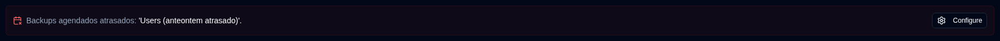
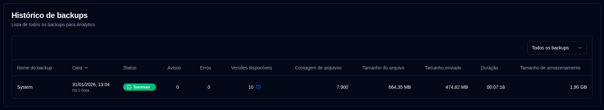

# Detalhes do Servidor {#server-details}

Clicar em um servidor do painel abre uma página com uma lista de backups para esse servidor. Você pode visualizar todos os backups ou selecionar um específico se o servidor tiver múltiplos backups configurados.

## Estatísticas do Servidor/Backup {#serverbackup-statistics}

Esta seção mostra estatísticas para todos os backups no servidor ou um backup único selecionado.

- **TOTAL DE TRABALHOS DE BACKUP**: Número total de trabalhos de backup configurados neste servidor.
- **TOTAL DE EXECUÇÕES DE BACKUP**: Número total de execuções de backup realizadas (conforme relatado pelo servidor Duplicati).
- **VERSÕES DISPONÍVEIS**: Número de versões disponíveis (conforme relatado pelo servidor Duplicati).
- **DURAÇÃO MÉDIA**: Duração média (média aritmética) dos backups registrada no banco de dados **duplistatus**.
- **TAMANHO DO ÚLTIMO BACKUP**: Tamanho dos arquivos de origem do último log de backup recebido.
- **ARMAZENAMENTO TOTAL USADO**: Armazenamento usado no destino de backup, conforme relatado no último log de backup.
- **TOTAL ENVIADO**: Soma de todos os dados enviados registrados no banco de dados **duplistatus**.

Se este backup ou qualquer um dos backups no servidor (quando **Todos os backups** está selecionado) está atrasado, uma mensagem aparece abaixo do resumo.

Clique em <IconButton icon="lucide:settings" href="settings/backup-monitoring-settings" label="Configurar"/> para ir para [Configurações → Monitoramento de backup](settings/backup-monitoring-settings.md). Ou clique em <SvgButton SvgButton svgFilename="duplicati_logo.svg" href="duplicati-configuration" /> na barra de ferramentas para abrir a interface web do servidor Duplicati e verificar os logs.

 

## Histórico de backups {#backup-history}

Esta tabela lista os logs de backup para o servidor selecionado.

- **Nome do backup**: O nome do backup no servidor Duplicati.
- **Data**: A data e hora do backup e o tempo decorrido desde a última atualização da tela.
- **Status**: O status do backup (Sucesso, Aviso, Erro, Fatal).
- **Avisos/Erros**: O número de avisos/erros relatados no log do backup.
- **Versões disponíveis**: O número de versões de backup disponíveis no destino do backup. Se o ícone estiver esmaecido, informações detalhadas não foram recebidas.
- **Quantidade de arquivos, Tamanho dos arquivos, Tamanho enviado, Duração, Tamanho de armazenamento**: Valores conforme relatado pelo servidor Duplicati.

:::tip Tips
• Use o menu suspenso na seção **Histórico de backups** para selecionar **Todos os backups** ou um backup específico para este servidor.

• Você pode classificar qualquer coluna clicando em seu cabeçalho, clique novamente para inverter a ordem de classificação.
 
• Clique em qualquer lugar em uma linha para visualizar os [Detalhes do backup](#backup-details).

:::

:::note
Quando **Todos os backups** está selecionado, a lista mostra todos os backups ordenados do mais recente para o mais antigo por padrão.
:::

 

## Detalhes do backup {#backup-details}

Clicar em um badge de status no Painel (visualização de tabela) ou em qualquer linha na tabela de Histórico de backups exibe as Informações do backup detalhadas.

- **Detalhes do servidor**: nome do servidor, alias e nota.
- **Informações do backup**: A data e hora do backup e seu ID.
- **Estatísticas do backup**: Um resumo dos contadores, tamanhos e duração relatados.
- **Resumo do log**: O número de mensagens relatadas.
- **Versões disponíveis**: Uma lista de versões disponíveis (exibida apenas se as informações foram recebidas nos logs).
- **Mensagens/Avisos/Erros**: Os logs de execução completos. O subtítulo indica se o log foi truncado pelo servidor Duplicati.

 

:::note
Consulte as [instruções de Configuração do Duplicati](../installation/duplicati-server-configuration.md) para aprender como configurar o servidor Duplicati para enviar logs de execução completos e evitar truncamento.
:::
