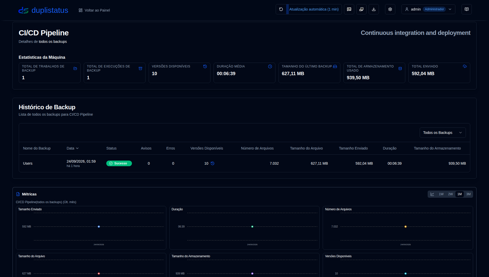
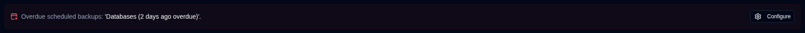
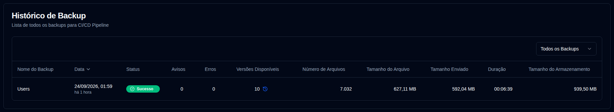
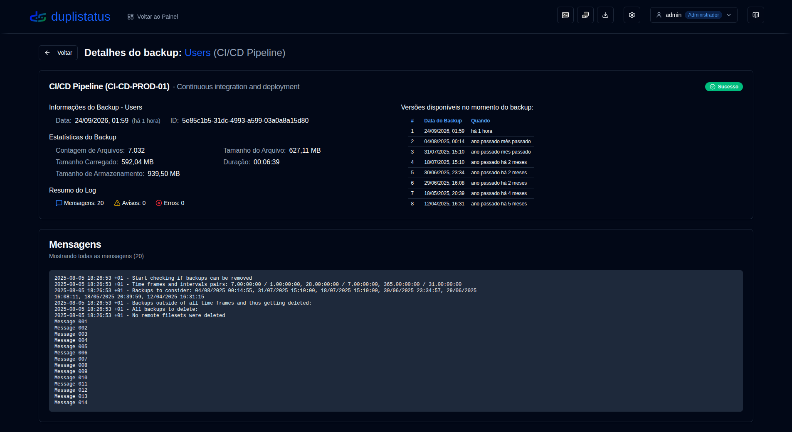

# Detalhes do Servidor {/* #server-details */}

Clicar em um servidor no painel abre uma página com uma lista de backups para esse servidor. Você pode visualizar todos os backups ou selecionar um específico, se o servidor tiver vários backups configurados.

## Estatísticas do Servidor/Backup {/* #serverbackup-statistics */}

Esta seção mostra estatísticas para todos os backups no servidor ou para um backup específico selecionado.

- **TOTAL DE TRABALHOS DE BACKUP**: Número total de trabalhos de backup configurados neste servidor.
- **TOTAL DE EXECUÇÕES DE BACKUP**: Número total de execuções de backup realizadas (conforme relatado pelo servidor Duplicati).
- **VERSÕES DISPONÍVEIS**: Número de versões disponíveis (conforme relatado pelo servidor Duplicati).
- **DURAÇÃO MÉDIA**: Duração média (média) dos backups registrados no banco de dados **duplistatus**.
- **TAMANHO DO ÚLTIMO BACKUP**: Tamanho dos arquivos de origem do último log de backup recebido.
- **TOTAL DE ARMAZENAMENTO USADO**: Armazenamento usado no destino do backup, conforme relatado no último log de backup.
- **TOTAL ENVIADO**: Soma de todos os dados enviados registrados no banco de dados **duplistatus**.

Se este backup ou qualquer um dos backups no servidor (quando **Todos os Backups** está selecionado) estiver atrasado, uma mensagem aparecerá abaixo do resumo.

Clique no <IconButton icon="lucide:settings" href="settings/backup-monitoring-settings" label="Configurar"/> para ir para [Configurações → Monitoramento de Backup](settings/backup-monitoring-settings.md). Ou clique no <SvgButton SvgButton svgFilename="duplicati_logo.svg" href="duplicati-configuration" /> na barra de ferramentas para abrir a interface web do servidor Duplicati e verificar os logs.

 

## Histórico de Backup {/* #backup-history */}

Esta tabela lista os logs de backup para o servidor selecionado.

- **Nome do Backup**: O nome do backup no servidor Duplicati.
- **Data**: O timestamp do backup e o tempo decorrido desde a última atualização da tela.
- **Status**: O status do backup (Sucesso, Aviso, Erro, Fatal).
- **Avisos/Erros**: O número de avisos/erros relatados no log de backup.
- **Versões Disponíveis**: O número de versões de backup disponíveis no destino do backup. Se o ícone estiver desativado, as informações detalhadas não foram recebidas.
- **Número de Arquivos, Tamanho do Arquivo, Tamanho Enviado, Duração, Tamanho do Armazenamento**: Valores conforme relatados pelo servidor Duplicati.

:::tip Dicas
• Use o menu suspenso na seção **Histórico de Backup** para selecionar **Todos os Backups** ou um backup específico para este servidor.

• Você pode ordenar qualquer coluna clicando no cabeçalho, clique novamente para inverter a ordem de classificação.
 
• Clique em qualquer lugar em uma linha para visualizar os [Detalhes do Backup](#backup-details).

:::

:::note
Quando **Todos os Backups** está selecionado, a lista mostra todos os backups ordenados do mais novo para o mais antigo por padrão.
:::

 

## Detalhes do Backup {/* #backup-details */}

Clicar em um badge de status no painel (visualização em tabela) ou em qualquer linha na tabela de histórico de backup exibe as informações detalhadas do backup.

- **Detalhes do Servidor**: nome do servidor, alias e nota.
- **Informações do Backup**: O timestamp do backup e seu ID.
- **Estatísticas do Backup**: Um resumo dos contadores relatados, tamanhos e duração.
- **Resumo do Log**: O número de mensagens relatadas.
- **Versões Disponíveis**: Uma lista de versões disponíveis (apenas exibida se as informações foram recebidas nos logs).
- **Mensagens/Avisos/Erros**: Os logs de execução completos. O subtítulo indica se o log foi truncado pelo servidor Duplicati.

 

:::note
Consulte as [instruções de Configuração do Duplicati](../installation/duplicati-server-configuration.md) para aprender como configurar o servidor Duplicati para enviar logs de execução completos e evitar truncamento.
:::
