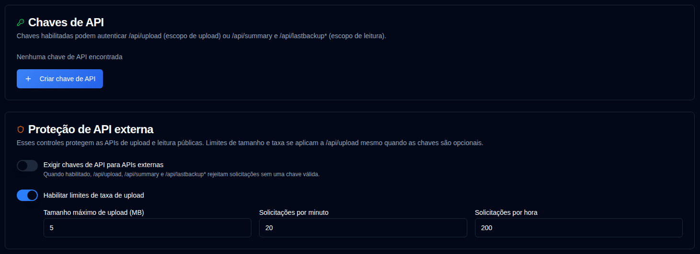

# Chaves de API {/* #api-keys */}

Administradores podem criar chaves de API com escopo para as APIs HTTP externas que o Duplicati e a Página Inicial usam. As chaves são opcionais por padrão, então os trabalhos existentes do Duplicati continuam funcionando.



## Escopos {/* #scopes */}

| Escopo | Endpoints |
|-------|-----------|
| Upload | `POST /api/upload` |
| Leitura | `GET /api/summary`, `GET /api/lastbackup/:id`, `GET /api/lastbackups/:id` |

Uma chave de upload não pode chamar as APIs de leitura, e uma chave de leitura não pode fazer upload de relatórios.

## Criando uma chave {/* #creating-a-key */}

1. Abra **Configurações → Chaves de API**.
2. Clique em **Criar chave de API** na parte inferior do cartão de Chaves de API.
3. Insira um nome, escolha um escopo e, opcionalmente, defina uma data de expiração (`YYYY-MM-DD`).
4. Gere a chave e copie o segredo imediatamente. Ele é mostrado apenas uma vez no diálogo.
5. A lista depois mostra uma impressão digital como `Qk7v…3xTa` (primeiros e últimos quatro caracteres), a data de expiração e o status. A mesma impressão digital aparece no log de auditoria.

### Desativar ou excluir {/* #disable-or-delete */}

Use a caixa de seleção na coluna **Ações** para desativar uma chave sem excluí-la. Chaves desativadas não podem autenticar. Marque a caixa de seleção novamente para reativar a chave. Chaves expiradas não podem ser reativadas; crie uma nova chave em vez disso. Excluir remove a chave permanentemente.

### Expiração {/* #expiry */}

Uma data de expiração opcional é o último dia do calendário em que a chave permanece válida. Ela expira às **23:59:59 nesse dia no fuso horário local do navegador**, não às 00:00:00 no início do dia.

Escolher `2026-12-01` constrói `2026-12-01T23:59:59` localmente, depois armazena esse instante como UTC. Para um navegador no UTC+1, isso é `2026-12-01T22:59:59.000Z`. A chave permanece válida até 1 de dezembro e é tratada como expirada a partir das 23:59:59 locais (`expires_at <= now`). A tabela de Chaves de API mostra a data de expiração (ou **Nunca** se nenhuma foi definida). Depois desse instante, o selo de Status muda para **Expirado** (cinza); chaves expiradas não podem autenticar mesmo se elas foram deixadas ativadas.

## Usando uma chave {/* #using-a-key */}

O Duplicati não pode definir cabeçalhos personalizados. Coloque a chave na URL do relatório:

```bash
--send-http-json-urls=https://your-host/api/upload?api_key=YOUR_KEY
```

Os widgets da Página Inicial podem usar o mesmo parâmetro de consulta:

```yaml
url: http://your-host/api/summary?api_key=YOUR_READ_KEY
```

Clientes que podem enviar cabeçalhos podem usar `X-Api-Key` ou `Authorization: Bearer` em vez disso. Chaves de string de consulta aparecem nos logs de acesso do proxy reverso.

## Exigir chaves {/* #require-keys */}

O interruptor **Exigir chaves de API para APIs externas** está desativado por padrão. Enquanto estiver desativado, solicitações sem uma chave são permitidas. Se um cliente ainda enviar uma chave, uma chave válida com escopo correspondente é aceita e registrada; uma chave inválida, desativada, expirada ou com escopo errado é ignorada e a solicitação ainda é permitida. Quando você ativa o interruptor, as quatro APIs de dados externas retornam `401` sem uma chave válida (e rejeitam chaves ruins). Ative pelo menos uma chave de upload e uma chave de leitura primeiro, ou os uploads do Duplicati e os widgets da Página Inicial pararão. As alterações são salvas automaticamente.

## Proteção de API externa {/* #external-api-protection */}

A mesma página pode exigir chaves de API para as APIs públicas de carregamento e leitura, e configura um tamanho máximo do corpo (padrão 5 MB) e limites de taxa por endereço IP para `/api/upload`. Os limites de tamanho e taxa se aplicam mesmo quando as chaves são opcionais e são a principal defesa contra inundação. Os campos de limite e interruptores salvam automaticamente; não há um botão Salvar separado.

Consulte também [Lista de permissões de IP](ip-allowlist-settings.md). Lista de permissões de IP e Chaves de API são recursos independentes; você pode usar um ou ambos juntos. Habilitar ambos aumenta a segurança, restringindo o acesso com base no endereço IP e exigindo uma chave de API.
