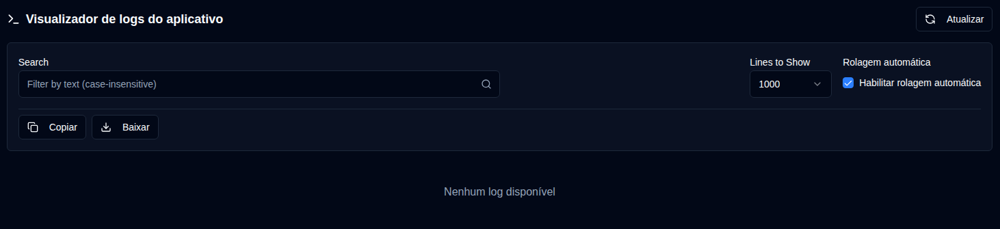

# Logs da aplicação {#application-logs}

O Visualizador de logs do aplicativo permite que administradores monitorem todos os logs da aplicação em um único lugar, com filtragem, exportação e atualizações em tempo real diretamente da interface web.

 

## Ações Disponíveis {#available-actions}

| Botão                                                               | Descrição                                                                                         |
|:--------------------------------------------------------------------|:----------------------------------------------------------------------------------------------------|
| <IconButton icon="lucide:refresh-cw" label="Atualizar" />            | Recarregue manualmente os logs do arquivo selecionado. Mostra um spinner de carregamento durante a atualização e redefine o rastreamento para detecção de novas linhas. |
| <IconButton icon="lucide:copy" label="Copiar para a área de transferência" />         | Copie todas as linhas de log filtradas para sua área de transferência. Respeita o filtro de pesquisa atual. Útil para compartilhamento rápido ou colagem em outras ferramentas. |
| <IconButton icon="lucide:download" label="Exportar" />               | Baixe os logs como um arquivo de texto. Exporta da versão do arquivo atualmente selecionada e aplica o filtro de pesquisa atual (se houver). Formato do nome do arquivo: `duplistatus-logs-YYYY-MM-DD.txt` (data em formato ISO). |
| <IconButton icon="lucide:arrow-down-from-line" />                   | Pule rapidamente para o início dos logs exibidos. Útil quando a rolagem automática está desabilitada ou ao navegar por arquivos de log longos. |
| <IconButton icon="lucide:arrow-down-to-line" />                    | Pule rapidamente para o final dos logs exibidos. Útil quando a rolagem automática está desabilitada ou ao navegar por arquivos de log longos. |

 

## Controles e Filtros {#controls-and-filters}

| Controle | Descrição |
|:--------|:-----------|
| **Versão do arquivo** | Selecionar qual arquivo de log visualizar: **Atual** (arquivo ativo) ou arquivos rotacionados (`.1`, `.2`, etc., onde números maiores são mais antigos). |
| **Linhas para mostrar** | Exibir as **100**, **500**, **1000** (padrão), **5000**, ou **10000** linhas mais recentes do arquivo selecionado. |
| **Rolagem automática** | Quando habilitado (padrão para arquivo atual), rola automaticamente para novas entradas de log e atualiza a cada 2 segundos. Funciona apenas para a versão de arquivo `Atual`. |
| **Pesquisar** | Filtrar linhas de log por texto (sem distinção de maiúsculas e minúsculas). Os filtros se aplicam às linhas atualmente exibidas. |

 

O cabeçalho de exibição do log mostra a contagem de linhas filtradas, linhas totais, tamanho dos arquivos e data e hora da última modificação.

 
