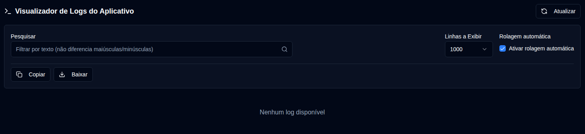

# Logs do Aplicativo {/* #application-logs */}

O visualizador de Logs do Aplicativo permite que administradores monitorem todos os logs do aplicativo em um único lugar, com filtragem, exportação e atualizações em tempo real diretamente da interface web.

 

## Ações Disponíveis {/* #available-actions */}

| Botão                                                               | Descrição                                                                                           |
|:----------------------------------------------------------------------|:----------------------------------------------------------------------------------------------------|
| <IconButton icon="lucide:refresh-cw" label="Atualizar" />            | Recarrega manualmente os logs do arquivo selecionado. Mostra um spinner de carregamento durante a atualização e redefine o rastreamento para detecção de novas linhas. |
| <IconButton icon="lucide:copy" label="Copiar para a área de transferência" />         | Copia todas as linhas de log filtradas para sua área de transferência. Respeita o filtro de pesquisa atual. Útil para compartilhamento rápido ou colagem em outras ferramentas. |
| <IconButton icon="lucide:download" label="Exportar" />               | Baixa logs como um arquivo de texto. Exporta a partir da versão do arquivo atualmente selecionada e aplica o filtro de pesquisa atual (se houver). Formato do nome do arquivo: `duplistatus-logs-YYYY-MM-DD.txt` (data no formato ISO). |
| <IconButton icon="lucide:arrow-down-from-line" />                   | Pula rapidamente para o início dos logs exibidos. Útil quando a rolagem automática está desativada ou ao navegar por arquivos de log longos. |
| <IconButton icon="lucide:arrow-down-to-line" />                    | Pula rapidamente para o final dos logs exibidos. Útil quando a rolagem automática está desativada ou ao navegar por arquivos de log longos. |

 

## Controles e Filtros {/* #controls-and-filters */}

| Controle | Descrição |
|:---------|:----------|
| **Versão do Arquivo** | Seleciona qual arquivo de log visualizar: **Atual** (arquivo ativo) ou arquivos rotacionados (`.1`, `.2`, etc., onde números mais altos são mais antigos). |
| **Linhas a Exibir** | Exibe as **100**, **500**, **1000** (padrão), **5000** ou **10000** linhas mais recentes do arquivo selecionado. |
| **Rolagem automática** | Quando habilitado (padrão para arquivo atual), rola automaticamente para novas entradas de log e atualiza a cada 2 segundos. Funciona apenas para a versão do arquivo **Atual**. |
| **Pesquisar** | Filtra linhas de log por texto (não diferencia maiúsculas de minúsculas). Os filtros se aplicam às linhas atualmente exibidas. |

 

O cabeçalho da exibição de log mostra a contagem de linhas filtradas, total de linhas, tamanho do arquivo e timestamp da última modificação.

 
