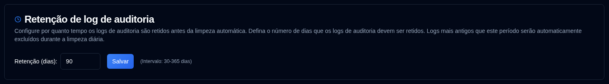

# Retenção de log de auditoria {#audit-log-retention}

Configurar por quanto tempo os logs de auditoria são retidos antes da limpeza automática.

| Configuração | Descrição | Valor Padrão |
|:-------|:-----------|:-------------|
| **Retenção (dias)** | Número de dias para reter logs de auditoria antes da exclusão automática | `90 dias` |

## Configurações de Retenção {#retention-settings}

- **Intervalo**: 30 a 365 dias
- **Limpeza Automática**: Executada diariamente às 02:00 UTC (não configurável)
- **Limpeza Manual**: Disponível via API para administradores (consulte [Cleanup Audit Logs](../../api-reference/administration-apis.md#cleanup-audit-logs-apiaudit-logcleanup))
