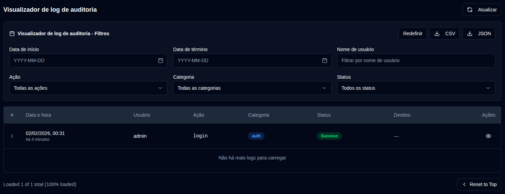

# Logs de Auditoria {#audit-logs}

O log de auditoria fornece um registro abrangente de todas as alterações do sistema e ações do usuário em **duplistatus**. Isso ajuda a rastrear alterações de configuração, atividades do usuário e operações do sistema para fins de segurança e solução de problemas.

## Visualizador de log de auditoria {#audit-log-viewer}

O visualizador de log de auditoria exibe uma lista cronológica de todos os eventos registrados com as seguintes informações:

- **Data e hora**: Quando o evento ocorreu
- **Usuário**: O nome de usuário que realizou a ação (ou "Sistema" para ações automatizadas)
- **Ação**: A ação específica que foi realizada
- **Categoria**: A categoria da ação (Autenticação, Gerenciamento de usuários, Configuração, Operações de backup, Gerenciamento de servidores, Operações do sistema)
- **Status**: Se a ação foi bem-sucedida ou falhou
- **Destino**: O objeto que foi afetado (se aplicável)
- **Detalhes**: Informações adicionais sobre a ação

### Visualizando Detalhes do Log {#viewing-log-details}

Clique no ícone <IconButton icon="lucide:eye" /> de olho ao lado de qualquer entrada de log para visualizar informações detalhadas, incluindo:
- Data e hora completa
- Informações do usuário
- Detalhes completos da ação (por exemplo: campos alterados, estatísticas, etc.)
- Endereço IP e agente do usuário
- Mensagens de erro (se a ação falhou)

### Exportando Logs de Auditoria {#exporting-audit-logs}

Você pode exportar logs de auditoria filtrados em dois formatos:

| Botão | Descrição |
|:------|:-----------|
| <IconButton icon="lucide:download" label="CSV"/> | Exportar logs como arquivo CSV para análise em planilha |
| <IconButton icon="lucide:download" label="JSON"/> | Exportar logs como arquivo JSON para análise programática |

:::note
As exportações incluem apenas os logs visíveis no momento com base nos seus filtros ativos. Para exportar todos os logs, limpe todos os filtros primeiro.
:::
