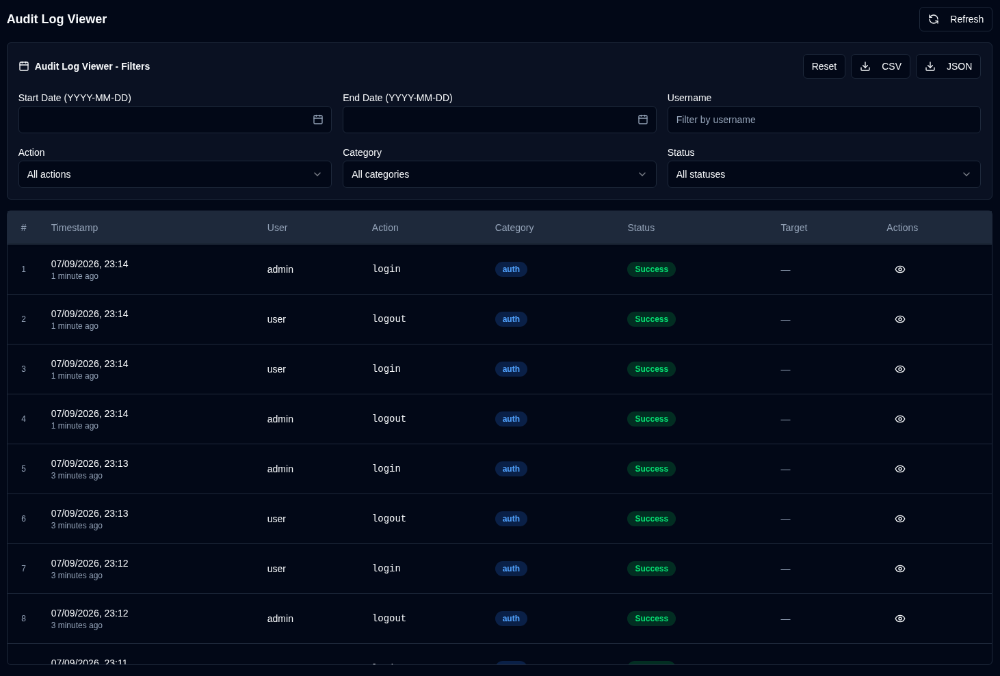

# Logs de Auditoria {/* #audit-logs */}

O log de auditoria fornece um registro abrangente de todas as alterações no sistema e ações de usuários no **duplistatus**. Isso ajuda a rastrear alterações de configuração, atividades de usuários e operações do sistema para fins de segurança e solução de problemas.

## Visualizador de Log de Auditoria {/* #audit-log-viewer */}

O visualizador de log de auditoria exibe uma lista cronológica de todos os eventos registrados com as seguintes informações:

- **Timestamp**: Quando o evento ocorreu
- **Usuário**: O nome de usuário que realizou a ação (ou "Sistema" para ações automatizadas)
- **Ação**: A ação específica que foi realizada
- **Categoria**: A categoria da ação (Autenticação, Gerenciamento de Usuários, Configuração, Operações de Backup, Gerenciamento de Servidor, Operações do Sistema)
- **Status**: Se a ação teve sucesso ou falhou
- **Destino**: O objeto que foi afetado (se aplicável)
- **Detalhes**: Informações adicionais sobre a ação

### Visualizando Detalhes do Log {/* #viewing-log-details */}

Clique no ícone de olho <IconButton icon="lucide:eye" /> ao lado de qualquer entrada de log para visualizar informações detalhadas, incluindo:
- Timestamp completo
- Informações do usuário
- Detalhes completos da ação (por exemplo: campos alterados, estatísticas, etc.)
- Endereço IP e agente do usuário
- Mensagens de erro (se a ação falhou)

### Exportando Logs de Auditoria {/* #exporting-audit-logs */}

Você pode exportar logs de auditoria filtrados em dois formatos:

| Botão | Descrição |
|:------|:-----------|
| <IconButton icon="lucide:download" label="CSV"/> | Exportar logs como um arquivo CSV para análise de planilhas |
| <IconButton icon="lucide:download" label="JSON"/> | Exportar logs como um arquivo JSON para análise programática |

:::note
As exportações incluem apenas os logs atualmente visíveis com base nos filtros ativos. Para exportar todos os logs, limpe todos os filtros primeiro.
:::
