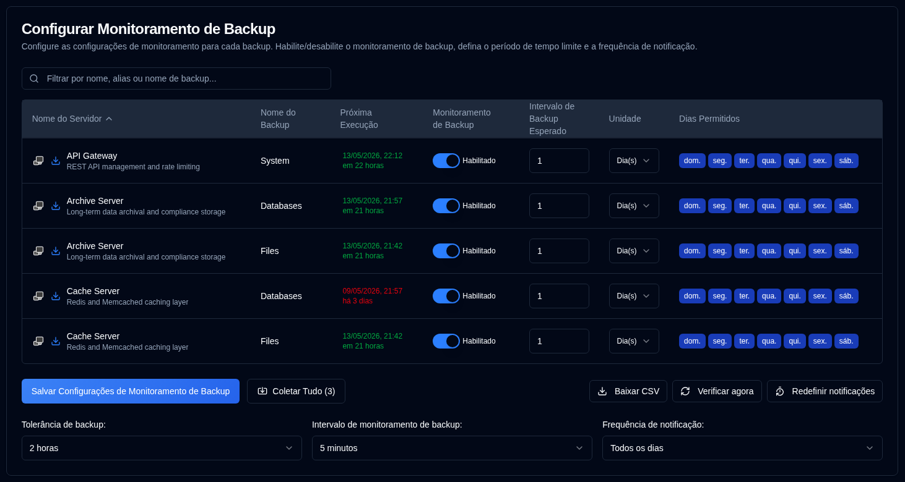

# Monitoramento de Backup {#backup-monitoring}

## Configurar Configurações de Monitoramento por Backup {#configure-per-backup-monitoring-settings}

-  **Nome do Servidor**: O nome do servidor a ser monitorado quanto a backups atrasados. 
   - Clique em <SvgIcon svgFilename="duplicati_logo.svg" height="18"/> para abrir a interface web do servidor Duplicati
   - Clique em <IIcon2 icon="lucide:download" height="18"/> para coletar os logs de backup deste servidor.
- **Nome do Backup**: O nome do backup a ser monitorado quanto a atrasos.
- **Próxima Execução**: O próximo horário agendado para o backup, exibido em verde se estiver no futuro ou em vermelho se estiver atrasado. Passar o mouse sobre o valor de "Próxima Execução" exibe uma dica com o carimbo de data/hora do último backup do banco de dados, formatado com data/hora completa e tempo relativo.
- **Monitoramento de Backup**: Ativar ou desativar o monitoramento de backup para este backup.
- **Intervalo Esperado de Backup**: O intervalo esperado entre os backups.
- **Unidade**: A unidade do intervalo esperado.
- **Dias Permitidos**: Os dias da semana permitidos para o backup.

Se os ícones ao lado do nome do servidor estiverem acinzentados, o servidor não está configurado em [Configurações → Configurações do Servidor](/user-guide/settings/server-settings).

:::note
Quando você coleta logs de backup de um servidor Duplicati, o **duplistatus** atualiza automaticamente os intervalos e configurações de monitoramento de backup.
:::

:::tip
Para obter melhores resultados, colete logs de backup após alterar a configuração de intervalos de trabalho de backup no seu servidor Duplicati. Isso garante que **duplistatus** permaneça sincronizado com sua configuração atual.
:::

## Configurações Globais {#global-configurations}

Estas configurações aplicam-se a todos os backups:

| Configuração                         | Descrição                                                                                                                                                                                                                                                                                                                             |
|:--------------------------------|:----------------------------------------------------------------------------------------------------------------------------------------------------------------------------------------------------------------------------------------------------------------------------------------------------------------------------------------|
| **Tolerância de Backup**            | O período de carência (tempo extra permitido) adicionado ao horário esperado do backup antes de ser marcado como atrasado. O padrão é **1 hora**.                                                                                                                                                                                                             |
| **Intervalo de Monitoramento de Backup** | Com que frequência o sistema verifica backups atrasados. O padrão é **5 minutos**.                                                                                                                                                                                                                                                            |
| **Frequência de Notificação**      | Com que frequência enviar notificações de atraso:   **Uma vez`: Send **just one** notification when the backup becomes overdue.   `Toda semana`: Send **daily** notifications while overdue (default).   `Todo mês`: Send **weekly** notifications while overdue.   `**: Envia notificações **mensais** enquanto estiver atrasado. |

## Ações Disponíveis {#available-actions}

| Botão                                                              | Descrição                                                                                                                           |
|:--------------------------------------------------------------------|:--------------------------------------------------------------------------------------------------------------------------------------|
| <IconButton label="Salvar Configurações de Monitoramento de Backup" />              | Salva as configurações, limpa os temporizadores de quaisquer backups desativados e executa uma verificação de atrasos.                                                |
| <IconButton icon="lucide:import" label="Coletar Tudo (#)"/>          | Coleta logs de backup de todos os servidores configurados, entre colchetes o número de servidores dos quais coletar.                                   |
| <IconButton icon="lucide:download" label="Baixar CSV"/>           | Baixa um arquivo CSV contendo todas as configurações de monitoramento de backup e o "Carimbo de Data/Hora do Último Backup (BD)" do banco de dados.               |
| <IconButton icon="lucide:refresh-cw" label="Verificar agora"/>            | Executa imediatamente a verificação de backups atrasados. Isso é útil após alterar as configurações. Também dispara um recálculo da "Próxima Execução". |
| <IconButton icon="lucide:timer-reset" label="Redefinir notificações"/> | Redefine a última notificação de atraso enviada para todos os backups.                                                                            |
