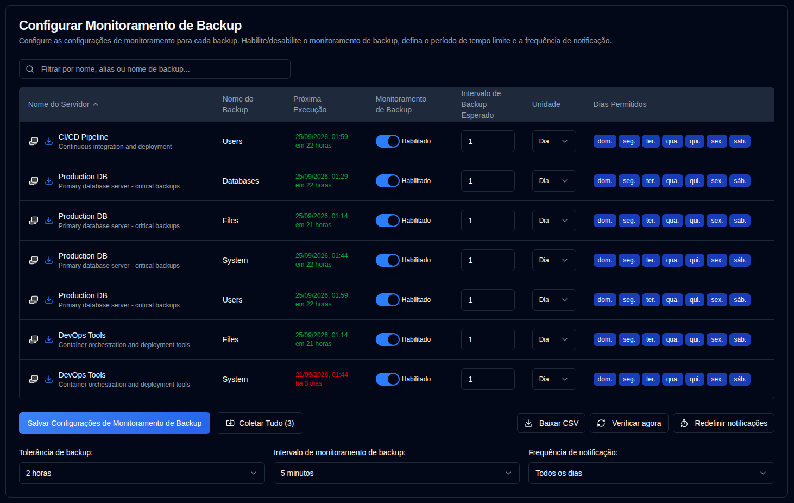

# Monitoramento de Backup {/* #backup-monitoring */}

## Filtragem de Servidores {/* #server-filtering */}

A lista de servidores nesta página pode ser filtrada usando o campo de filtro.

Quando o **Resumo Diário** está ativado, a detecção de atrasos continua, mas o e-mail de atraso para o destinatário de e-mail padrão é suprimido. Destinos de e-mail adicionais continuam para eventos correspondentes (atrasos contam como um Aviso). Veja [Resumo Diário](daily-summary-settings.md).

**Correspondências de Filtro:**
- ID do Servidor
- URL do Servidor
- Nomes dos trabalhos de backup

Isso facilita localizar rapidamente servidores ou backups específicos nas configurações de monitoramento ao gerenciar muitos sistemas.

## Configurar Configurações de Monitoramento Por-Backup {/* #configure-per-backup-monitoring-settings */}

-  **Nome do Servidor**: O nome do servidor a ser monitorado quanto a backups atrasados. 
   - Clique em <SvgIcon svgFilename="duplicati_logo.svg" height="18"/> para abrir a interface web do servidor Duplicati
   - Clique em <IIcon2 icon="lucide:download" height="18"/> para coletar logs de backup deste servidor.
- **Nome do Backup**: O nome do backup a ser monitorado quanto a backups atrasados.
- **Próxima Execução**: O próximo horário agendado para o backup exibido em verde se estiver agendado no futuro, ou em vermelho se estiver atrasado. Passar o mouse sobre o valor "Próxima Execução" exibe uma dica mostrando o timestamp do último backup do banco de dados, formatado com data/hora completa e tempo relativo.
- **Monitoramento de Backup**: Ativa ou desativa o monitoramento de backup para este backup.
- **Intervalo de Backup Esperado**: O intervalo de backup esperado.
- **Unidade**: A unidade do intervalo esperado.
- **Dias Permitidos**: Os dias da semana permitidos para o backup.

Se os ícones ao lado do nome do servidor estiverem esmaecidos, o servidor não está configurado em [Configurações → Configurações do Servidor](/user-guide/settings/server-settings).

:::note
Quando você coleta logs de backup de um servidor Duplicati, o **duplistatus** atualiza automaticamente os intervalos e configurações de monitoramento de backup.
:::

:::tip
Para melhores resultados, colete logs de backup após alterar a configuração de intervalos de tarefas de backup no seu servidor Duplicati. Isso garante que o **duplistatus** permaneça sincronizado com sua configuração atual.
:::

## Configurações Globais {/* #global-configurations */}

Essas configurações se aplicam a todos os backups:

| Configuração                   | Descrição                                                                                                                                                                                                                                                                                                                               |
|:-------------------------------|:------------------------------------------------------------------------------------------------------------------------------------------------------------------------------------------------------------------------------------------------------------------------------------------------------------------------------------------|
| **Tolerância de Backup**       | O período de carência (tempo extra permitido) adicionado ao tempo de backup esperado antes de marcar como atrasado. O padrão é **1 hora**.                                                                                                                                                                                               |
| **Intervalo de Monitoramento de Backup** | Com que frequência o sistema verifica por backups atrasados. O padrão é **5 minutos**.                                                                                                                                                                                                                                                     |
| **Frequência de Notificação** | Com que frequência enviar notificações de atraso:   **Uma vez`: Send **just one** notification when the backup becomes overdue.   `Todo dia`: Send **daily** notifications while overdue (default).   `Toda semana`: Send **weekly** notifications while overdue.   `Todo mês**: Envia notificações **mensais** enquanto estiver atrasado. |

## Ações Disponíveis {/* #available-actions */}

| Botão                                                             | Descrição                                                                                                                            |
|:--------------------------------------------------------------------|:--------------------------------------------------------------------------------------------------------------------------------------|
| <IconButton label="Salvar Configurações de Monitoramento de Backup" />              | Salva as configurações, limpa os temporizadores para quaisquer backups desativados e executa uma verificação de atraso.                 |
| <IconButton icon="lucide:import" label="Coletar Tudo (#)"/>          | Coleta logs de backup de todos os servidores configurados, entre colchetes o número de servidores dos quais coletar.                    |
| <IconButton icon="lucide:download" label="Baixar CSV"/>           | Baixa um arquivo CSV contendo todas as configurações de monitoramento de backup e o "Timestamp do Último Backup (BD)" do banco de dados. |
| <IconButton icon="lucide:refresh-cw" label="Verificar agora"/>            | Executa imediatamente a verificação de backup atrasado. Isso é útil após alterações nas configurações. Também aciona uma nova recalculação da "Próxima Execução". |
| <IconButton icon="lucide:timer-reset" label="Redefinir notificações"/> | Redefine a última notificação de atraso enviada para todos os backups.                                                                      |
