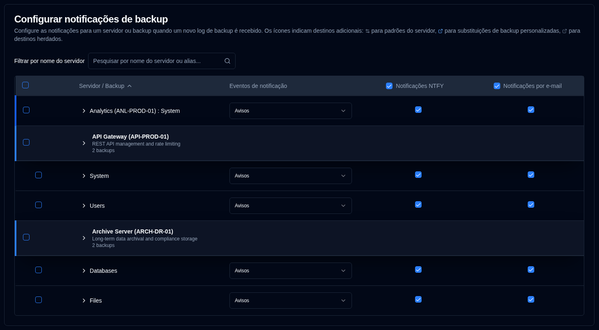
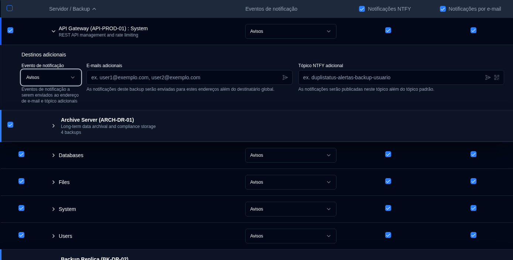
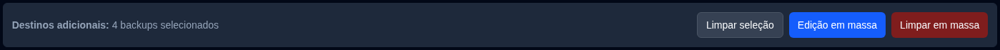

# Notificações de backup {#backup-notifications}

Use estas configurações para enviar notificações quando um [novo log de backup é recebido](../../installation/duplicati-server-configuration.md).

A tabela de notificações de backup é organizada por servidor. O formato de exibição depende de quantos backups um servidor possui:
- **Múltiplos backups**: Mostra uma linha de cabeçalho do servidor com linhas de backup individuais abaixo dela. Clique no cabeçalho do servidor para expandir ou recolher a lista de backups.
- **Um único backup**: Exibe uma **linha mesclada** com uma borda esquerda azul, mostrando:
  -  **Nome do servidor : Nome do backup** se nenhum apelido do servidor estiver configurado, ou
  - **Apelido do servidor (Nome do servidor) : Nome do backup** se estiver configurado.

Esta página possui um recurso de salvamento automático. Todas as alterações que você fizer serão salvas automaticamente.

 

## Filtrar e Pesquisar {#filter-and-search}

Use o campo **Filtrar por nome do servidor** no topo da página para encontrar rapidamente backups específicos por nome do servidor ou alias. A tabela será filtrada automaticamente para mostrar apenas as entradas correspondentes.

 

## Configurar Configurações de Notificação por Backup {#configure-per-backup-notification-settings}

| Configuração                       | Descrição                                               | Valor padrão |
| :---------------------------- | :-------------------------------------------------------- | :------------ |
| **Eventos de notificação**       | Configure quando enviar notificações para novos logs de backup. | **Avisos**    |
| **NTFY**                      | Ativar ou desativar notificações NTFY para este backup.     | **Habilitado**     |
| **E-mail**                     | Ativar ou desativar notificações por e-mail para este backup.    | **Habilitado**    |

**Opções de Eventos de notificação:**

- **todos**: Enviar notificações para todos os eventos de backup.
- **avisos**: Enviar notificações apenas para avisos e erros (padrão).
- **erros**: Enviar notificações apenas para erros.
- **desativado**: Desativar notificações para novos logs de backup para este backup.

 

## Destinos adicionais {#additional-destinations}

Destinos de notificação adicionais permitem que você envie notificações para endereços de e-mail específicos ou tópicos NTFY além das configurações globais. O sistema usa um modelo de herança hierárquica onde os backups podem herdar configurações padrão do seu servidor ou substituí-las por valores específicos do backup.

A configuração de destino adicional é indicada por ícones contextuais próximos aos nomes do servidor e backup:

- **Ícone do servidor** <IconButton icon="lucide:settings-2" style={{border: 'none', padding: 0, color: 'inherit', background: 'transparent'}} />: Aparece ao lado dos nomes de servidores quando destinos adicionais padrão são configurados no nível do servidor.

- **Ícone de backup** <IconButton icon="lucide:external-link" style={{border: 'none', padding: 0, color: '#60a5fa', background: 'transparent'}} /> (azul): Aparece ao lado dos nomes de backup quando destinos adicionais personalizados são configurados (substituindo os padrões do servidor).

- **Ícone de backup** <IconButton icon="lucide:external-link" style={{border: 'none', padding: 0, color: '#64748b', background: 'transparent'}} /> (cinza): Aparece ao lado dos nomes de backup quando o backup está herdando destinos adicionais dos padrões do servidor.

Se nenhum ícone for exibido, o servidor ou backup não possui destinos adicionais configurados.

### Padrões em Nível de Servidor {#server-level-defaults}

Você pode configurar Destinos adicionais padrão no nível do Servidor que todos os backups nesse servidor herdarão automaticamente.

1. Navegue até [Configurações → Notificações de backup](backup-notifications-settings.md).
2. A tabela é agrupada por servidor, com linhas de cabeçalho de servidor distintas mostrando o nome do servidor, alias e contagem de backups.
   - **Nota**: Para servidores com apenas um backup, uma linha mesclada é exibida em vez de um cabeçalho de servidor separado. Os padrões no nível do servidor não podem ser configurados diretamente a partir de linhas mescladas. Se você precisar configurar padrões de servidor para um servidor com um único backup, você pode fazer isso adicionando temporariamente outro backup a esse servidor, ou os Destinos adicionais do backup herdarão automaticamente de quaisquer padrões de servidor existentes.
3. Clique em qualquer lugar em uma linha de servidor para expandir a seção **Destinos adicionais padrão para este servidor**.
4. Configure as seguintes configurações padrão:
   - **Evento de notificação**: Escolha quais eventos acionam notificações para os destinos adicionais (**todos**, **avisos**, **erros** ou **desativado**).
   - **E-mails adicionais**: Digite um ou mais endereços de e-mail (separados por vírgula) que receberão notificações para todos os backups neste servidor. Clique no botão de ícone <IconButton icon="lucide:send-horizontal" style={{border: 'none', padding: 0, color: 'inherit', background: 'transparent'}} /> para enviar um e-mail de teste para os endereços no campo.
   - **Tópico NTFY adicional**: Digite um nome de tópico NTFY personalizado onde as notificações serão publicadas para todos os backups neste servidor. Clique no botão de ícone <IconButton icon="lucide:send-horizontal" style={{border: 'none', padding: 0, color: 'inherit', background: 'transparent'}} /> para enviar uma notificação de teste para o tópico, ou clique no botão de ícone <IconButton icon="lucide:qr-code" style={{border: 'none', padding: 0, color: 'inherit', background: 'transparent'}} /> para exibir um código QR para o tópico e configurar seu dispositivo para receber notificações.

**Gerenciamento Padrão do Servidor:**

- **Sincronizar com Todos**: Limpa todas as substituições de backup, fazendo com que todos os backups herdem os padrões do servidor.
- **Limpar Todos**: Limpa todos os destinos adicionais tanto dos padrões do servidor quanto de todos os backups, mantendo a estrutura de herança.

### Configuração Por Backup {#per-backup-configuration}

Os backups individuais herdam automaticamente os padrões do servidor, mas você pode substituí-los para trabalhos de backup específicos.

1. Clique em qualquer lugar em uma linha de backup para expandir sua seção **Destinos adicionais**.
2. Configure as seguintes configurações:
   - **Evento de notificação**: Escolha quais eventos acionam notificações para os destinos adicionais (**todos**, **avisos**, **erros** ou **desativado**).
   - **E-mails adicionais**: Digite um ou mais endereços de e-mail (separados por vírgula) que receberão notificações além do destinatário global. Clique no botão de ícone <IconButton icon="lucide:send-horizontal" style={{border: 'none', padding: 0, color: 'inherit', background: 'transparent'}} /> para enviar um e-mail de teste para os endereços no campo.
   - **Tópico NTFY adicional**: Digite um nome de tópico NTFY personalizado onde as notificações serão publicadas além do tópico padrão. Clique no botão de ícone <IconButton icon="lucide:send-horizontal" style={{border: 'none', padding: 0, color: 'inherit', background: 'transparent'}} /> para enviar uma notificação de teste para o tópico, ou clique no botão de ícone <IconButton icon="lucide:qr-code" style={{border: 'none', padding: 0, color: 'inherit', background: 'transparent'}} /> para exibir um código QR para o tópico e configurar seu dispositivo para receber notificações.

**Indicadores de Herança:**

- **Ícone de link** <IconButton icon="lucide:link" style={{border: 'none', padding: 0, color: '#3b82f6', background: 'transparent'}} /> em azul: Indica que o valor é herdado dos padrões do servidor. Clicar no campo criará uma substituição para edição.
- **Ícone de link quebrado** <IconButton icon="lucide:link-2-off" style={{border: 'none', padding: 0, color: '#3b82f6', background: 'transparent'}} /> em azul: Indica que o valor foi substituído. Clique no ícone para reverter para herança.

**Comportamento de Destinos Adicionais:**

- As notificações são enviadas tanto para as configurações globais quanto para os destinos adicionais quando configurados.
- A configuração de evento de notificação para destinos adicionais é independente da configuração de evento de notificação principal.
- Se os destinos adicionais estiverem definidos como **desativado**, nenhuma notificação será enviada para esses destinos, mas as notificações principais continuarão funcionando de acordo com as configurações primárias.
- Quando um backup herda dos padrões do servidor, quaisquer alterações nos padrões do servidor serão aplicadas automaticamente a esse backup (a menos que tenha sido substituído).

 

## Edição em massa {#bulk-edit}

Você pode editar configurações de destinos adicionais para múltiplos backups de uma vez usando o recurso de edição em massa. Isto é particularmente útil quando você precisa aplicar os mesmos destinos adicionais a muitos trabalhos de backup.

1. Navegue até [Configurações → Notificações de backup](backup-notifications-settings.md).
2. Use as caixas de seleção na primeira coluna para selecionar os backups ou servidores que deseja editar.
   - Use a caixa de seleção na linha de cabeçalho para selecionar ou deselecionar todos os backups visíveis.
   - Você pode usar o filtro para restringir a lista antes de selecionar.
3. Depois que os backups forem selecionados, uma barra de ação em massa aparecerá mostrando o número de backups selecionados.
4. Clique em **Edição em massa** para abrir o diálogo de edição.
5. Configure as configurações de destino adicional:
   - **Evento de notificação**: Defina o evento de notificação para todos os backups selecionados.
   - **E-mails adicionais**: Digite endereços de e-mail (separados por vírgula) para aplicar a todos os backups selecionados.
   - **Tópico NTFY adicional**: Digite um nome de tópico NTFY para aplicar a todos os backups selecionados.
   - Os botões de teste estão disponíveis no diálogo de edição em massa para verificar endereços de e-mail e tópicos NTFY antes de aplicar a vários backups.
6. Clique em **Salvar** para aplicar as configurações a todos os backups selecionados.

**Limpar em massa:**

Para remover todas as configurações de destino adicionais dos backups selecionados:

1. Selecione os backups que você deseja limpar.
2. Clique em **Limpar em massa** na barra de ação em massa.
3. Confirme a ação na caixa de diálogo.

Isto removerá todos os endereços de e-mail adicionais, tópicos NTFY e eventos de notificação para os backups selecionados. Após limpar, os backups reverterão para herdar dos padrões do servidor (se algum estiver configurado).

 
