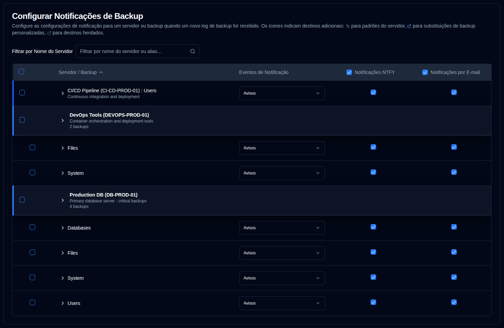
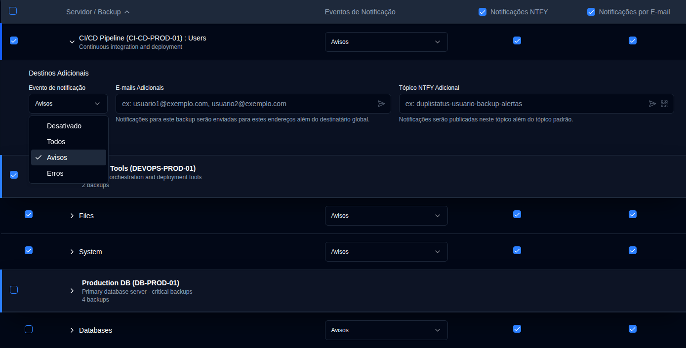

# Notificações de Backup {/* #backup-notifications */}

Use estas configurações para enviar notificações quando um [novo log de backup for recebido](../../installation/duplicati-server-configuration.md).

A tabela de notificações de backup é organizada por servidor. O formato de exibição depende de quantos backups um servidor possui:
- **Múltiplos backups**: Mostra uma linha de cabeçalho do servidor com linhas de backup individuais abaixo dela. Clique no cabeçalho do servidor para expandir ou recolher a lista de backup.
- **Backup único**: Exibe uma **linha mesclada** com borda esquerda azul, mostrando:
  -  **Nome do Servidor : Nome do Backup** se nenhum alias de servidor estiver configurado, ou
  - **Alias do Servidor (Nome do Servidor) : Nome do Backup** se estiver configurado.

Esta página tem um recurso de salvamento automático. Quaisquer alterações que você fizer serão salvas automaticamente.

Quando o **Resumo Diário** está ativado, os e-mails para o destinatário de E-mail padrão são suprimidos. Destinos de e-mail adicionais nesta página continuam recebendo eventos correspondentes. As configurações nesta página são preservadas e tornam-se ativas novamente quando o Resumo Diário é desativado. Veja [Resumo Diário](daily-summary-settings.md).

 

## Filtro {/* #filter */}

Use o campo **Filtrar por Nome do Servidor** na parte superior da página para encontrar rapidamente backups específicos pelo nome do servidor ou alias. A tabela será filtrada automaticamente para mostrar apenas as entradas correspondentes.

 

## Configurar Configurações de Notificação Por-Backup {/* #configure-per-backup-notification-settings */}

| Configuração                 | Descrição                                                 | Valor Padrão  |
| :--------------------------- | :-------------------------------------------------------- | :------------ |
| **Eventos de Notificação**   | Configure quando enviar notificações para novos logs de backup. | **Avisos**      |
| **NTFY**                     | Ative ou desative notificações NTFY para este backup.     | **Habilitado**  |
| **E-mail**                   | Ative ou desative notificações por e-mail para este backup.| **Habilitado**  |

**Opções de Eventos de Notificação:**

- **todos**: Envia notificações para todos os eventos de backup.
- **avisos**: Envia notificações apenas para avisos e erros (padrão).
- **erros**: Envia notificações apenas para erros.
- **desativado**: Desativa notificações para novos logs de backup para este backup.

 

## Destinos Adicionais {/* #additional-destinations */}

Destinos de notificação adicionais permitem que você envie notificações para endereços de e-mail específicos ou tópicos NTFY além das configurações globais. O sistema usa um modelo hierárquico de herança onde backups podem herdar configurações padrão de seu servidor, ou substituí-las com valores específicos de backup.

A configuração de destino adicional é indicada por ícones contextuais ao lado dos nomes de servidores e backups:

- **Ícone de servidor** <IconButton icon="lucide:settings-2" style={{border: 'none', padding: 0, color: 'inherit', background: 'transparent'}} />: Aparece ao lado dos nomes de servidores quando destinos adicionais padrão estão configurados no nível do servidor.

- **Ícone de backup** <IconButton icon="lucide:external-link" style={{border: 'none', padding: 0, color: '#60a5fa', background: 'transparent'}} /> (azul): Aparece ao lado dos nomes de backup quando destinos adicionais personalizados estão configurados (substituindo os padrões do servidor).

- **Ícone de backup** <IconButton icon="lucide:external-link" style={{border: 'none', padding: 0, color: '#64748b', background: 'transparent'}} /> (cinza): Aparece ao lado dos nomes de backup quando o backup está herdando destinos adicionais dos padrões do servidor.

Se nenhum ícone for exibido, o servidor ou backup não tem destinos adicionais configurados.

### Padrões no Nível do Servidor {/* #server-level-defaults */}

Você pode configurar destinos adicionais padrão no nível do servidor que todos os backups nesse servidor herdarão automaticamente.

1. Navegue até [Configurações → Notificações de Backup](backup-notifications-settings.md).
2. A tabela é agrupada por servidor, com linhas de cabeçalho distintas mostrando o nome do servidor, alias e contagem de backups.
   - **Nota**: Para servidores com apenas um backup, uma linha mesclada é exibida em vez de um cabeçalho de servidor separado. Os padrões no nível do servidor não podem ser configurados diretamente a partir de linhas mescladas. Se você precisar configurar padrões de servidor para um servidor com único backup, poderá fazê-lo temporariamente adicionando outro backup a esse servidor, ou os Destinos Adicionais do backup herdarão automaticamente quaisquer padrões de servidor existentes.
3. Clique em qualquer lugar na linha do servidor para expandir a seção **Destinos Adicionais Padrão para este servidor**.
4. Configure as seguintes configurações padrão:
   - **Evento de notificação**: Escolha quais eventos acionam notificações para os destinos adicionais (**todos**, **avisos**, **erros** ou **desativado**).
   - **E-mails Adicionais**: Insira um ou mais endereços de e-mail (separados por vírgula) que receberão notificações para todos os backups neste servidor. Clique no botão de ícone <IconButton icon="lucide:send-horizontal" style={{border: 'none', padding: 0, color: 'inherit', background: 'transparent'}} /> para enviar um e-mail de teste para os endereços no campo.
   - **Tópico NTFY Adicional**: Insira um nome personalizado de tópico NTFY onde as notificações serão publicadas para todos os backups neste servidor. Clique no botão de ícone <IconButton icon="lucide:send-horizontal" style={{border: 'none', padding: 0, color: 'inherit', background: 'transparent'}} /> para enviar uma notificação de teste para o tópico, ou clique no botão de ícone <IconButton icon="lucide:qr-code" style={{border: 'none', padding: 0, color: 'inherit', background: 'transparent'}} /> para exibir um código QR para o tópico e configurar seu dispositivo para receber notificações.

**Gerenciamento de Padrões do Servidor:**

- **Sincronizar para Todos**: Limpa todas as substituições de backup, fazendo com que todos os backups herdem dos padrões do servidor.
- **Limpar Tudo**: Limpa todos os destinos adicionais tanto dos padrões do servidor quanto de todos os backups, mantendo a estrutura de herança.

### Configuração Por Backup {/* #per-backup-configuration */}

Backups individuais herdam automaticamente os padrões do servidor, mas você pode substituí-los para trabalhos de backup específicos.

1. Clique em qualquer lugar na linha de um backup para expandir sua seção **Destinos Adicionais**.
2. Configure as seguintes configurações:
   - **Evento de notificação**: Escolha quais eventos acionam notificações para os destinos adicionais (**todos**, **avisos**, **erros** ou **desativado**).
   - **E-mails Adicionais**: Insira um ou mais endereços de e-mail (separados por vírgula) que receberão notificações além do destinatário global. Clique no botão de ícone <IconButton icon="lucide:send-horizontal" style={{border: 'none', padding: 0, color: 'inherit', background: 'transparent'}} /> para enviar um e-mail de teste para os endereços no campo.
   - **Tópico NTFY Adicional**: Insira um nome personalizado de tópico NTFY onde as notificações serão publicadas além do tópico padrão. Clique no botão de ícone <IconButton icon="lucide:send-horizontal" style={{border: 'none', padding: 0, color: 'inherit', background: 'transparent'}} /> para enviar uma notificação de teste para o tópico, ou clique no botão de ícone <IconButton icon="lucide:qr-code" style={{border: 'none', padding: 0, color: 'inherit', background: 'transparent'}} /> para exibir um código QR para o tópico e configurar seu dispositivo para receber notificações.

**Indicadores de Herança:**

- **Ícone de link** <IconButton icon="lucide:link" style={{border: 'none', padding: 0, color: '#3b82f6', background: 'transparent'}} /> em azul: Indica que o valor é herdado dos padrões do servidor. Clicar no campo criará uma substituição para edição.
- **Ícone de link quebrado** <IconButton icon="lucide:link-2-off" style={{border: 'none', padding: 0, color: '#3b82f6', background: 'transparent'}} /> em azul: Indica que o valor foi substituído. Clique no ícone para reverter à herança.

**Comportamento dos Destinos Adicionais:**

- As notificações são enviadas tanto para as configurações globais quanto para os destinos adicionais quando configuradas.
- A configuração de evento de notificação para destinos adicionais é independente da configuração principal de evento de notificação.
- Se os destinos adicionais estiverem definidos como **desativado**, nenhuma notificação será enviada para esses destinos, mas as notificações principais ainda funcionarão de acordo com as configurações primárias.
- Alertas **Atrasados** contam como um **Aviso** para o filtro de evento de notificação adicional: eles são enviados quando o evento é **todos** ou **avisos**, e não quando é **erros** ou **desativado**. O mesmo filtro se aplica aos tópicos NTFY adicionais.
- Quando um backup herda dos padrões do servidor, quaisquer alterações nos padrões do servidor serão aplicadas automaticamente àquele cópia de segurança (a menos que tenha sido substituída).
- Enquanto o [Resumo Diário](daily-summary-settings.md) estiver habilitado, destinos de e-mail adicionais ainda recebem eventos correspondentes; somente o destinatário de e-mail padrão é suprimido.

 

## Edição em Lote {/* #bulk-edit */}

Você pode editar as configurações de destinos adicionais para múltiplos backups ao mesmo tempo usando o recurso de edição em lote. Isso é particularmente útil quando você precisa aplicar os mesmos destinos adicionais a muitos trabalhos de backup.

1. Navegue até [Configurações → Notificações de Backup](backup-notifications-settings.md).
2. Use as caixas de seleção na primeira coluna para selecionar os backups ou servidores que deseja editar.
   - Use a caixa de seleção na linha do cabeçalho para selecionar ou desmarcar todos os backups visíveis.
   - Você pode usar o filtro para reduzir a lista antes de selecionar.
3. Após selecionar os backups, uma barra de ações em lote aparecerá mostrando o número de backups selecionados.
4. Clique em **Edição em Lote** para abrir o diálogo de edição.
5. Configure as configurações de destino adicionais:
   - **Evento de notificação**: Defina o evento de notificação para todos os backups selecionados.
   - **E-mails Adicionais**: Digite endereços de e-mail (separados por vírgula) para aplicar a todos os backups selecionados.
   - **Tópico NTFY Adicional**: Digite um nome de tópico NTFY para aplicar a todos os backups selecionados.
   - Botões de teste estão disponíveis no diálogo de edição em lote para verificar endereços de e-mail e tópicos NTFY antes de aplicar a múltiplos backups.
6. Clique em **Salvar** para aplicar as configurações a todos os backups selecionados.

**Limpar em Lote:**

Para remover todas as configurações de destino adicionais dos backups selecionados:

1. Selecione os backups que deseja limpar.
2. Clique em **Limpar em Lote** na barra de ações em lote.
3. Confirme a ação na caixa de diálogo.

Isso removerá todos os endereços de e-mail adicionais, tópicos NTFY e evento de notificação para os backups selecionados. Após a limpeza, os backups voltarão a herdar dos padrões do servidor (se houver algum configurado).

 
