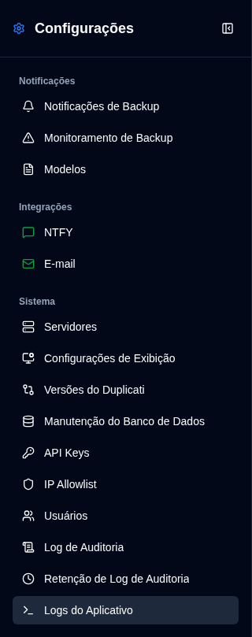

# Resumo Diário {#daily-summary}

O Resumo Diário é um modo de notificação opcional que envia **um** instantâneo localizado de todos os trabalhos de backup conhecidos em um horário exato. Enquanto estiver habilitado, as mensagens de e-mail individuais de backup e atrasados, bem como as notificações NTFY adicionais, são pausadas, incluindo destinos adicionais por trabalho. Essas configurações são armazenadas e se tornam ativas novamente assim que o Resumo Diário for desativado.

O instantâneo é o **status atual** no momento do envio (o último resultado para cada trabalho). Não é um histórico das execuções do dia anterior.

## Requisitos {#requirements}

- O SMTP deve estar configurado. O e-mail é sempre enviado uma vez para o destinatário SMTP.
- O serviço cron deve estar em execução. O despachante verifica a cada minuto em UTC.
- A entrega opcional via NTFY também requer configurações válidas de NTFY armazenadas.

## O que está incluído {#what-is-included}

Os trabalhos conhecidos são a união de:

- o último backup observado para cada servidor e nome de backup
- configurações explícitas por trabalho cujos servidores ainda existem

Um trabalho configurado que nunca enviou um relatório é rotulado como **Nenhum relatório recebido**. Os buckets de status (Sucesso, Aviso, Erro, Fatal, Desconhecido, Nenhum relatório recebido) são mutuamente exclusivos e somam ao número de trabalhos. **Atrasado** é contado separadamente: um trabalho bem-sucedido atrasado ainda é Sucesso e também está atrasado.

## Agendamento {#schedule}

Escolha um horário exato `HH:mm` e salve o fuso horário IANA do navegador. O fuso horário salvo fica visível e não é substituído quando outro navegador abre as Configurações.

- Habilitar ou alterar o agendamento começa na **próxima ocorrência futura**, nunca um envio surpresa imediato.
- Reiniciar mais tarde no mesmo dia local ainda captura após o horário configurado.
- Dias completamente perdidos não são reproduzidos.
- Horários perdidos no horário de verão são executados no primeiro minuto válido após o intervalo. Horas repetidas no horário de inverno são enviadas uma vez.

## Comportamento de substituição {#replacement-behaviour}

Quando o Resumo Diário está ativado:

- o upload e os e-mails/NTFY de atraso não são enviados
- os carimbos de data/hora de atraso não são avançados, então os alertas de atraso podem ser retomados imediatamente quando o modo for desativado
- a visualização do modelo, testes de transporte e **Enviar resumo agora** ainda funcionam

**Enviar resumo agora** é uma entrega extra. Ele não consome a próxima ocorrência agendada.

## Modelos {#templates}

Edite o e-mail do Resumo Diário (Markdown) e os modelos compactos do NTFY em [Configurações → Modelos](/user-guide/settings/notification-templates). Os corpos de e-mail para Sucesso, Aviso/Erro, Atrasado e Resumo Diário todos usam Markdown.

**Gerar visualização** nesta página abre uma caixa de diálogo com a captura atual. O E-mail HTML segue o tema claro ou escuro atual.
