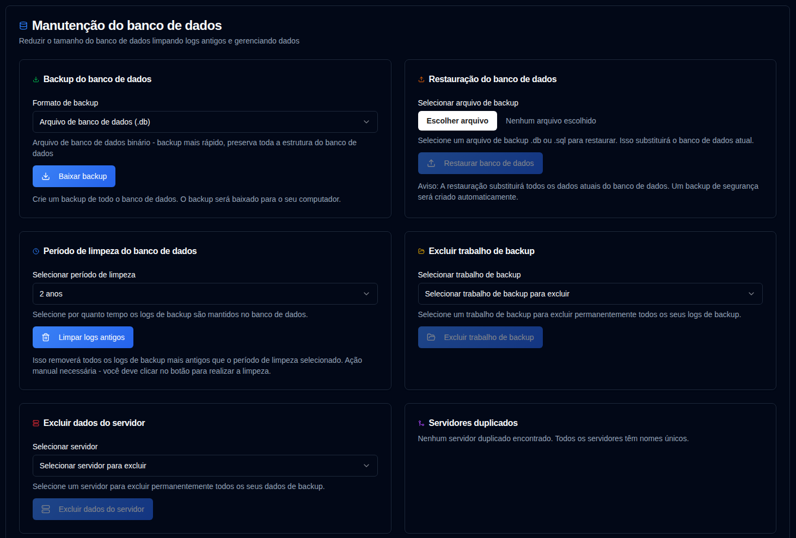

# Manutenção do banco de dados {#database-maintenance}

Gerencie seus dados de backup e otimize o desempenho através de operações de manutenção do banco de dados.

 

## Backup do banco de dados {#database-backup}

Crie um backup de todo o seu banco de dados para salvaguarda ou fins de migração.

1.  Navegue para [Configurações → Manutenção do banco de dados](database-maintenance.md).
2.  Na seção **Backup do banco de dados**, selecione um formato de backup:
    - **Arquivo de banco de dados (.db)**: Formato binário - backup mais rápido, preserva exatamente toda a estrutura do banco de dados
    - **Dump SQL (.sql)**: Formato de texto - instruções SQL legíveis por humanos, podem ser editadas antes da restauração
3.  Clique em <IconButton icon="lucide:download" label="Baixar backup" />.
4.  O arquivo de backup será baixado para seu computador com um nome de arquivo com timestamp.

**Formatos de Backup:**

- **.db format**: Recomendado para backups regulares. Cria uma cópia exata do arquivo de banco de dados usando a API de backup do SQLite, garantindo consistência mesmo enquanto o banco de dados está em uso.
- **.sql format**: Útil para migração, inspeção ou quando você precisa editar os dados antes de restaurar. Contém todas as instruções SQL necessárias para recriar o banco de dados.

**Melhores Práticas:**

- Crie backups regulares antes de operações importantes (limpeza, mesclagem, etc.)
- Armazene backups em um local seguro separado da aplicação
- Teste procedimentos de restauração periodicamente para garantir que os backups sejam válidos

 

## Restauração do banco de dados {#database-restore}

Restaure seu banco de dados a partir de um arquivo de backup criado anteriormente.

1.  Navegue para [Configurações → Manutenção do banco de dados](database-maintenance.md).
2.  Na seção **Restauração do banco de dados**, clique na entrada de arquivo e selecione um arquivo de backup:
    - Formatos suportados: `.db`, `.sql`, `.sqlite`, `.sqlite3`
    - Tamanho máximo de arquivo: 100MB
3.  Clique em <IconButton icon="lucide:upload" label="Restaurar banco de dados" />.
4.  Confirme a ação na caixa de diálogo.

**Processo de Restauração:**

- Um backup de segurança do banco de dados atual é criado automaticamente antes da restauração
- O banco de dados atual é substituído pelo arquivo de backup
- Todas as sessões são limpas por segurança (usuários devem entrar novamente)
- A integridade do banco de dados é verificada após a restauração
- Todos os caches são limpos para garantir dados atualizados

**Formatos de Restauração:**

- **Arquivos .db**: O arquivo de banco de dados é substituído diretamente. Método de restauração mais rápido.
- **Arquivos .sql**: As instruções SQL são executadas para recriar o banco de dados. Permite restauração seletiva, se necessário.

:::warning
Restaurar um banco de dados **substituirá todos os dados atuais**. Esta ação não pode ser desfeita.  
Um backup de segurança é criado automaticamente, mas é recomendado criar seu próprio backup antes de restaurar.
 
**Importante:** Após a restauração, todas as sessões de usuário são limpas por segurança. Você precisará fazer login novamente.
:::

**Solução de problemas:**

- Se a restauração falhar, o banco de dados original é automaticamente restaurado a partir do backup de segurança
- Certifique-se de que o arquivo de backup não está corrompido e corresponde ao formato esperado
- Para bancos de dados grandes, o processo de restauração pode levar vários minutos

 

---

 

:::note
Isto se aplica a todas as funções de manutenção abaixo: todas as estatísticas no painel, páginas de detalhes e gráficos são calculadas usando dados do banco de dados **duplistatus**. Excluir informações antigas afetará esses cálculos.

Se você excluir dados acidentalmente, poderá restaurá-los usando o recurso [Coletar logs de backup](../collect-backup-logs.md).
:::

 

## Período de Limpeza de Dados {#data-cleanup-period}

Remova registros de backup desatualizados para liberar espaço de armazenamento e melhorar o desempenho do sistema.

1.  Navegue para [Configurações → Manutenção do banco de dados](database-maintenance.md).
2.  Escolha um período de retenção:
    - **6 meses**: Reter registros dos últimos 6 meses.
    - **1 ano**: Reter registros do último ano.
    - **2 anos**: Reter registros dos últimos 2 anos (padrão).
    - **Excluir todos os dados**: Remover todos os registros de backup e servidores. 
3.  Clique em <IconButton icon="lucide:trash-2" label="Limpar logs antigos" />.
4.  Confirme a ação na caixa de diálogo.

**Efeitos de Limpeza:**

- Deleta registros de backup mais antigos que o período selecionado
- Atualiza todas as Estatísticas e Métricas relacionadas

:::warning

Selecionar a opção "Excluir todos os dados" irá **remover permanentemente todos os registros de backup e configurações do sistema**.

É fortemente recomendado criar um backup do banco de dados antes de prosseguir com esta ação.

:::

 

## Excluir trabalho de backup {#delete-backup-job-data}

Remover dados de um Backup Job (tipo) específico.

1.  Navegue para [Configurações → Manutenção do banco de dados](database-maintenance.md).
2.  Selecione um trabalho de backup na lista suspensa.
    - Os backups serão ordenados por apelido do servidor ou nome, depois pelo nome do backup.
3.  Clique em <IconButton icon="lucide:folder-open" label="Excluir trabalho de backup" />.
4.  Confirme a ação na caixa de diálogo.

**Efeitos da Exclusão:**

- Exclui permanentemente todos os dados associados a este Backup Job / Servidor.
- Limpa as configurações associadas.
- Atualiza as estatísticas do painel de acordo.

 

## Excluir dados do servidor {#delete-server-data}

Remover um servidor específico e todos os seus dados de backup associados.

1.  Navegue para [Configurações → Manutenção do banco de dados](database-maintenance.md).
2.  Selecione um servidor na lista suspensa.
3.  Clique em <IconButton icon="lucide:server" label="Excluir dados do servidor" />.
4.  Confirme a ação na caixa de diálogo.

**Efeitos da Exclusão:**

- Exclui permanentemente o servidor selecionado e todos os seus registros de backup
- Limpa as configurações associadas
- Atualiza as estatísticas do painel de acordo

 

## Mesclar servidores duplicados {#merge-duplicate-servers}

Detectar e mesclar servidores duplicados que têm o mesmo nome, mas IDs diferentes. Use este recurso para consolidá-los em uma única entrada de servidor.

Isso pode ocorrer quando o `machine-id` do Duplicati muda após uma atualização ou reinstalação. Servidores duplicados são exibidos apenas quando existem. Se nenhum duplicado for detectado, a seção exibirá uma mensagem indicando que todos os servidores têm nomes únicos.

1.  Navegue para [Configurações → Manutenção do banco de dados](database-maintenance.md).
2.  Se servidores duplicados forem detectados, uma seção **Mesclar servidores duplicados** aparecerá.
3.  Revise a lista de grupos de servidores duplicados:
    - Cada grupo mostra servidores com o mesmo nome, mas IDs diferentes
    - O **Servidor de destino** (mais recente pela data de criação) é destacado
    - **IDs de servidores antigos** que serão mesclados são listados separadamente
4.  Selecione os grupos de servidores que deseja mesclar marcando a caixa de seleção ao lado de cada grupo.
5.  Clique em <IconButton icon="lucide:git-merge" label="Mesclar servidores selecionados" />.
6.  Confirme a ação na caixa de diálogo.

**Processo de Mesclagem:**

- Todos os IDs de servidor antigos são mesclados no servidor de destino (mais recente pela data de criação)
- Todos os registros de backup e configurações são transferidos para o servidor de destino
- As entradas do servidor antigo são deletadas
- As estatísticas do painel são atualizadas automaticamente

:::info[IMPORTANTE]
Esta ação não pode ser desfeita. Um backup do banco de dados é recomendado antes de confirmar.  
:::

 
