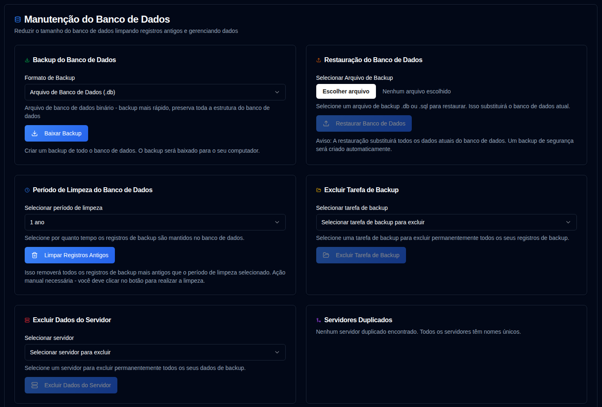

# Manutenção do Banco de Dados {/* #database-maintenance */}

Gerencie seus dados de backup e otimize o desempenho por meio de operações de manutenção do banco de dados.

 

## Backup do Banco de Dados {/* #database-backup */}

Crie um backup de todo o seu banco de dados para fins de armazenamento seguro ou migração.

1.  Navegue até [Configurações → Manutenção do Banco de Dados](database-maintenance.md).
2.  Na seção **Backup do Banco de Dados**, selecione um formato de backup:
    - **Arquivo de Banco de Dados (.db)**: Formato binário - backup mais rápido, preserva toda a estrutura do banco de dados exatamente
    - **Despejo SQL (.sql)**: Formato de texto - instruções SQL legíveis por humanos, podem ser editadas antes da restauração
3.  Clique em <IconButton icon="lucide:download" label="Baixar Backup" />.
4.  O arquivo de backup será baixado para o seu computador com um nome de arquivo com carimbo de data/hora.

**Formatos de Backup:**

- **Formato .db**: Recomendado para backups regulares. Cria uma cópia exata do arquivo do banco de dados usando a API de backup do SQLite, garantindo consistência mesmo enquanto o banco de dados está em uso.
- **Formato .sql**: Útil para migração, inspeção ou quando você precisa editar os dados antes de restaurar. Contém todas as instruções SQL necessárias para recriar o banco de dados.

**Práticas Recomendadas:**

- Crie backups regulares antes de operações importantes (limpeza, mesclagem, etc.)
- Armazene backups em um local seguro separado da aplicação
- Teste os procedimentos de restauração periodicamente para garantir que os backups sejam válidos

 

## Restauração do Banco de Dados {/* #database-restore */}

Restaure seu banco de dados a partir de um arquivo de backup previamente criado.

1.  Navegue até [Configurações → Manutenção do Banco de Dados](database-maintenance.md).
2.  Na seção **Restauração do Banco de Dados**, clique no campo de entrada de arquivo e selecione um arquivo de backup:
    - Formatos suportados: `.db`, `.sql`, `.sqlite`, `.sqlite3`
    - Tamanho máximo do arquivo: 100MB
3.  Clique em <IconButton icon="lucide:upload" label="Restaurar Banco de Dados" />.
4.  Confirme a ação na caixa de diálogo.

**Processo de Restauração:**

- Um backup de segurança do banco de dados atual é criado automaticamente antes da restauração
- O banco de dados atual é substituído pelo arquivo de backup
- Todas as sessões são limpas por segurança (os usuários devem fazer login novamente)
- A integridade do banco de dados é verificada após a restauração
- Todos os caches são limpos para garantir dados recentes

**Formatos de Restauração:**

- **Arquivos .db**: O arquivo do banco de dados é substituído diretamente. Método de restauração mais rápido.
- **Arquivos .sql**: As instruções SQL são executadas para recriar o banco de dados. Permite restauração seletiva, se necessário.

:::warning
Restaurar um banco de dados **substituirá todos os dados atuais**. Esta ação não pode ser desfeita.  
Um backup de segurança é criado automaticamente, mas é recomendado criar seu próprio backup antes de restaurar.
 
**Importante:** Após a restauração, todas as sessões de usuário são limpas por segurança. Você precisará fazer login novamente.
:::

**Solução de Problemas:**

- Se a restauração falhar, o banco de dados original é automaticamente restaurado do backup de segurança
- Certifique-se de que o arquivo de backup não está corrompido e corresponde ao formato esperado
- Para bancos de dados grandes, o processo de restauração pode levar vários minutos

 

---

 

:::note
Isso se aplica a todas as funções de manutenção abaixo: todas as estatísticas no painel, páginas de detalhes e gráficos são calculadas usando dados do banco de dados **duplistatus**. Excluir informações antigas afetará esses cálculos.
 
Se você excluir dados acidentalmente, pode restaurá-los usando o recurso [Coletar Logs de Backup](../collect-backup-logs.md).
:::

O serviço cron também **compacta** o banco de dados todo Domingo às 04:00 UTC. Essa execução exclui linhas de backup cujos servidores não existem mais, linhas de servidor sem relatórios de backup restantes, configurações de Monitoramento de Backup e notificações de atraso, linhas antigas de entrega de Resumo Diário e executa SQLite `VACUUM` para recuperar espaço em disco. Excluir um servidor ou tarefa de backup ainda limpa as configurações correspondentes imediatamente.

 

## Período de Limpeza de Dados {/* #data-cleanup-period */}

Remova registros de backup desatualizados para liberar espaço de armazenamento e melhorar o desempenho do sistema.

1.  Navegue até [Configurações → Manutenção do Banco de Dados](database-maintenance.md).
2.  Escolha um período de retenção:
    - **6 meses**: Reter registros dos últimos 6 meses.
    - **1 ano**: Reter registros do último ano.
    - **2 anos**: Reter registros dos últimos 2 anos (padrão).
    - **Excluir todos os dados**: Remover todos os registros de backup e servidores. 
3.  Clique em <IconButton icon="lucide:trash-2" label="Limpar Registros Antigos" />.
4.  Confirme a ação na caixa de diálogo.

**Efeitos da Limpeza:**

- Exclui registros de backup mais antigos que o período selecionado
- Atualiza todas as estatísticas e métricas relacionadas

:::warning

Selecionar a opção "Excluir todos os dados" **removerá permanentemente todos os registros de backup e configurações do sistema**.

É altamente recomendável criar um backup do banco de dados antes de prosseguir com esta ação.

:::

 

## Excluir Dados da Tarefa de Backup {/* #delete-backup-job-data */}

Remova os dados de uma Tarefa de Backup (tipo) específica.

1.  Navegue até [Configurações → Manutenção do Banco de Dados](database-maintenance.md).
2.  Selecione uma Tarefa de Backup na lista suspensa.
    - Os backups serão ordenados pelo alias ou nome do servidor, em seguida, pelo nome do backup.
3.  Clique em <IconButton icon="lucide:folder-open" label="Excluir Tarefa de Backup" />.
4.  Confirme a ação na caixa de diálogo.

**Efeitos da Exclusão:**

- Exclui permanentemente todos os dados associados a esta Tarefa de Backup / Servidor.
- Limpa as configurações associadas.
- Atualiza as estatísticas do painel conforme necessário.

 

## Excluir Dados do Servidor {/* #delete-server-data */}

Remova um servidor específico e todos os dados de backup associados.

1.  Navegue até [Configurações → Manutenção do Banco de Dados](database-maintenance.md).
2.  Selecione um servidor na lista suspensa.
3.  Clique em <IconButton icon="lucide:server" label="Excluir Dados do Servidor" />.
4.  Confirme a ação na caixa de diálogo.

**Efeitos da Exclusão:**

- Exclui permanentemente o servidor selecionado e todos os seus registros de backup
- Limpa as configurações associadas
- Atualiza as estatísticas do painel conforme necessário

 

## Mesclar Servidores Duplicados {/* #merge-duplicate-servers */}

Detecte e mescle servidores duplicados que tenham o mesmo nome, mas IDs diferentes. Use este recurso para consolidá-los em uma única entrada de servidor.

Isso pode ocorrer quando o `machine-id` do Duplicati muda após uma atualização ou reinstalação. Servidores duplicados são mostrados apenas quando existem. Se nenhum duplicado for detectado, a seção exibirá uma mensagem indicando que todos os servidores têm nomes únicos.

1.  Navegue até [Configurações → Manutenção do Banco de Dados](database-maintenance.md).
2.  Se servidores duplicados forem detectados, uma seção **Mesclar Servidores Duplicados** aparecerá.
3.  Revise a lista de grupos de servidores duplicados:
    - Cada grupo mostra servidores com o mesmo nome, mas IDs diferentes
    - O **Servidor de Destino** (mais recente pela data de criação) é destacado
    - Os **IDs de Servidores Antigos** que serão mesclados são listados separadamente
4.  Selecione os grupos de servidores que deseja mesclar marcando a caixa de seleção ao lado de cada grupo.
5.  Clique em <IconButton icon="lucide:git-merge" label="Mesclar Servidores Selecionados" />.
6.  Confirme a ação na caixa de diálogo.

**Processo de Mesclagem:**

- Todos os IDs de servidores antigos são mesclados no servidor de destino (mais recente pela data de criação)
- Todos os registros de backup e configurações são transferidos para o servidor de destino
- Valores duplicados de `backup_id` para o mesmo nome de backup são consolidados em um único ID (a linha de backup mais recente vence)
- As entradas de servidores antigos são excluídas
- As estatísticas do painel são atualizadas automaticamente

:::info[IMPORTANTE]
Esta ação não pode ser desfeita. É recomendado fazer um backup do banco de dados antes de confirmar.
:::

 
