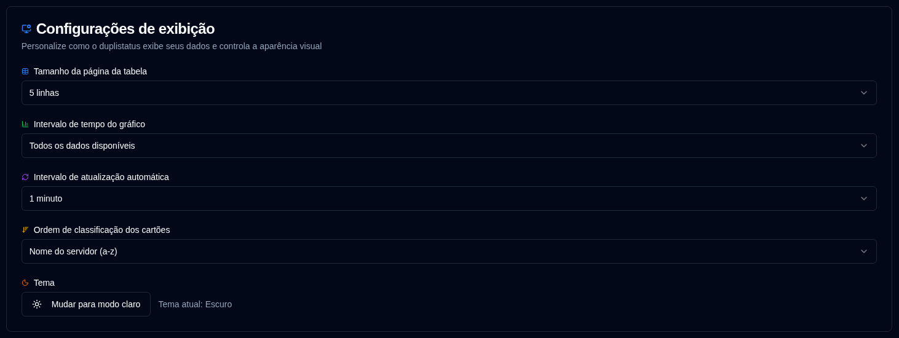

# Exibição {#display}

Configurar preferências de interface do usuário e exibição.

 

| Configuração                    | Descrição                                           | Valor padrão        |
| :------------------------------ | :-------------------------------------------------- | :------------------ |
| **Tamanho da tabela**           | Número de linhas por página na página de detalhes do servidor. | 5 linhas            |
| **Intervalo de tempo do gráfico** | Intervalo de tempo mostrado nos gráficos.          | Todos os dados disponíveis |
| **Intervalo de atualização automática** | Com que frequência as páginas são atualizadas automaticamente. | 1 minuto            |
| **Ordem de classificação dos cartões** | Como os cartões são classificados no painel.       | `Nome do servidor (a-z)` |
| **Tema**                        | Selecionar o tema claro ou escuro.                  | Escuro              |

 

:::tip
**Acesso Rápido**: Você pode acessar rapidamente esta página clicando com o botão direito no botão de atualização automática na barra de ferramentas da aplicação.
:::
