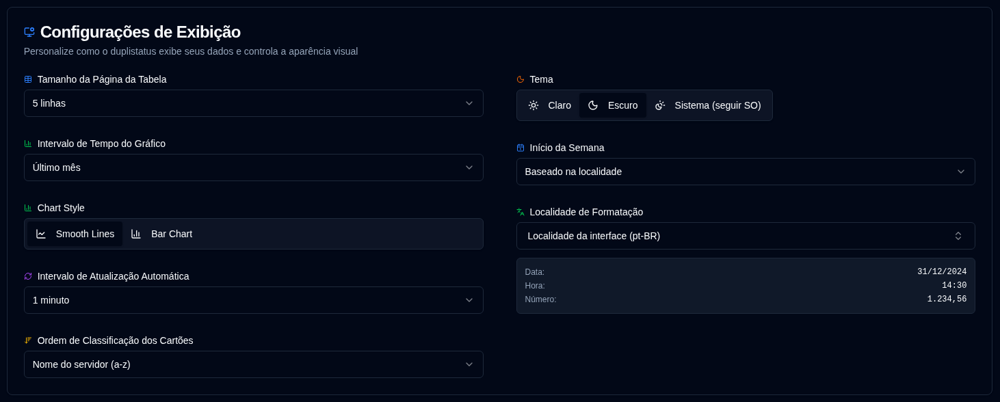

# Exibição {#display}

Configurar preferências de interface do usuário e exibição.

 

| Configuração                   | Descrição                                         | Valor Padrão      |
|:------------------------------|:--------------------------------------------------|:------------------|
| **Tamanho da Tabela**            | Número de linhas por página na página de detalhes do servidor. | 5 linhas             |
| **Intervalo de Tempo do Gráfico**      | Intervalo de tempo exibido nos gráficos.                  | Todos os dados disponíveis |
| **Intervalo de atualização automática** | Com que frequência as páginas são atualizadas automaticamente.              | 1 minuto           |
| **Ordem de classificação dos cartões**      | A forma como os cartões são classificados no painel.              | Nome do servidor (a-z)  |
| **Início da semana**         | Configurar quando a semana começa.                     | Baseado na localidade    |
| **Tema**                 | Escolha claro, escuro ou corresponda à aparência do seu sistema operacional (preferência de modo claro/escuro). | Seguir SO quando não definido |

 

:::tip
**Acesso Rápido**: Você pode acessar rapidamente esta página clicando com o botão direito no botão de atualização automática na barra de ferramentas da aplicação.
:::
