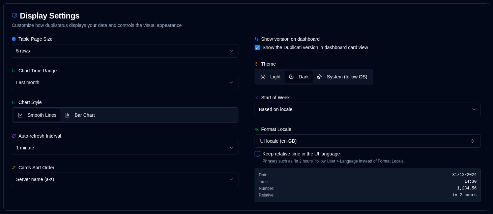

# Exibição {#display}

Configurar preferências de interface do usuário e exibição.

 

| Configuração                   | Descrição                                         | Valor Padrão      |
|:------------------------------|:--------------------------------------------------|:------------------|
| **Tamanho da Tabela**            | Número de linhas por página na página de detalhes do servidor. | 5 linhas             |
| **Mostrar versão no painel** | Mostrar ou ocultar a versão do Duplicati nos cards do painel. A tabela do painel sempre mostra a coluna Versão. Também disponível em [Versões do Duplicati](duplicati-versions.md). | Em |
| **Tema**                 | Escolha claro, escuro ou corresponda à aparência do seu sistema operacional (preferência de modo claro/escuro). | Seguir SO quando não definido |
| **Intervalo de Tempo do Gráfico**      | Intervalo de tempo mostrado nos gráficos. Opções disponíveis: **1W** (últimos 7 dias), **2W** (últimos 14 dias), **1M** (últimos 30 dias), **3M** (últimos 90 dias). Você também pode alternar o intervalo de tempo diretamente nos cabeçalhos dos gráficos. | 1 mês            |
| **Estilo do Gráfico**           | Escolha entre gráficos de linhas suaves ou visualização de Gráfico de Barras. Ambos os modos usam agregação por intervalos de tempo para exibição ideal. Você também pode alternar diretamente nos cabeçalhos dos gráficos. | Linhas suaves       |
| **Localidade de Formatação**         | Selecione uma localidade de formatação independente do idioma da interface do usuário (416 localidades suportadas). Isso afeta como datas, horas e números são exibidos. Frases de tempo relativo (por exemplo, "em 2 horas") seguem a Localidade de Formatação, a menos que **Manter tempo relativo na linguagem da interface** esteja habilitado. Uma visualização em tempo real inclui amostras de data, hora, número e tempo relativo. Exemplo: Idioma da interface = Alemão, Localidade de formatação = Inglês (Reino Unido) → Interface em Alemão com formatos de data do Reino Unido. | Baseado no idioma da interface |
| **Manter tempo relativo na linguagem da interface** | Quando habilitado, frases como "em 2 horas" seguem **Usuário → Idioma** em vez da Localidade de Formatação. Datas, horas e números ainda usam a Localidade de Formatação. Desativado por padrão. | Desativado |
| **Intervalo de atualização automática** | Com que frequência as páginas são atualizadas automaticamente.              | 1 minuto           |
| **Ordem de classificação dos cartões**      | A forma como os cartões são classificados no painel.              | Nome do servidor (a-z)  |
| **Início da semana**         | Configurar quando a semana começa.                     | Baseado na localidade    |

 

:::tip
**Acesso Rápido**: Você pode acessar rapidamente esta página clicando com o botão direito no botão de atualização automática na barra de ferramentas da aplicação.
:::
