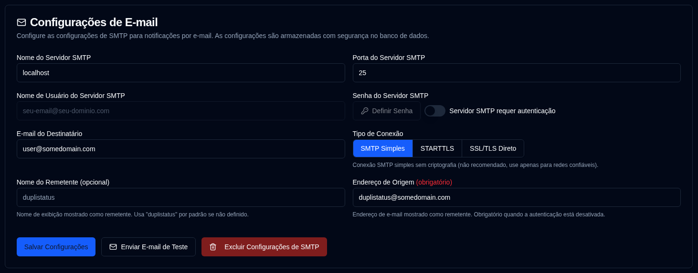

# E-mail {#email}

**duplistatus** oferece suporte ao envio de notificações por e-mail via SMTP como alternativa ou complemento às notificações NTFY. A configuração de e-mail agora é gerenciada através da interface web com armazenamento criptografado no banco de dados para maior segurança.

| Configuração                 | Descrição                                                      |
|:------------------------|:-----------------------------------------------------------------|
| **Nome do host do servidor SMTP**    | Servidor SMTP do seu provedor de e-mail (por exemplo, `smtp.gmail.com`).      |
| **Porta do servidor SMTP**    | Número da porta (normalmente `25` para SMTP Puro, `587` para STARTTLS ou `465` para SSL/TLS Direto). |
| **Tipo de Conexão**     | Selecione entre SMTP Puro, STARTTLS ou SSL/TLS Direto. O padrão é SSL/TLS Direto para novas configurações. |
| **Autenticação SMTP** | Alternar para habilitar ou desativar a autenticação SMTP. Quando desativada, os campos de nome de usuário e senha não são obrigatórios. |
| **Nome de usuário SMTP**       | Seu endereço de e-mail ou nome de usuário (obrigatório quando a autenticação está habilitada). |
| **Senha SMTP**       | Sua senha de e-mail ou senha específica para aplicativos (obrigatória quando a autenticação está habilitada). |
| **Nome do remetente**         | Nome exibido como remetente nas notificações por e-mail (opcional, padrão é "duplistatus"). |
| **Endereço de origem**        | Endereço de e-mail exibido como remetente. Obrigatório para conexões SMTP Puro ou quando a autenticação está desativada. O padrão é o nome de usuário SMTP quando a autenticação está habilitada. Observe que alguns provedores de e-mail substituirão o `From Address` pelo `SMTP Server Username`. |
| **E-mail do destinatário**     | O endereço de e-mail que receberá as notificações. Deve estar em formato válido de endereço de e-mail. |

Um ícone <IIcon2 icon="lucide:mail" color="green"/> verde ao lado de **E-mail** na barra lateral significa que suas configurações são válidas. Se o ícone for <IIcon2 icon="lucide:mail" color="yellow"/> amarelo, suas configurações não são válidas ou não estão configuradas.

O ícone fica verde quando todos os campos obrigatórios estão definidos: Host do servidor SMTP, Porta do servidor SMTP, E-mail do destinatário, e (Nome de usuário SMTP + Senha quando a autenticação é obrigatória) ou (Endereço do remetente quando a autenticação não é obrigatória).

Quando a configuração não está totalmente configurada, uma caixa de alerta amarela é exibida informando que nenhum e-mail será enviado até que as configurações de e-mail sejam preenchidas corretamente. As caixas de seleção de E-mail na aba [Notificações de backup](backup-notifications-settings.md) também ficarão acinzentadas e mostrarão rótulos "(Desabilitado)".

 

## Ações Disponíveis {#available-actions}

| Botão                                                           | Descrição                                              |
|:-----------------------------------------------------------------|:---------------------------------------------------------|
| <IconButton label="Salvar Configurações" />                             | Salva as alterações feitas nas configurações do NTFY.              |
| <IconButton icon="lucide:mail" label="Enviar E-mail de Teste"/>         | Envia uma mensagem de e-mail de teste usando a configuração SMTP. O e-mail de teste exibe o nome do host do servidor SMTP, porta, tipo de conexão, status de autenticação, nome de usuário (se aplicável), e-mail do destinatário, endereço de origem, nome do remetente e carimbo de data/hora do teste. |
| <IconButton icon="lucide:trash-2" label="Excluir Configurações SMTP"/> | Excluir / Limpar a configuração SMTP.                   |

 

:::info[IMPORTANT]
  Você deve usar o botão <IconButton icon="lucide:mail" label="Enviar e-mail de teste"/> para garantir que sua configuração de e-mail funcione antes de confiar nela para notificações.

 Mesmo que você veja um ícone <IIcon2 icon="lucide:mail" color="green"/> verde e tudo pareça configurado, os e-mails podem não ser enviados.
 
 **duplistatus** apenas verifica se suas configurações de SMTP estão preenchidas, não se os e-mails podem realmente ser entregues.
:::

 

## Provedores SMTP Comuns {#common-smtp-providers}

**Gmail:**

- Host: `smtp.gmail.com`
- Porta: `587` (STARTTLS) ou `465` (SSL/TLS Direto)
- Tipo de Conexão: STARTTLS para a porta 587, SSL/TLS Direto para a porta 465
- Nome de usuário: Seu endereço Gmail
- Senha: Use uma Senha de Aplicativo (não sua senha regular). Gere uma em https://myaccount.google.com/apppasswords
- Autenticação: Obrigatória

**Outlook/Hotmail:**

- Host: `smtp-mail.outlook.com`
- Porta: `587`
- Tipo de Conexão: STARTTLS
- Nome de usuário: Seu endereço de e-mail do Outlook
- Senha: Sua senha da conta
- Autenticação: Obrigatória

**Yahoo Mail:**

- Host: `smtp.mail.yahoo.com`
- Porta: `587`
- Tipo de Conexão: STARTTLS
- Nome de usuário: Seu endereço de e-mail do Yahoo
- Senha: Use uma Senha de Aplicativo
- Autenticação: Obrigatória

### Práticas Recomendadas de Segurança {#security-best-practices}

- Considere usar uma conta de e-mail dedicada para notificações
 - Teste sua configuração usando o botão "Enviar E-mail de Teste"
 - As configurações são criptografadas e armazenadas com segurança no banco de dados
 - **Use conexões criptografadas** - STARTTLS e SSL/TLS Direto são recomendados para uso em produção
 - Conexões SMTP Puro (porta 25) estão disponíveis para redes locais confiáveis, mas não são recomendadas para uso em produção em redes não confiáveis
