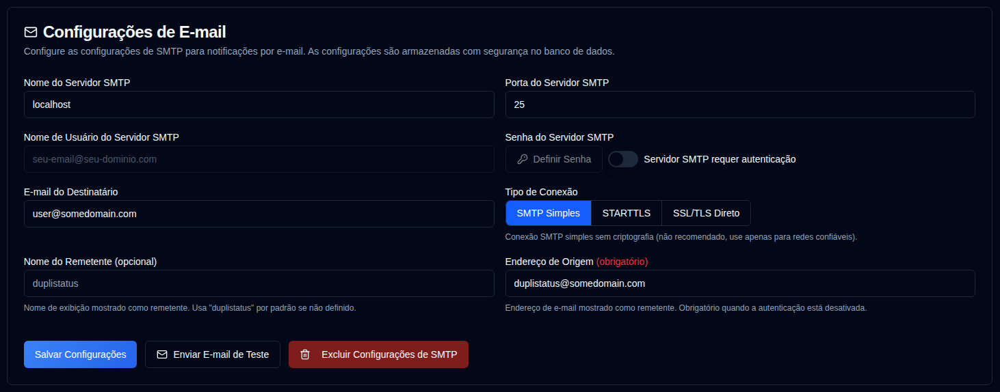

# E-mail {/* #email */}

**duplistatus** suporta o envio de notificações por e-mail via SMTP como alternativa ou complemento às notificações NTFY. A configuração de e-mail agora é gerenciada através da interface web com armazenamento criptografado no banco de dados para maior segurança.

| Configuração            | Descrição                                                        |
|:------------------------|:-----------------------------------------------------------------|
| **Servidor SMTP**       | Servidor SMTP do seu provedor de e-mail (por exemplo, `smtp.gmail.com`).|
| **Porta do Servidor SMTP** | Número da porta (normalmente `25` para SMTP Simples, `587` para STARTTLS ou `465` para SSL/TLS Direto). |
| **Tipo de Conexão**     | Selecione entre SMTP Simples, STARTTLS ou SSL/TLS Direto. O padrão é SSL/TLS Direto para novas configurações. |
| **Autenticação SMTP**   | Alternar para ativar ou desativar a autenticação SMTP. Quando desativada, os campos de nome de usuário e senha não são obrigatórios. |
| **Nome de Usuário SMTP**| Seu endereço de e-mail ou nome de usuário (obrigatório quando a autenticação está ativada). |
| **Senha SMTP**          | Sua senha de e-mail ou senha específica do aplicativo (obrigatória quando a autenticação está ativada). |
| **Nome do Remetente**   | Nome de exibição mostrado como remetente nas notificações por e-mail (opcional, o padrão é "duplistatus"). |
| **Endereço de Origem**  | Endereço de e-mail mostrado como remetente. Obrigatório para conexões SMTP Simples ou quando a autenticação está desativada. O padrão é o nome de usuário SMTP quando a autenticação está ativada. Observe que alguns provedores de e-mail substituirão o `From Address` pelo `SMTP Server Username`. |
| **E-mail do Destinatário** | O endereço de e-mail para receber notificações. Deve estar em formato válido de endereço de e-mail. |

Um ícone <IIcon2 icon="lucide:mail" color="green"/> verde ao lado de **E-mail** na barra lateral significa que suas configurações são válidas. Se o ícone estiver <IIcon2 icon="lucide:mail" color="yellow"/> amarelo, suas configurações não são válidas ou não estão configuradas.

O ícone fica verde quando todos os campos obrigatórios estão definidos: Servidor SMTP, Porta do Servidor SMTP, E-mail do Destinatário e (Nome de Usuário SMTP + Senha quando a autenticação é necessária) ou (Endereço de Origem quando a autenticação não é necessária).

Quando a configuração não está totalmente configurada, uma caixa de alerta amarela é exibida informando que nenhum e-mail será enviado até que as configurações de e-mail sejam preenchidas corretamente. As caixas de seleção de E-mail na aba [Notificações de Backup](backup-notifications-settings.md) também serão desativadas e mostrarão rótulos "(desativado)".

 

## Ações Disponíveis {/* #available-actions */}

| Botão                                                            | Descrição                                                |
|:-----------------------------------------------------------------|:---------------------------------------------------------|
| <IconButton label="Salvar Configurações" />                             | Salva as alterações feitas nas configurações NTFY.       |
| <IconButton icon="lucide:mail" label="Enviar E-mail de Teste"/>         | Envia uma mensagem de teste por e-mail usando a configuração SMTP. O e-mail de teste exibe o nome do servidor SMTP, porta, tipo de conexão, status de autenticação, nome de usuário (se aplicável), e-mail do destinatário, endereço de origem, nome do remetente e timestamp do teste. |
| <IconButton icon="lucide:trash-2" label="Excluir Configurações SMTP"/> | Excluir / Limpar a configuração SMTP. Desativado enquanto o [Resumo Diário](daily-summary-settings.md) estiver ativado, porque esse modo requer e-mail. |

 

:::info[IMPORTANTE]
  Você deve usar o botão <IconButton icon="lucide:mail" label="Enviar E-mail de Teste"/> para garantir que a configuração de e-mail funcione antes de depender dela para notificações.

 Mesmo que você veja um ícone verde <IIcon2 icon="lucide:mail" color="green"/> e tudo pareça configurado, os e-mails podem não ser enviados.
 
 O **duplistatus** verifica apenas se as configurações SMTP estão preenchidas, não se os e-mails podem ser realmente entregues.

 Se a entrega falhar posteriormente, os administradores verão uma sirene vermelha na barra de ferramentas. Consulte [Falhas de entrega](../delivery-failures.md).
:::

 

## Provedores SMTP Comuns {/* #common-smtp-providers */}

**Gmail:**

- Host: `smtp.gmail.com`
- Porta: `587` (STARTTLS) ou `465` (SSL/TLS Direto)
- Tipo de Conexão: STARTTLS para porta 587, SSL/TLS Direto para porta 465
- Nome de usuário: Seu endereço Gmail
- Senha: Use uma Senha de Aplicativo (não sua senha regular). Gere uma em https://myaccount.google.com/apppasswords
- Autenticação: Obrigatória

**Outlook/Hotmail:**

- Host: `smtp-mail.outlook.com`
- Porta: `587`
- Tipo de Conexão: STARTTLS
- Nome de usuário: Seu endereço de e-mail do Outlook
- Senha: Sua senha da conta
- Autenticação: Obrigatória

**Yahoo Mail:**

- Host: `smtp.mail.yahoo.com`
- Porta: `587`
- Tipo de Conexão: STARTTLS
- Nome de usuário: Seu endereço de e-mail Yahoo
- Senha: Use uma Senha de Aplicativo
- Autenticação: Obrigatória

### Práticas Recomendadas de Segurança {/* #security-best-practices */}

- Considere usar uma conta de e-mail dedicada para notificações
 - Teste sua configuração usando o botão "Enviar E-mail de Teste"
 - As configurações são criptografadas e armazenadas com segurança no banco de dados
 - **Use conexões criptografadas** - STARTTLS e SSL/TLS Direto são recomendados para uso em produção
 - Conexões SMTP simples (porta 25) estão disponíveis para redes locais confiáveis, mas não são recomendadas para uso em produção em redes não confiáveis
