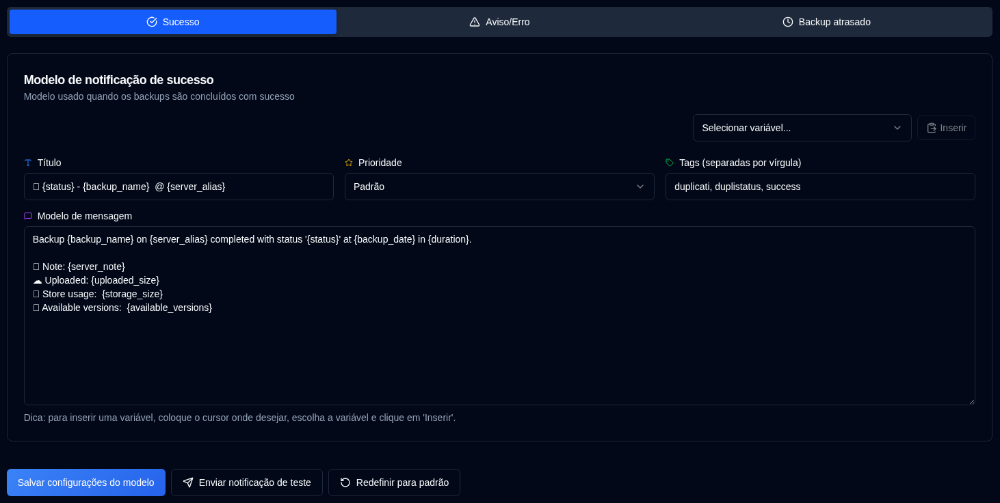

# Modelos {#templates}

**duplistatus** usa três modelos para mensagens de notificação. Esses modelos são usados tanto para notificações NTFY quanto para notificações por e-mail.

A página inclui um seletor de **Idioma do Modelo** que define a localidade para modelos padrão. Alterar o idioma atualiza a localidade para novos padrões, mas não altera o texto de modelos existentes. Para aplicar um novo idioma aos seus modelos, você pode editá-los manualmente ou usar **Redefinir este modelo para o padrão** (para a guia atual) ou **Redefinir todos para o padrão** (para os três modelos).

| Template           | Descrição                                           |
| :----------------- | :-------------------------------------------------- |
| **Sucesso**        | Usado quando os backups são concluídos com sucesso. |
| **Aviso/Erro**     | Usado quando os backups são concluídos com avisos ou erros. |
| **Backup atrasado** | Usado quando os backups estão atrasados.            |

 

## Idioma do Modelo {#template-language}

Um seletor de **Idioma do Modelo** no topo da página permite escolher o idioma para modelos padrão (Inglês, Alemão, Francês, Espanhol, Português (Brasil)). Alterar o idioma atualiza a localidade para padrões, mas modelos personalizados existentes mantêm seu texto atual até que você os atualize ou use um dos botões de redefinição.

 

## Ações Disponíveis {#available-actions}

| Botão                                                              | Descrição                                                                                         |
|:--------------------------------------------------------------------|:----------------------------------------------------------------------------------------------------|
| <IconButton label="Salvar configurações do modelo" />                      | Salva as configurações ao alterar o modelo. O botão salva o modelo sendo exibido (Sucesso, Aviso/Erro ou Backup Atrasado). |
| <IconButton icon="lucide:send" label="Enviar notificação de teste"/>     | Verifica o modelo após atualizá-lo. As variáveis serão substituídas por seus nomes para o teste. Para notificações por e-mail, o título do modelo se torna a linha de assunto do e-mail. |
| <IconButton icon="lucide:rotate-ccw" label="Redefinir este modelo para o padrão"/> | Restaura o modelo padrão para o **modelo selecionado** (a guia atual). Lembre-se de salvar após redefinir. |
| <IconButton icon="lucide:rotate-ccw" label="Redefinir todos para o padrão"/> | Restaura os três modelos (Sucesso, Aviso/Erro, Backup Atrasado) para os padrões do Idioma do Modelo selecionado. Lembre-se de salvar após redefinir. |

 

## Variáveis {#variables}

Todos os modelos suportam variáveis que serão substituídas por valores reais. A tabela a seguir mostra as variáveis disponíveis:

| Variável              | Descrição                                       | Disponível em    |
|:-----------------------|:------------------------------------------------|:-----------------|
| `{server_name}`        | Nome do servidor.                               | Todos os modelos |
| `{server_alias}`       | Alias do servidor.                              | Todos os modelos |
| `{server_note}`        | Nota do servidor.                               | Todos os modelos |
| `{server_url}`         | URL da configuração web do servidor Duplicati   | Todos os modelos |
| `{backup_name}`        | Nome do backup.                                 | Todos os modelos |
| `{status}`             | Status do backup (Sucesso, Aviso, Erro, Fatal). | Sucesso, Aviso   |
| `{backup_date}`        | Data e hora do backup.                          | Sucesso, Aviso   |
| `{duration}`           | Duração do backup.                              | Sucesso, Aviso   |
| `{uploaded_size}`      | Quantidade de dados enviados.                   | Sucesso, Aviso   |
| `{storage_size}`       | Informações de uso de armazenamento.            | Sucesso, Aviso   |
| `{available_versions}` | Número de versões de backup disponíveis.        | Sucesso, Aviso   |
| `{file_count}`         | Número de arquivos processados.                 | Sucesso, Aviso   |
| `{file_size}`          | Tamanho total dos arquivos com backup.          | Sucesso, Aviso   |
| `{messages_count}`     | Número de mensagens.                            | Sucesso, Aviso   |
| `{warnings_count}`     | Número de avisos.                               | Sucesso, Aviso   |
| `{errors_count}`       | Número de erros.                                | Sucesso, Aviso   |
| `{log_text}`           | Mensagens de log (avisos e erros)               | Sucesso, Aviso   |
| `{last_backup_date}`   | Data do último backup.                          | Atrasado         |
| `{last_elapsed}`       | Tempo decorrido desde o último backup.          | Atrasado         |
| `{expected_date}`      | Data esperada do backup.                        | Atrasado         |
| `{expected_elapsed}`   | Tempo decorrido desde a data esperada.          | Atrasado         |
| `{backup_interval}`    | String de intervalo (ex: "1D", "2W", "1M").     | Atrasado         |
| `{overdue_tolerance}`  | Configuração de tolerância de atraso.           | Atrasado         |
