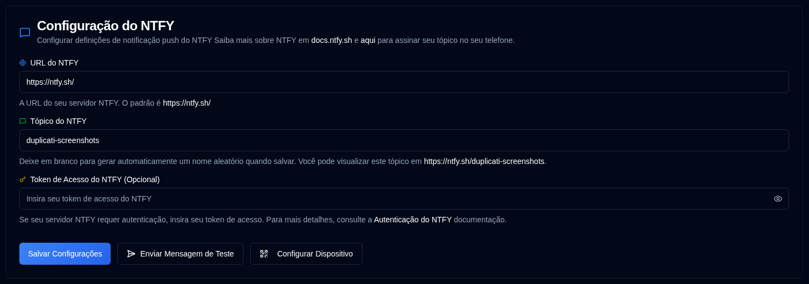

# NTFY {#ntfy}

[NTFY](https://github.com/binwiederhier/ntfy) é um serviço de notificação simples que pode enviar notificações push para seu telefone ou desktop. Esta seção permite que você configure sua conexão com o servidor de notificações e autenticação.

| Configuração               | Descrição                                                                                                                                   |
|:----------------------|:----------------------------------------------------------------------------------------------------------------------------------------------|
| **URL do NTFY**          | A URL do seu servidor NTFY (padrão: o público `https://ntfy.sh/`).                                                                      |
| **Tópico do NTFY**        | Um identificador único para suas notificações. O sistema gerará automaticamente um tópico aleatório se deixado em branco, ou você pode especificar o seu próprio. |
| **Token de Acesso do NTFY** | Um token de acesso opcional para servidores NTFY autenticados. Deixe este campo em branco se o seu servidor não exigir autenticação.               |

 

Um ícone <IIcon2 icon="lucide:message-square" color="green"/> verde ao lado de **NTFY** na barra lateral significa que suas configurações são válidas. Se o ícone for <IIcon2 icon="lucide:message-square" color="yellow"/> amarelo, suas configurações não são válidas.
Quando a configuração não é válida, as caixas de seleção NTFY na aba [`Notificações de Backup`](backup-notifications-settings.md) também ficarão desativadas.

## Ações Disponíveis {#available-actions}

| Botão                                                                | Descrição                                                                                                  |
|:----------------------------------------------------------------------|:-------------------------------------------------------------------------------------------------------------|
| <IconButton label="Salvar Configurações" />                                  | Salvar quaisquer alterações feitas nas configurações do NTFY.                                                                  |
| <IconButton icon="lucide:send-horizontal" label="Enviar Mensagem de Teste"/> | Enviar uma mensagem de teste para o seu servidor NTFY para verificar sua configuração.                                         |
| <IconButton icon="lucide:qr-code" label="Configurar Dispositivo"/>          | Exibir um código QR que permite configurar rapidamente seu dispositivo móvel ou desktop para notificações NTFY. |

## Configuração de Dispositivo {#device-configuration}

Você deve instalar o aplicativo NTFY em seu dispositivo antes de configurá-lo ([veja aqui](https://ntfy.sh/)). Clicar no botão <IconButton icon="lucide:qr-code" label="Configurar dispositivo"/> ou clicar com o botão direito no ícone <SvgButton svgFilename="ntfy.svg" /> na barra de ferramentas do aplicativo exibirá um código QR. Escanear este código QR configurará automaticamente seu dispositivo com o tópico NTFY correto para notificações.

 

 

:::caution
Se você usar o servidor público **ntfy.sh** sem um token de acesso, qualquer pessoa com o nome do seu tópico poderá visualizar suas notificações.

Para fornecer um grau de privacidade, um tópico aleatório de 12 caracteres é gerado, oferecendo mais de 3 sextilhões (3.000.000.000.000.000.000.000) de combinações possíveis, dificultando a adivinhação.

Para melhor segurança, considere usar [autenticação por token de acesso](https://docs.ntfy.sh/config/#access-tokens) e [listas de controle de acesso](https://docs.ntfy.sh/config/#access-control-list-acl) para proteger seus tópicos, ou [auto-hospedar NTFY](https://docs.ntfy.sh/install/#docker) para controle total.

⚠️ **Você é responsável por proteger seus tópicos NTFY. Use este serviço por sua conta e risco.**
:::

 
 

:::note
Todos os nomes de produtos, logotipos e marcas registradas são de propriedade de seus respectivos proprietários. Ícones e nomes são usados apenas para fins de identificação e não implicam endosso.
:::
