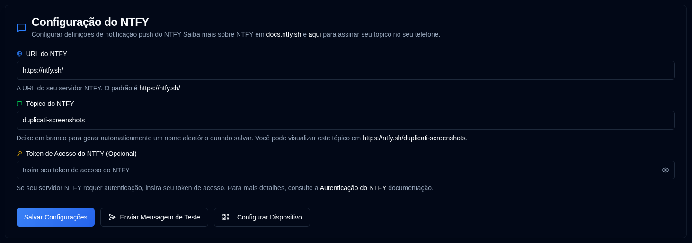

# NTFY {/* #ntfy */}

[NTFY](https://github.com/binwiederhier/ntfy) é um serviço de notificação simples que pode enviar notificações push para o seu telefone ou desktop. Esta seção permite configurar a conexão com o servidor de notificação e autenticação.

| Configuração         | Descrição                                                                                                                                                             |
|:---------------------|:----------------------------------------------------------------------------------------------------------------------------------------------------------------------|
| **URL do NTFY**      | A URL do seu servidor NTFY (padrão é o público `https://ntfy.sh/`).                                                                                                   |
| **Tópico do NTFY** | Um identificador único para suas notificações. O sistema irá gerar automaticamente um tópico aleatório se deixado vazio, ou você pode especificar o seu próprio. |
| **Token de Acesso NTFY** | Um token de acesso opcional para servidores NTFY autenticados. Deixe este campo em branco se o seu servidor não exigir autenticação.                               |

 

Um ícone verde <IIcon2 icon="lucide:message-square" color="green"/> ao lado de **NTFY** na barra lateral significa que suas configurações são válidas. Se o ícone estiver amarelo <IIcon2 icon="lucide:message-square" color="yellow"/>, suas configurações não são válidas.
Quando a configuração não é válida, as caixas de seleção NTFY na aba [`Backup Notifications`](backup-notifications-settings.md) também serão desativadas.

## Ações Disponíveis {/* #available-actions */}

| Botão                                                                     | Descrição                                                                                                    |
|:--------------------------------------------------------------------------|:-----------------------------------------------------------------------------------------------------------|
| <IconButton label="Salvar Configurações" />                                      | Salvar quaisquer alterações feitas nas configurações do NTFY.                                               |
| <IconButton icon="lucide:send-horizontal" label="Enviar Mensagem de Teste"/> | Enviar uma mensagem de teste para o seu servidor NTFY para verificar sua configuração.                        |
| <IconButton icon="lucide:qr-code" label="Configurar Dispositivo"/>            | Exibir um código QR que permite configurar rapidamente seu dispositivo móvel ou desktop para notificações NTFY. |

Se uma entrega posterior do ntfy falhar, os administradores verão uma sirene vermelha na barra de ferramentas. Consulte [Falhas de entrega](../overview.md#delivery-failures).

## Configuração do Dispositivo {/* #device-configuration */}

Você deve instalar o aplicativo NTFY no seu dispositivo antes de configurá-lo ([veja aqui](https://ntfy.sh/)). Clicar no botão <IconButton icon="lucide:qr-code" label="Configurar Dispositivo"/>, ou clicar com o botão direito no ícone <SvgButton svgFilename="ntfy.svg" /> na barra de ferramentas do aplicativo, exibirá um código QR. A leitura deste código QR configurará automaticamente seu dispositivo com o tópico NTFY correto para notificações.

 

 

:::caution
Se você usar o servidor público **ntfy.sh** sem um token de acesso, qualquer pessoa com seu nome de tópico poderá visualizar suas
notificações. 
 
Para proporcionar um grau de privacidade, um tópico aleatório de 12 caracteres é gerado, oferecendo mais de
3 sextilhões (3.000.000.000.000.000.000.000) de combinações possíveis, tornando difícil adivinhá-lo.

Para segurança aprimorada, considere usar [autenticação por token de acesso](https://docs.ntfy.sh/config/#access-tokens) e [listas de controle de acesso](https://docs.ntfy.sh/config/#access-control-list-acl) para proteger seus tópicos, ou [hospede o NTFY você mesmo](https://docs.ntfy.sh/install/#docker) para controle total.

⚠️ **Você é responsável por proteger seus tópicos NTFY. Por favor, utilize este serviço a seu critério.**
:::

 
 

:::note
 Todos os nomes de produtos, logos e marcas registradas são propriedade de seus respectivos proprietários. Ícones e nomes são usados apenas para fins de identificação e não implicam endosso.
:::
