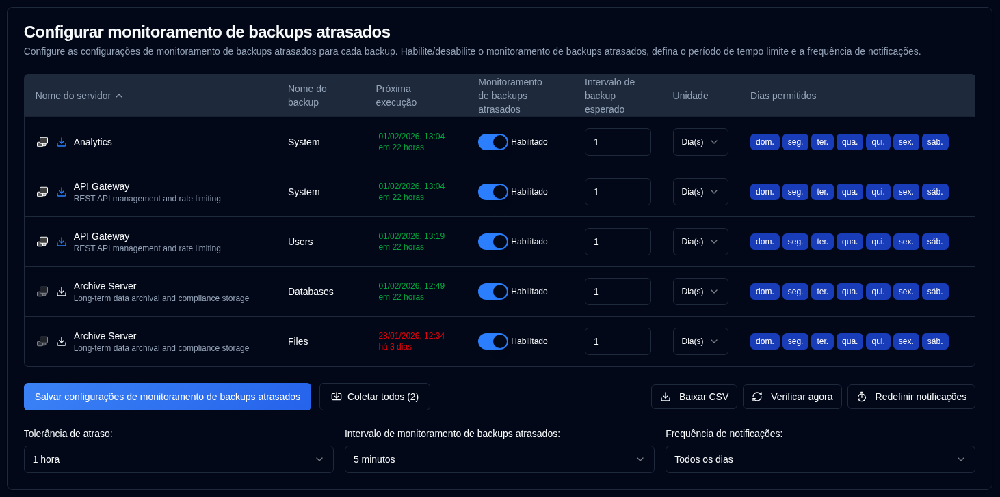

# Notificações Atrasadas {#overdue-notifications}

## Configurar Configurações de Backup Atrasado por Backup {#configure-per-backup-overdue-settings}

-  **Nome do servidor**: O nome do servidor a monitorar para backups atrasados. 
   - Clique <SvgIcon svgFilename="duplicati_logo.svg" height="18"/> para abrir a interface web do servidor Duplicati
   - Clique <IIcon2 icon="lucide:download" height="18"/> para coletar logs de backup deste servidor.
- **Nome do backup**: O nome do backup a monitorar para backups atrasados.
- **Próxima execução**: A próxima hora de backup agendada exibida em verde se agendada no futuro, ou em vermelho se atrasada. Passar o mouse sobre o valor "Próxima execução" exibe uma dica de ferramenta mostrando a data e hora do último backup do banco de dados, formatada com data/hora completa e tempo relativo.
- **Monitoramento de backups atrasados**: Ativar ou desativar o monitoramento de backups atrasados para este backup.
- **Intervalo de backup esperado**: O intervalo de backup esperado.
- **Unidade**: A unidade do intervalo esperado.
- **Dias permitidos**: Os dias da semana permitidos para o backup.

Se os ícones ao lado do nome do servidor estiverem acinzentados, o servidor não está configurado em [`Configurações → Configurações do Servidor`](server-settings.md).

:::note
Quando você coleta logs de backup de um servidor Duplicati, **duplistatus** atualiza automaticamente os intervalos de monitoramento de backups atrasados e as configurações.
:::

:::tip
Para obter melhores resultados, colete logs de backup após alterar a configuração de intervalos de trabalho de backup no seu servidor Duplicati. Isso garante que **duplistatus** permaneça sincronizado com sua configuração atual.
:::

## Configurações Globais {#global-configurations}

Estas configurações aplicam-se a todos os backups:

| Configuração                         | Descrição                                                                                                                                                                                                                                                                                           |
|:--------------------------------|:------------------------------------------------------------------------------------------------------------------------------------------------------------------------------------------------------------------------------------------------------------------------------------------------------|
| **Tolerância de atraso**           | O período de carência (tempo extra permitido) adicionado ao tempo de backup esperado antes de marcar como atrasado. O padrão é `1 hora`.                                                                                                                                                                           |
| **Intervalo de monitoramento de backups atrasados** | Com que frequência o sistema verifica backups atrasados. O padrão é `5 minutos`.                                                                                                                                                                                                                          |
| **Frequência de notificações**      | Com que frequência enviar notificações de atraso:   `Uma vez`: Enviar **apenas uma** notificação quando o backup ficar atrasado.   `Diariamente`: Enviar **notificações diárias** enquanto atrasado (padrão).   `Semanalmente`: Enviar **notificações semanais** enquanto atrasado.   `Mensalmente`: Enviar **notificações mensais** enquanto atrasado. |

## Ações Disponíveis {#available-actions}

| Botão                                                              | Descrição                                                                                         |
|:--------------------------------------------------------------------|:----------------------------------------------------------------------------------------------------|
| <IconButton label="Salvar configurações de monitoramento de backups atrasados" />             | Salva as configurações, limpa temporizadores para qualquer backup desabilitado e executa uma verificação de backups atrasados.              |
| <IconButton icon="lucide:import" label="Coletar todos (#)"/>          | Coleta logs de backup de todos os servidores configurados, entre parênteses o número de servidores para coletar. |
| <IconButton icon="lucide:download" label="Baixar CSV"/>            | Baixa um arquivo CSV contendo todas as configurações de monitoramento de backups atrasados e a "Data e hora do último backup (DB)" do banco de dados. |
| <IconButton icon="lucide:refresh-cw" label="Verificar agora"/>            | Executa a verificação de backup atrasado imediatamente. Isto é útil após alterar configurações. Também dispara um recálculo de "Próxima execução". |
| <IconButton icon="lucide:timer-reset" label="Redefinir notificações"/> | Redefine a última notificação de backup atrasado enviada para todos os backups.                                          |
