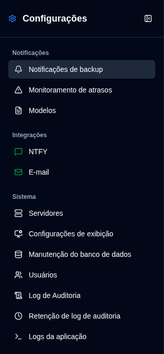
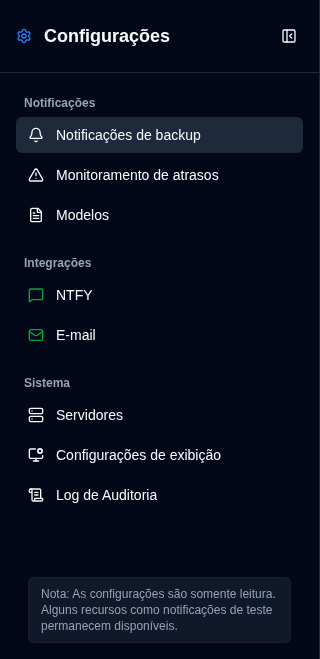

# Visão geral {#overview}

A página de Configurações oferece uma interface unificada para configurar todos os aspectos do **duplistatus**. Você pode acessá-la clicando no botão <IconButton icon="lucide:settings" /> `Configurações` na [Barra de Ferramentas da Aplicação](../overview#application-toolbar). Observe que usuários comuns verão um menu simplificado com menos opções em comparação com administradores.

## Visualizar Administrador {#administrator-view}

Os administradores veem todas as configurações disponíveis.

<table>
  <tr>
    <td>
      
    </td>
    <td>
      <ul>
        <li>
          <strong>Notificações</strong>
          <ul>
            <li><a href="backup-notifications-settings.md">Notificações de Backup</a>: Configurar definições de notificação por backup</li>
            <li><a href="overdue-settings.md">Monitoramento de Atrasos</a>: Configurar detecção e alertas de backup atrasado</li>
            <li><a href="notification-templates.md">Modelos</a>: Personalizar modelos de mensagens de notificação</li>
          </ul>
        </li> 
        <li>
          <strong>Integrações</strong>
          <ul>
            <li><a href="ntfy-settings.md">NTFY</a>: Configurar serviço de notificação push NTFY</li>
            <li><a href="email-settings.md">E-mail</a>: Configurar notificações de e-mail SMTP</li>
          </ul>
        </li> 
        <li>
          <strong id="system">Sistema</strong>
          <ul>
            <li><a href="server-settings.md">Servidores</a>: Gerenciar configurações do servidor Duplicati</li>
            <li><a href="display-settings.md">Exibição</a>: Configurar preferências de exibição</li>
            <li><a href="database-maintenance.md">Manutenção de Banco de Dados</a>: Executar limpeza de banco de dados (somente admin)</li>
            <li><a href="user-management-settings.md">Usuários</a>: Gerenciar contas de usuário (somente admin)</li>
            <li><a href="audit-logs-viewer.md">Log de Auditoria</a>: Visualizar logs de auditoria do sistema</li>
            <li><a href="audit-logs-retention.md">Retenção de log de auditoria</a>: Configurar retenção de log de auditoria (somente admin)</li>
            <li><a href="application-logs-settings.md">Logs da aplicação</a>: Visualizar e exportar logs da aplicação (somente admin)</li>
          </ul>
        </li>
      </ul>
    </td>
  </tr>
</table>

## Visualizar Não-Administrador {#non-administrator-view}

Usuários regulares veem um conjunto limitado de configurações.

<table>
  <tr>
    <td>
      
    </td>
    <td>
      <ul>
        <li>
          <strong>Notificações</strong>
          <ul>
            <li><a href="backup-notifications-settings.md">Notificações de Backup</a>: Visualizar configurações de notificação por backup (somente leitura)</li>
            <li><a href="overdue-settings.md">Monitoramento de Atrasos</a>: Visualizar configurações de backup atrasado (somente leitura)</li>
            <li><a href="notification-templates.md">Modelos</a>: Visualizar modelos de notificação (somente leitura)</li>
          </ul>
        </li> 
        <li>
          <strong>Integrações</strong>
          <ul>
            <li><a href="ntfy-settings.md">NTFY</a>: Visualizar configurações de NTFY (somente leitura)</li>
            <li><a href="email-settings.md">E-mail</a>: Visualizar configurações de e-mail (somente leitura)</li>
          </ul>
        </li> 
        <li>
          <strong id="system">Sistema</strong>
          <ul>
            <li><a href="server-settings.md">Servidores</a>: Visualizar configurações de servidor (somente leitura)</li>
            <li><a href="display-settings.md">Exibição</a>: Configurar preferências de exibição</li>
            <li><a href="audit-logs-viewer.md">Log de Auditoria</a>: Visualizar logs de auditoria do sistema (somente leitura)</li>
          </ul>
        </li>
      </ul>
    </td>
  </tr>
</table>

## Ícones de Status {#status-icons}

A barra lateral exibe ícones de status ao lado das configurações de integração **NTFY** e **E-mail**:
- <IIcon2 icon="lucide:message-square" color="green"/> <IIcon2 icon="lucide:mail" color="green"/> **Ícone verde**: Suas configurações são válidas e estão configuradas corretamente
- <IIcon2 icon="lucide:message-square" color="yellow"/> <IIcon2 icon="lucide:mail" color="yellow"/> **Ícone amarelo**: Suas configurações não são válidas ou não estão configuradas

Quando a configuração é inválida, as caixas de seleção correspondentes na aba [`Notificações de Backup`](backup-notifications-settings.md) ficarão acinzentadas e desabilitadas. Para mais detalhes, consulte as páginas [Configurações NTFY](ntfy-settings.md) e [Configurações de E-mail](email-settings.md).

 

:::important
Um ícone verde não significa necessariamente que as notificações estão funcionando corretamente. Sempre use os recursos de teste disponíveis para confirmar que suas notificações estão funcionando antes de depender delas.
:::

 
