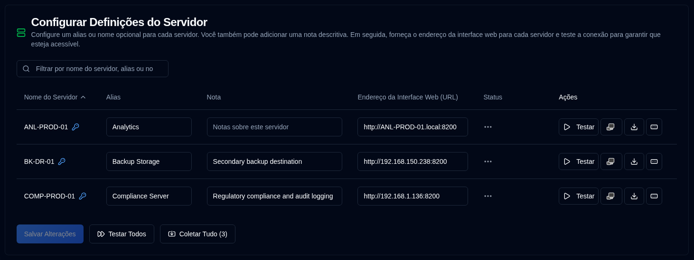

# Servidor {#server}

Você pode configurar um nome alternativo (alias) para seus servidores, uma nota para descrever sua função e os endereços web de seus Servidores Duplicati aqui.

| Configuração                         | Descrição                                                                                                                                                                                  |
|:--------------------------------|:---------------------------------------------------------------------------------------------------------------------------------------------------------------------------------------------|
| **Nome do Servidor**                 | Nome do servidor configurado no servidor Duplicati. Um <IIcon2 icon="lucide:key-round" color="#42A5F5"/> aparecerá se uma senha for definida para o servidor.                                         |
| **Apelido**                       | Um apelido ou nome legível para humanos do seu servidor. Ao passar o mouse sobre um apelido, ele mostrará seu nome; em alguns casos, para deixar claro, exibirá o apelido e o nome entre parênteses. |
| **Observação**                        | Texto livre para descrever a funcionalidade do servidor, local de instalação ou qualquer outra informação. Quando configurado, será exibido ao lado do nome ou apelido do servidor.                 |
| **Endereço da Interface Web (URL)** | Configure a URL para acessar a interface do Servidor Duplicati. URLs `HTTP` e `HTTPS` são suportadas.                                                                                           |
| **Status**                      | Exibe os resultados do teste ou da coleta de logs de backup                                                                                                                                              |
| **Ações**                     | Você pode testar, abrir a interface do Duplicati, coletar logs e definir uma senha; veja abaixo para mais detalhes.                                                                                         |

 

:::note
Se o Endereço da interface web (URL) não estiver configurado, o botão <SvgIcon svgFilename="duplicati_logo.svg" /> 
será desabilitado em todas as páginas e o servidor não será exibido na lista de [Configuração do Duplicati](../duplicati-configuration.md) <SvgButton svgFilename="duplicati_logo.svg" href="../duplicati-configuration"/>.
:::

 

## Ações disponíveis para cada servidor {#available-actions-for-each-server}

| Botão                                                                                                      | Descrição                                                             |
|:------------------------------------------------------------------------------------------------------------|:------------------------------------------------------------------------|
| <IconButton icon="lucide:play" label="Testar"/>                                                               | Testar a conexão com o servidor Duplicati.                            |
| <SvgButton svgFilename="duplicati_logo.svg" />                                                              | Abrir a interface web do servidor Duplicati em uma nova aba do navegador.         |
| <IconButton icon="lucide:download" />                                                                       | Coletar logs de backup do servidor Duplicati.                          |
| <IconButton icon="lucide:rectangle-ellipsis" /> &nbsp; ou <IIcon2 icon="lucide:key-round" color="#42A5F5"/> | Alterar ou definir uma senha para o servidor Duplicati para coletar backups. |

 

:::info[IMPORTANTE]

Para proteger sua segurança, você pode realizar apenas as seguintes ações:
- Definir uma senha para o servidor
- Remover (excluir) a senha completamente
 
A senha é armazenada criptografada no banco de dados e nunca é exibida na interface do usuário.
:::

 

## Ações disponíveis para todos os servidores {#available-actions-for-all-servers}

| Botão                                                     | Descrição                                     |
|:-----------------------------------------------------------|:------------------------------------------------|
| <IconButton label="Salvar Alterações" />                        | Salvar as alterações feitas nas configurações do servidor.   |
| <IconButton icon="lucide:fast-forward" label="Testar Todos"/>  | Testar a conexão com todos os servidores Duplicati.   |
| <IconButton icon="lucide:import" label="Coletar Tudo (#)"/> | Coletar logs de backup de todos os servidores Duplicati. |

 
