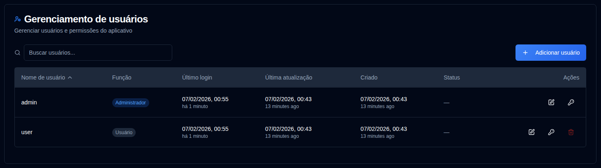

# Usuários {#users}

Gerencie contas de usuários, permissões e controle de acesso para **duplistatus**. Esta seção permite que administradores criem, modifiquem e excluam contas de usuários.

>[!TIP] 
>A conta `admin` padrão pode ser excluída. Para fazer isso, primeiro crie um novo usuário administrador, entre com essa conta 
> e depois exclua a conta `admin`.
>
> A senha padrão para a conta `admin` é `Duplistatus09`. Você será obrigado a alterá-la no primeiro login.

## Gerenciamento de usuários {#accessing-user-management}

Você pode acessar a seção Gerenciamento de usuários de duas formas:

1. **No Menu do Usuário**: Clique no <IconButton icon="lucide:user" label="nome de usuário" />   na [Barra de Ferramentas da Aplicação](../overview.md#application-toolbar) e selecione "Usuários Admin".

2. **A partir de Configurações**: Clique em <IconButton icon="lucide:settings"/> e **Usuários** na barra lateral de configurações

## Criando um Novo Usuário {#creating-a-new-user}

1. Clique no botão <IconButton icon="lucide:plus" label="Adicionar usuário"/>
2. Digite os detalhes do usuário:
   - **Nome de usuário**: Deve ter 3-50 caracteres, ser único e não diferenciar maiúsculas de minúsculas
   - **Admin**: Verificar para conceder privilégios de administrador
   - **Exigir alteração de senha**: Verificar para forçar a alteração de senha no primeiro login
   - **Senha**: 
     - Opção 1: Verificar "Gerar senha automaticamente" para criar uma senha temporária segura
     - Opção 2: Desmarcar e digitar uma senha personalizada
3. Clique em <IconButton icon="lucide:user-plus" label="Criar usuário" />.

## Editando um Usuário {#editing-a-user}

1. Clique no ícone <IconButton icon="lucide:edit" /> editar ao lado do usuário
2. Modifique qualquer um dos seguintes:
   - **Nome de usuário**: Altere o nome de usuário (deve ser único)
   - **Admin**: Alterne os privilégios de administrador
   - **Exigir Alteração de Senha**: Alterne o requisito de alteração de senha
3. Clique em <IconButton icon="lucide:check" label="Salvar alterações" />.

## Redefinindo uma Senha de Usuário {#resetting-a-user-password}

1. Clique no ícone <IconButton icon="lucide:key-round" /> de chave ao lado do usuário
2. Confirmar a redefinição de senha
3. Uma nova senha temporária será gerada e exibida
4. Copie a senha e forneça-a ao usuário com segurança

## Deletando um Usuário {#deleting-a-user}

1. Clique no ícone <IconButton icon="lucide:trash-2" /> de exclusão ao lado do usuário
2. Confirmar a exclusão na caixa de diálogo. **A exclusão do usuário é permanente e não pode ser desfeita.**

## Bloqueio de Conta {#account-lockout}

As contas são automaticamente bloqueadas após múltiplas tentativas de login falhadas:
- **Limite de Bloqueio**: 5 tentativas falhadas
- **Duração do Bloqueio**: 15 minutos
- Contas bloqueadas não podem entrar até que o período de bloqueio expire

## Recuperando Acesso de Admin {#recovering-admin-access}

Se você perdeu sua senha de admin ou foi bloqueado de sua conta, você pode recuperar o acesso usando o script de recuperação de admin. Consulte o guia [Admin Account Recovery](../admin-recovery.md) para instruções detalhadas sobre como recuperar o acesso de administrador em ambientes Docker.
