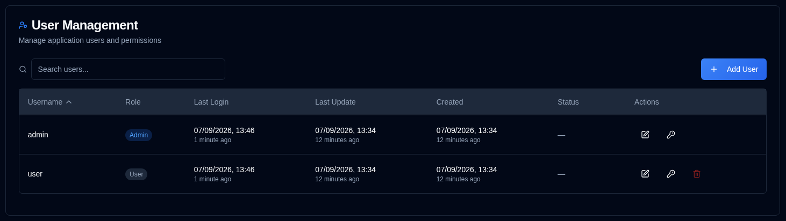

# Usuários {/* #users */}

Gerencie contas de usuário, permissões e controle de acesso para **duplistatus**. Esta seção permite aos administradores criar, modificar e excluir contas de usuário.

>[!TIP] 
> A conta padrão `admin` pode ser excluída. Para fazer isso, primeiro crie um novo usuário administrador, faça login com essa conta,
> e então exclua a conta `admin`.
>
> A senha padrão para a conta `admin` é `Duplistatus09`. Você será obrigado a alterá-la no primeiro login.

## Acessando o Gerenciamento de Usuários {/* #accessing-user-management */}

Você pode acessar a seção de Gerenciamento de Usuários de duas maneiras:

1. **Do Menu de Usuário**: Clique no <IconButton icon="lucide:user" label="nome de usuário" /> na [Barra de Ferramentas do Aplicativo](../overview.md#application-toolbar) e selecione "Usuários Admin".

2. **Das Configurações**: Clique em <IconButton icon="lucide:settings"/> e **Usuários** na barra lateral de configurações

## Criando um Novo Usuário {/* #creating-a-new-user */}

1. Clique no botão <IconButton icon="lucide:plus" label="Adicionar Usuário"/>
2. Insira os detalhes do usuário:
   - **Nome de usuário**: Deve ter 3-50 caracteres, ser único e não sensível a maiúsculas/minúsculas
   - **Administrador**: Marque para conceder privilégios de administrador
   - **Exigir Alteração de Senha**: Marque para forçar a alteração de senha no primeiro login
   - **Senha**: 
     - Opção 1: Marque "Gerar senha automaticamente" para criar uma senha temporária segura
     - Opção 2: Desmarque e insira uma senha personalizada
3. Clique em <IconButton icon="lucide:user-plus" label="Criar Usuário" />.

## Editando um Usuário {/* #editing-a-user */}

1. Clique no ícone de edição <IconButton icon="lucide:edit" /> ao lado do usuário
2. Modifique qualquer um dos seguintes:
   - **Nome de usuário**: Altere o nome de usuário (deve ser único)
   - **Administrador**: Ative/desative privilégios de administrador
   - **Exigir Alteração de Senha**: Ative/desative a exigência de alteração de senha
3. Clique em <IconButton icon="lucide:check" label="Salvar Alterações" />.

## Redefinindo a Senha de um Usuário {/* #resetting-a-user-password */}

1. Clique no ícone de chave <IconButton icon="lucide:key-round" /> ao lado do usuário
2. Confirme a redefinição da senha
3. Uma nova senha temporária será gerada e exibida
4. Copie a senha e forneça-a ao usuário de forma segura

## Excluindo um Usuário {/* #deleting-a-user */}

1. Clique no ícone de exclusão <IconButton icon="lucide:trash-2" /> ao lado do usuário
2. Confirme a exclusão na caixa de diálogo. **A exclusão de usuário é permanente e não pode ser desfeita.**

## Bloqueio de Conta {/* #account-lockout */}

Contas são bloqueadas automaticamente após várias tentativas de login falhadas:
- **Limite de Bloqueio**: 5 tentativas falhadas
- **Duração do Bloqueio**: 15 minutos
- Contas bloqueadas não podem fazer login até que o período de bloqueio expire

## Recuperando o acesso do Administrador {/* #recovering-admin-access */}

Se você perdeu sua senha de administrador ou foi bloqueado da sua conta, você pode recuperar o acesso usando o script de recuperação de administrador. Consulte o guia [Recuperação de Conta de Administrador](../admin-recovery.md) para obter instruções detalhadas sobre como recuperar o acesso de administrador em ambientes Docker.

Se o navegador mostrar **Acesso negado** (HTTP 403) antes do formulário de login, recupere usando [Bloqueado pela Lista de Permissões de IP](../troubleshooting.md#locked-out-by-ip-allowlist) em vez disso.
