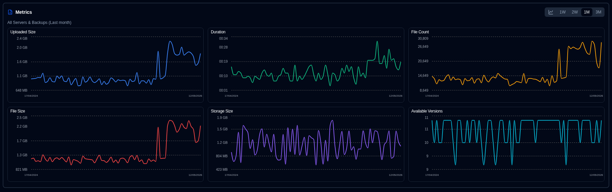

# 备份指标 {#backup-metrics}

备份指标随时间变化的图表会显示在仪表板（表格视图）和服务器详情页面上。

- **Dashboard**：图表显示 **duplistatus** 数据库中记录的所有备份总数。若使用卡片布局，可选择服务器查看其汇总指标（侧边面板显示指标时）。
- **Server Details** 页面：图表显示所选服务器（其所有备份）或单个特定备份的指标。

## 内联图表控件 {#inline-chart-controls}

图表面板标题处提供快捷控件，无需进入显示设置即可轻松配置：

### 时间范围选择器 {#time-range-selector}

图表标题处显示药丸按钮，用于快速选择时间范围：**1W | 2W | 1M | 3M**

- **1W**：最近 7 天（滚动窗口）
- **2W**：最近 14 天（滚动窗口）
- **1M**：最近 30 天（滚动窗口，默认）
- **3M**：最近 90 天（滚动窗口）

此处的更改会与显示设置同步，因此您的偏好在页面刷新后仍会保留。

### 图表样式切换 {#chart-style-toggle}

图表标题处的切换按钮可在以下两种模式间切换：

- **Smooth Lines**：以平滑曲线连接数据点
- **Bar Chart**：以离散柱状图显示各时间段数据

两种模式均使用时间桶聚合以优化显示。柱状模式下空时间段不显示柱条。您的偏好在页面刷新后保留，并与显示设置同步。

## 图表数据合并 {#chart-data-consolidation}

同一天发生多次备份时，**duplistatus** 会在图表显示前合并数据：

- **SUM**：用于累计指标（Duration、File Count、File Size、Uploaded Size）
- **LAST**：用于 Storage Size（当天最新值）
- **MAX**：用于 Available Versions（当天最高计数）

此合并在应用时间桶聚合之前进行，确保汇总指标准确。例如，5/12/26 的两次备份会在图表上产生一个合并数据点。

## 指标定义 {#metric-definitions}

- **Uploaded Size**：每天从 Duplicati 服务器上传到目标端（本地存储、FTP、云提供商等）的数据总量。
- **Duration**：每天收到的所有备份总耗时，格式为 HH:MM。
- **File Count**：每天收到的所有备份的文件计数之和。
- **File Size**：每天收到的所有备份中 Duplicati 服务器报告的文件大小之和。
- **Storage Size**：每天 Duplicati 服务器报告的备份目标端已用存储大小之和。
- **Available Versions**：每天所有备份的可用版本总数之和。

:::note
您可以使用[显示设置](settings/display-settings.md)控件配置图表的时间范围。
:::
