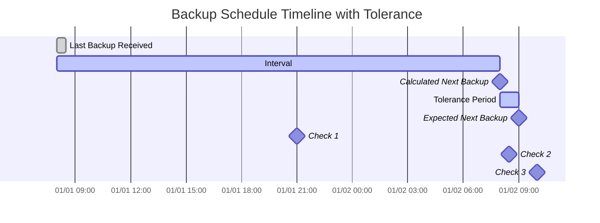

import { ZoomMermaid } from '@site/src/components/ZoomMermaid';

# 备份监控 {#backup-monitoring}

备份监控功能可跟踪并告警逾期的备份。通知可通过 NTFY 或电子邮件发送。

在用户界面中，逾期备份会显示警告图标。悬停在图标上会显示逾期备份详情，包括上次备份时间、预期备份时间、宽限期和预期下次备份时间。

## 逾期检查流程 {#overdue-check-process}

**工作原理：**

| **Step** | **Value**                  | **Description**                                   | **Example**        |
|:--------:|:---------------------------|:--------------------------------------------------|:-------------------|
|    1     | **Last Backup**            | 上次成功备份的时间戳。      | `2024-01-01 08:00` |
|    2     | **Expected Interval**      | 已配置的备份频率。                  | `1 day`            |
|    3     | **Calculated Next Backup** | `Last Backup` + `Expected Interval`               | `2024-01-02 08:00` |
|    4     | **Tolerance**              | 已配置的宽限期（允许的额外时间）。 | `1 hour`           |
|    5     | **Expected Next Backup**   | `Calculated Next Backup` + `Tolerance`            | `2024-01-02 09:00` |

若当前时间晚于 `Expected Next Backup` 时间，则备份被视为**逾期**。

<ZoomMermaid>

</ZoomMermaid>

**基于上述时间线的示例：**

- 在 `2024-01-01 21:00`（🔹Check 1），备份**未逾期**。
- 在 `2024-01-02 08:30`（🔹Check 2），备份**未逾期**，仍在宽限期内。
- 在 `2024-01-02 10:00`（🔹Check 3），备份**已逾期**，因为已超过 `Expected Next Backup` 时间。

## 定期检查 {#periodic-checks}

**duplistatus** 按可配置间隔定期检查逾期备份。默认间隔为 20 分钟，可在[设置 → 备份监控](settings/backup-monitoring-settings.md)中配置。

## 自动配置 {#automatic-configuration}

从 Duplicati 服务器收集备份日志时，**duplistatus** 会自动：

- 从 Duplicati 配置中提取备份计划
- 更新备份监控间隔以完全匹配
- 同步允许的星期几和计划时间
- 保留您的通知偏好

:::tip
为获得最佳效果，在 Duplicati 服务器中更改备份任务间隔后，请重新收集备份日志。这能确保 **duplistatus** 与当前配置保持同步。
:::

请参阅[备份监控设置](settings/backup-monitoring-settings.md)章节了解详细配置选项。
