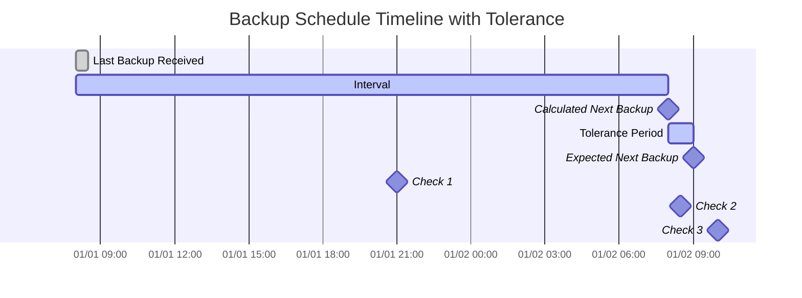

import { ZoomMermaid } from '@site/src/components/ZoomMermaid';

# 备份监控 {#backup-monitoring}

备份监控功能允许您跟踪并针对逾期备份发出警报。通知可以通过 NTFY 或 邮件 发送。

在用户界面中，逾期备份会显示一个警告图标。将鼠标悬停在图标上可显示逾期备份的 详情，包括 上次备份 时间、预期间隔、容差期和 预期的下一页 备份时间。

## 逾期检查流程 {#overdue-check-process}

**工作原理：**

| **步骤** | **值**                  | **描述**                                   | **示例**        |
|:--------:|:---------------------------|:--------------------------------------------------|:-------------------|
|    1     | **上次备份**            | 上次成功备份的时间戳。      | `2024-01-01 08:00` |
|    2     | **预期间隔**      | 配置的备份频率。                  | `1 day`            |
|    3     | **计算的下次备份** | `Last Backup` + `Expected Interval`               | `2024-01-02 08:00` |
|    4     | **容差**              | 配置的宽限期（允许的额外时间）。 | `1 hour`           |
|    5     | **预期的下次备份**   | `Calculated Next Backup` + `Tolerance`            | `2024-01-02 09:00` |

如果当前时间晚于 `Expected Next Backup` 时间，则备份被视为 **逾期**。

<ZoomMermaid>

</ZoomMermaid>

**基于上述时间线的示例：**

- 在 `2024-01-01 21:00` (🔹检查 1) 时，备份 **准时**。
- 在 `2024-01-02 08:30` (🔹检查 2) 时，备份 **准时**，因为它仍处于容差期内。
- 在 `2024-01-02 10:00` (🔹检查 3) 时，备份 **逾期**，因为此时已超过 `Expected Next Backup` 时间。

## 定期检查 {#periodic-checks}

**duplistatus** 以可配置的间隔定期检查逾期备份。 默认 间隔为 20 分钟，但您可以在 [设置 → 备份监控](settings/backup-monitoring-settings.md) 中对其进行 配置。

## 自动配置 {#automatic-configuration}

当您从 Duplicati 服务器 采集备份日志 时，**duplistatus** 会自动：

- 从 Duplicati 配置 中提取备份计划
- 更新备份监控间隔以完全匹配
- 同步 允许的星期 和计划时间
- 保留您的通知首选项

:::tip
为了获得最佳效果，请在更改 Duplicati 服务器中的备份任务间隔后采集备份日志。这可确保 **duplistatus** 与您的当前配置保持同步。
:::

请参阅 [备份监控设置](settings/backup-monitoring-settings.md) 部分以了解详细的配置选项。
