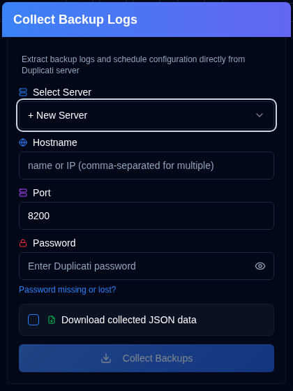
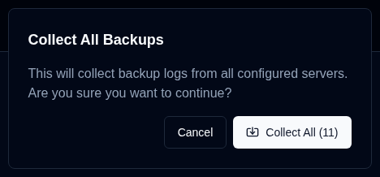

# 收集备份日志 {#collect-backup-logs}

**duplistatus** 可直接从 Duplicati 服务器检索备份日志，以填充数据库或恢复缺失的日志数据。应用程序会自动跳过数据库中已存在的重复日志。

## 收集备份日志的步骤 {#steps-to-collect-backup-logs}

### 手动收集 {#manual-collection}

1.  点击[应用工具栏](overview.md#application-toolbar)上的 <IconButton icon="lucide:download" /> **Collect Backup Logs** 图标。

2.  选择服务器

    若在[设置 → 服务器设置](settings/server-settings.md)中已配置服务器地址，可从下拉列表中选择以立即收集。若未配置任何服务器，可手动输入 Duplicati 服务器详情。

3.  输入 Duplicati 服务器详情：
    - **Hostname**：Duplicati 服务器的主机名或 IP 地址。可输入多个主机名，以逗号分隔，例如 `192.168.1.23,someserver.local,192.168.1.89`
    - **Port**：Duplicati 服务器使用的端口号（默认：`8200`）。
    - **Password**：如需认证，请输入密码。
    - **Download collected JSON data**：启用此选项以下载 duplistatus 收集的数据。
4.  点击 **Collect Backups**。

***Notes:***
- 若输入多个主机名，将使用相同端口和密码对所有服务器执行收集。
- **duplistatus** 会自动检测最佳连接协议（HTTPS 或 HTTP）。它会先尝试 HTTPS（含正确 SSL 验证），再尝试接受自签名证书的 HTTPS，最后回退到 HTTP。

:::tip
<IconButton icon="lucide:download" /> 按钮也出现在[设置 → 备份监控](settings/backup-monitoring-settings.md)和[设置 → 服务器设置](settings/server-settings.md)中，用于单服务器收集。
:::

 

### 批量收集 {#bulk-collection}

_右键点击_ 应用工具栏上的 <IconButton icon="lucide:download" /> **Collect Backup Logs** 按钮，可从所有已配置服务器收集。

:::tip
您也可在[设置 → 备份监控](settings/backup-monitoring-settings.md)和[设置 → 服务器设置](settings/server-settings.md)页面使用 <IconButton icon="lucide:import" label="Collect All"/> 按钮，从所有已配置服务器收集。
:::

## 收集流程如何工作 {#how-the-collection-process-works}

- **duplistatus** 自动检测最佳连接协议并连接指定的 Duplicati 服务器。
- 它检索备份历史、日志信息和备份设置（用于备份监控）。
- **duplistatus** 数据库中已存在的日志会被跳过。
- 新数据被处理并存储到本地数据库。
- 使用的 URL（含检测到的协议）会被存储或更新到本地数据库。
- 若选择了下载选项，将下载收集的 JSON 数据。文件名格式：`[serverName]_collected_[Timestamp].json`。时间戳使用 ISO 8601 日期格式（YYYY-MM-DDTHH:MM:SS）。
- 仪表板会更新以反映新信息。

## 收集问题排查 {#troubleshooting-collection-issues}

备份日志收集要求 Duplicati 服务器可从 **duplistatus** 安装位置访问。若遇到问题，请验证以下内容：

- 确认主机名（或 IP 地址）和端口号正确。可在浏览器中访问 Duplicati 服务器 UI 进行测试（例如 `http://hostname:port`）。
- 检查 **duplistatus** 能否连接到 Duplicati 服务器。常见问题为 DNS 名称解析（系统无法通过主机名找到服务器）。详见[故障排除章节](troubleshooting.md#collect-backup-logs-not-working)。
- 确保您提供的密码正确。
