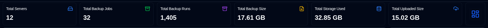
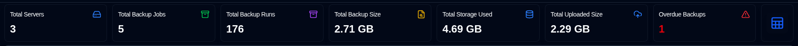
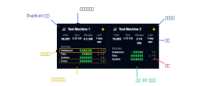
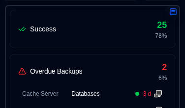
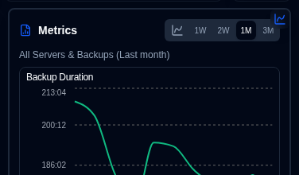
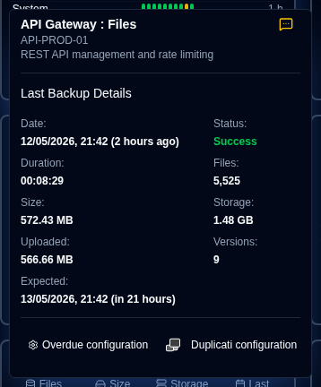
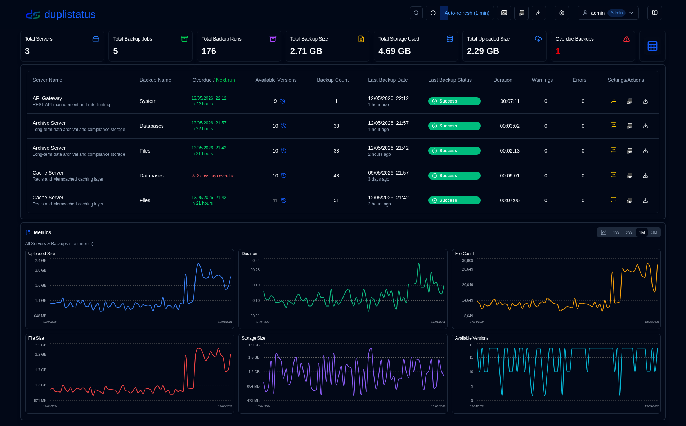
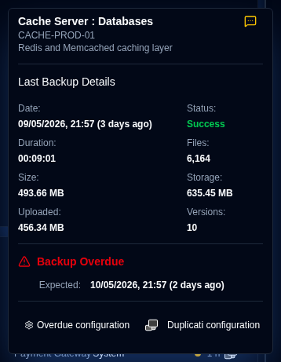
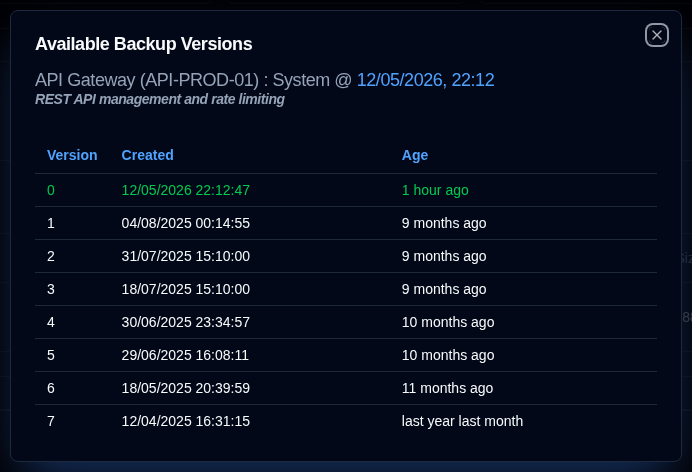

# 仪表板 {#dashboard}

## 仪表板摘要 {#dashboard-summary}

本节显示所有备份的汇总统计。

- **Total Servers**：正在监控的服务器数量。
- **Total Backup Jobs**：所有服务器上已配置的备份任务（类型）总数。
- **Total Backup Runs**：所有服务器已接收或已收集的备份运行日志总数。
- **Total Backup Size**：根据最新收到的备份日志，所有源数据的合计大小。
- **Total Storage Used**：根据最新备份日志，备份在目标端（如云存储、FTP 服务器、本地磁盘）占用的总存储空间。
- **Total Uploaded Size**：从 Duplicati 服务器上传到目标端（如本地存储、FTP、云提供商）的数据总量。
- **Overdue Backups**（表格）：逾期备份的数量。参见[备份通知设置](settings/backup-notifications-settings.md)
- **Layout Toggle**：在卡片布局（默认）和表格布局之间切换。

## 服务器筛选 {#server-filtering}

您可以使用应用工具栏中的搜索字段筛选仪表板上显示的服务器和备份。点击筛选图标 <IconButton icon="lucide:search" /> 显示搜索字段。

**筛选匹配项：**
- 服务器 ID
- 服务器 URL
- 备份任务名称

**范围：**
- 同时筛选仪表板上的卡片视图和表格视图
- 通过 Dashboard Server Filter Provider 保持会话状态
- 刷新或离开仪表板时清除

这使您能在众多受监控系统中快速定位特定服务器或备份。

## 卡片布局 {#cards-layout}

卡片布局显示每个备份最近收到的备份日志状态。

- **Server Name**：Duplicati 服务器名称（或别名）
  - 悬停在 **Server Name** 上会显示服务器名称和备注
- **Overall Status**：服务器状态。逾期备份会显示为 **Warning** 状态
- **Summary information**：该服务器所有备份的文件数、大小和已用存储的汇总信息。还显示最近收到备份的耗时（悬停显示时间戳）
- **Backups list**：该服务器所有已配置备份的表格，共 3 列：
  - **Backup Name**：Duplicati 服务器中的备份名称
  - **Status history**：最近 10 次收到备份的状态。
  - **Last backup received**：自上次收到日志至今的耗时。若备份逾期，会显示警告图标。
    - 时间以缩写格式显示：`m` 表示分钟，`h` 表示小时，`d` 表示天，`w` 表示周，`mo` 表示月，`y` 表示年。

卡片排序顺序及其他配置可在[显示设置](settings/display-settings.md)中设置。

面板视图提供两种信息展示，可通过侧边面板右上角按钮切换：

- Status：按状态显示备份任务统计，并列出逾期备份以及有警告/错误状态的备份任务。

- Metrics：显示汇总或所选服务器随时间变化的耗时、文件大小和存储大小图表。

### 备份详情 {#backup-details}

悬停在列表中的备份上，会显示最近收到的备份日志详情及逾期信息。

- **Server Name : Backup**：Duplicati 服务器和备份的名称或别名，也会显示服务器名称和备注。
  - 别名和备注可在[设置 → 服务器设置](settings/server-settings.md)中配置。
- **Notification**：显示新备份日志的[已配置通知](#notifications-icons)设置的图标。
- **Date**：备份时间戳及自上次屏幕刷新以来的耗时。
- **Status**：最近收到备份的状态（Success、Warning、Error、Fatal）。
- **Duration, File Count, File Size, Storage Size, Uploaded Size**：Duplicati 服务器报告的值。
- **Available Versions**：备份时目标端存储的备份版本数量。

若此备份逾期，工具提示还会显示：

- **Expected Backup**：预期备份时间，包含已配置的宽限期（标记为逾期前允许的额外时间）。

您也可以点击底部按钮，打开[设置 → 备份通知](settings/backup-notifications-settings.md)配置监控设置，或打开 Duplicati 服务器的 Web 界面。

## 表格布局 {#table-layout}

表格布局列出所有服务器和备份最近收到的备份日志。

- **Server Name**：Duplicati 服务器名称（或别名）
  - 名称下方为服务器备注
- **Backup Name**：Duplicati 服务器中的备份名称。
- **Available Versions**：目标端存储的备份版本数量。若图标为灰色，表示日志中未收到详细信息。详见 [Duplicati 配置说明](../installation/duplicati-server-configuration.md)。
- **Backup Count**：Duplicati 服务器报告的备份次数。
- **Last Backup Date**：最近收到备份日志的时间戳及自上次屏幕刷新以来的耗时。
- **Last Backup Status**：最近收到备份的状态（Success、Warning、Error、Fatal）。
- **Duration**：备份耗时，格式为 HH:MM:SS。
- **Warnings/Errors**：备份日志中报告的警告/错误数量。
- **Settings**：
  - **Notification**：显示新备份日志的已配置通知设置图标。
  - **Duplicati configuration**：打开 Duplicati 服务器 Web 界面的按钮

您可以使用[显示设置](settings/display-settings.md)配置表格大小及其他选项。

### 通知图标 {#notifications-icons}

| 图标                                                                                                                               | 通知选项 | 说明                                                                                         |
|------------------------------------------------------------------------------------------------------------------------------------|---------------------|-----------------------------------------------------------------------------------------------------|
| <IconButton icon="lucide:message-square-off" style={{border: 'none', padding: 0, color: '#9ca3af', background: 'transparent'}} />  | Off                 | 收到新备份日志时不发送通知                                     |
| <IconButton icon="lucide:message-square-more" style={{border: 'none', padding: 0, color: '#60a5fa', background: 'transparent'}} /> | All                 | 每次收到新备份日志都发送通知，无论状态如何。                      |
| <IconButton icon="lucide:message-square-more" style={{border: 'none', padding: 0, color: '#fbbf24', background: 'transparent'}} /> | Warnings            | 仅对状态为 Warning、Unknown、Error 或 Fatal 的备份日志发送通知。 |
| <IconButton icon="lucide:message-square-more" style={{border: 'none', padding: 0, color: '#f87171', background: 'transparent'}} /> | Errors              | 仅对状态为 Error 或 Fatal 的备份日志发送通知。                    |

:::note
此通知设置仅在 **duplistatus** 从 Duplicati 服务器收到新备份日志时生效。逾期通知单独配置，不受此设置影响。
:::

### 逾期详情 {#overdue-details}

悬停在逾期警告图标上会显示逾期备份的详细信息。

- **Checked**：上次执行逾期检查的时间。在[备份通知设置](settings/backup-notifications-settings.md)中配置检查频率。
- **Last Backup**：上次收到备份日志的时间。
- **Expected Backup**：预期备份时间，包含已配置的宽限期（标记为逾期前允许的额外时间）。
- **Last Notification**：上次发送逾期通知的时间。

### 可用备份版本 {#available-backup-versions}

点击蓝色时钟图标，会打开备份时 Duplicati 服务器报告的可用备份版本列表。

- **Backup Details**：显示服务器名称和别名、服务器备注、备份名称及备份执行时间。
- **Version Details**：显示版本号、创建日期和存在时长。

:::note
若图标为灰色，表示消息日志中未收到详细信息。
详见 [Duplicati 配置说明](../installation/duplicati-server-configuration.md)。
:::
