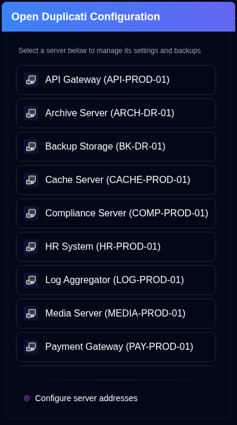

# Duplicati 配置 {#duplicati-configuration}

[应用工具栏](overview.md#application-toolbar)上的 <SvgButton svgFilename="duplicati_logo.svg" /> 按钮会在新标签页中打开 Duplicati 服务器的 Web 界面。

您可从下拉列表中选择服务器。若已选择服务器（点击其卡片）或正在查看其详情，该按钮会直接打开该特定服务器的 Duplicati 配置。

- 服务器列表显示 `server name` 或 `server alias (server name)`。
- 服务器地址在[设置 → 服务器](settings/server-settings.md)中配置。
- 使用 <IconButton icon="lucide:download" height="16" href="collect-backup-logs" /> [Collect Backup Logs](collect-backup-logs.md) 功能时，应用程序会自动保存服务器 URL。
- 若未配置服务器地址，该服务器不会出现在服务器列表中。

## 访问旧版 Duplicati UI {#accessing-the-old-duplicati-ui}

若新版 Duplicati Web 界面（`/ngclient/`）出现登录问题，可右键点击 <SvgButton svgFilename="duplicati_logo.svg" /> 按钮或服务器选择弹出窗口中的任意服务器项，在新标签页中打开旧版 Duplicati UI（`/ngax/`）。

  

:::note
所有产品名称、徽标和商标均归其各自所有者所有。图标和名称仅用于识别，不代表背书。
:::
