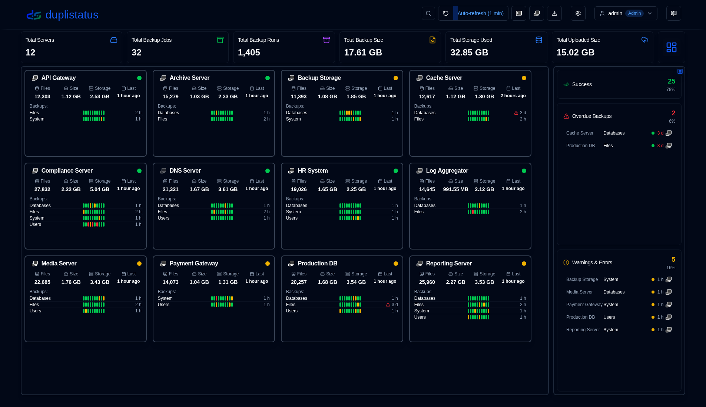
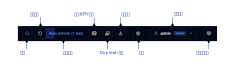
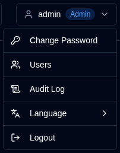
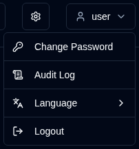

# 用户指南概览 {#overview}

欢迎使用 duplistatus 用户指南。本文档提供详细说明，帮助您使用 duplistatus 监控和管理跨多台服务器的 Duplicati 备份操作。

## 什么是 duplistatus？ {#what-is-duplistatus}

duplistatus 是专为 Duplicati 备份系统设计的强大监控仪表板。它提供：

- 从单一界面集中监控多台 Duplicati 服务器
- 实时跟踪所有备份操作状态
- 自动检测逾期备份并支持可配置告警
- 全面的指标和备份性能可视化
- 通过 NTFY 和电子邮件的灵活通知系统
- 多语言支持（英语、法语、德语、西班牙语、巴西葡萄牙语和简体中文）。

## 安装 {#installation}

有关前提条件和详细安装说明，请参阅[安装指南](../installation/installation.md)。

## 访问仪表板 {#accessing-the-dashboard}

安装成功后，按以下步骤访问 duplistatus Web 界面：

1. 打开您偏好的 Web 浏览器
2. 访问 `http://your-server-ip:9666`
   - 将 `your-server-ip` 替换为 duplistatus 服务器的实际 IP 地址或主机名
   - 默认端口为 `9666`
3. 将显示登录页面。

   首次使用（或从 0.9.x 之前版本升级后）请使用以下凭据：
    - 用户名：`admin`
    - 密码：`Duplistatus09`

   在右上角 <IconButton icon="lucide:languages" label="Language" /> 选择界面语言，或登录后在 <IconButton icon="lucide:user" label="username" /> 中选择（见下文）。

4. 登录后，主仪表板将自动显示（首次使用时无数据）

## 用户界面概览 {#user-interface-overview}

duplistatus 提供直观的仪表板，用于监控整个基础设施中的 Duplicati 备份操作。

用户界面分为几个关键部分，提供清晰全面的监控体验：

1. [应用程序工具栏](#application-toolbar)：快速访问基本功能和配置
2. [仪表板摘要](dashboard.md#dashboard-summary)：所有受监控服务器的概览统计
3. 服务器概览：[卡片布局](dashboard.md#cards-layout)或[表格布局](dashboard.md#table-layout)，显示所有备份的最新状态
4. [逾期详情](dashboard.md#overdue-details)：逾期备份的可视化警告，悬停时显示详细信息
5. [可用备份版本](dashboard.md#available-backup-versions)：点击蓝色图标查看目标端可用的备份版本
6. [备份指标](backup-metrics.md)：显示备份性能随时间变化的交互式图表
7. [服务器详情](server-details.md)：特定服务器已记录备份的完整列表，包括详细统计
8. [备份详情](server-details.md#backup-details)：单个备份的深入信息，包括执行日志、警告和错误

## 应用程序工具栏 {#application-toolbar}

应用程序工具栏提供对关键功能和设置的便捷访问，按高效工作流组织。

| 按钮                                                                                                                                           | 说明                                                                                                                                                                                |
|--------------------------------------------------------------------------------------------------------------------------------------------------|--------------------------------------------------------------------------------------------------------------------------------------------------------------------------------------------|
| <IconButton icon="lucide:search" /> &nbsp; 筛选                                                                                            | 按 ID、URL 或备份任务名称搜索和筛选服务器。                                                      |
| <IconButton icon="lucide:rotate-ccw" /> &nbsp; 刷新屏幕                                                                                    | 立即手动刷新所有数据                                                                                                                                     |
| <IconButton label="Auto-refresh" />                                                                                                              | 启用或禁用自动刷新功能。在[显示设置](settings/display-settings.md)中配置   _右键点击_ 打开显示设置页面                         |
| <SvgButton svgFilename="ntfy.svg" /> &nbsp; 打开 NTFY                                                                                            | 访问 ntfy.sh 网站查看已配置的通知主题。   _右键点击_ 显示二维码，配置设备以接收 duplistatus 通知。               |
| <SvgButton svgFilename="duplicati_logo.svg" href="duplicati-configuration" /> &nbsp; [Duplicati 配置](duplicati-configuration.md)       | 打开所选 Duplicati 服务器的 Web 界面   _右键点击_ 在新标签页中打开 Duplicati 旧版 UI（`/ngax`）                                                              |
| <IconButton icon="lucide:download" href="collect-backup-logs" /> &nbsp; [采集日志](collect-backup-logs.md)                                   | 连接到 Duplicati 服务器并检索备份日志   _右键点击_ 为所有已配置服务器采集日志                                                                       |
| <IconButton icon="lucide:settings" href="settings/backup-notifications-settings" /> &nbsp; [设置](settings/backup-notifications-settings.md) | 配置通知、监控、SMTP 服务器和通知模板                                                                                                               |
| <IconButton icon="lucide:user" label="username" />                                                                                               | 显示当前登录用户、用户类型（`Admin`、`User`），点击打开用户菜单（含语言选择）。详见[用户管理](settings/user-management-settings.md)               |
| <IconButton icon="lucide:book-open-text" href="overview" /> &nbsp; 用户指南                                                                    | 打开与当前页面相关的[用户指南](overview.md)章节。工具提示显示「[页面名称] 帮助」，指示将打开哪部分文档。 |

### 用户菜单 {#user-menu}

点击用户按钮将打开包含用户特定选项的下拉菜单。菜单选项因管理员或普通用户而异。两种角色均可通过 **语言** 子菜单更改界面语言。支持的语言：英语、法语、德语、西班牙语、巴西葡萄牙语和简体中文。

<table>
  <tr>
    <th>管理员</th>
    <th>普通用户</th>
  </tr>
  <tr>
    <td style={{verticalAlign: 'top'}}></td>
    <td style={{verticalAlign: 'top'}}></td>
  </tr>
</table>

## 基本配置 {#essential-configuration}

1. 配置 [Duplicati 服务器](../installation/duplicati-server-configuration.md) 向 duplistatus 发送备份日志消息（必需）。
2. 采集初始备份日志 – 使用[采集备份日志](collect-backup-logs.md)功能，用所有 Duplicati 服务器的历史备份数据填充数据库。这还会根据每台服务器的配置自动更新备份监控间隔。
3. 配置服务器设置 – 在[设置 → 服务器](settings/server-settings.md)中设置服务器别名和备注，使仪表板信息更丰富。
4. 配置 NTFY 设置 – 在[设置 → NTFY](settings/ntfy-settings.md)中通过 NTFY 设置通知。
5. 配置电子邮件设置 – 在[设置 → 电子邮件](settings/email-settings.md)中设置电子邮件通知。
6. 配置备份通知 – 在[设置 → 备份通知](settings/backup-notifications-settings.md)中设置按备份或按服务器的通知。

 

:::info[IMPORTANT]
请记得配置 Duplicati 服务器向 duplistatus 发送备份日志，详见[Duplicati 配置](../installation/duplicati-server-configuration.md)部分。
:::

 

:::note
所有产品名称、徽标和商标均为各自所有者所有。图标和名称仅用于识别，不表示背书。
:::
