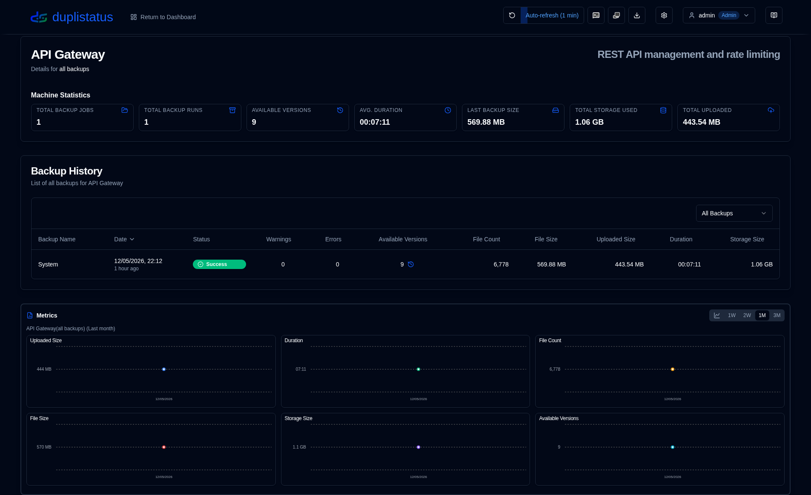
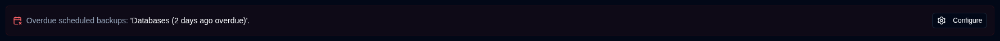
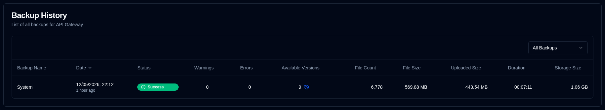
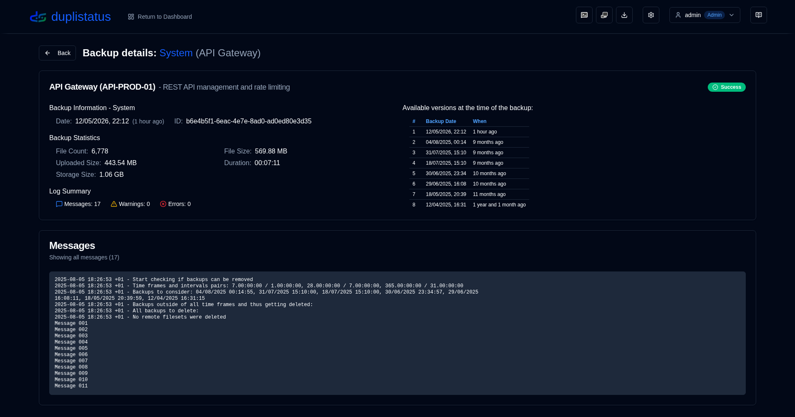

# 服务器详情 {#server-details}

在仪表板中点击某个服务器将打开一个页面，其中列出了该服务器的备份列表。如果服务器配置了多个备份，您可以查看全部备份或选择其中一个特定的备份。

## 服务器/备份统计 {#serverbackup-statistics}

此部分显示服务器上全部备份或单个所选备份的统计信息。

- **备份任务总数**：此服务器上配置的备份任务总数。
- **备份运行总数**：已执行的备份运行总数（由 Duplicati 服务器报告）。
- **可用版本数**：可用版本数量（由 Duplicati 服务器报告）。
- **平均持续时间**：**duplistatus** 数据库中记录的备份平均（算术平均）持续时间。
- **上次备份大小**：接收到的上次备份日志中源文件的大小。
- **已用存储总量**：上次备份日志中报告的备份目标端所使用的存储空间。
- **已上传总量**：**duplistatus** 数据库中记录的所有已上传数据的总和。

如果此备份或服务器上的任何备份（当选择 **全部备份** 时）逾期，摘要下方将出现一条消息。

点击 <IconButton icon="lucide:settings" href="settings/backup-monitoring-settings" label="配置"/> 以转到 [设置 → 备份监控](settings/backup-monitoring-settings.md)。或者点击工具栏上的 <SvgButton SvgButton svgFilename="duplicati_logo.svg" href="duplicati-configuration" /> 以打开 Duplicati 服务器的 Web 界面并检查日志。

 

## 备份历史 {#backup-history}

此表格列出了所选服务器的备份日志。

- **备份名称**：Duplicati 服务器中的备份名称。
- **日期**：备份的时间戳以及自上次屏幕刷新以来经过的时间。
- **状态**：备份的状态（成功、警告、错误、致命）。
- **警告/错误**：备份日志中报告的警告/错误数量。
- **可用版本**：备份目标端上的可用备份版本数量。如果图标为灰色，则表示未接收到详细信息。
- **文件数, 文件大小, 已上传大小, 持续时间, 存储大小**：由 Duplicati 服务器报告的数值。

:::tip 提示
• 使用 **备份历史** 部分的下拉菜单为该服务器选择 **全部备份** 或特定备份。

• 您可以通过点击列标题对任何列进行排序，再次点击可反转排序顺序。
 
• 点击行的任意位置即可查看 [备份详情](#backup-details)。

:::

:::note
当选择 **全部备份** 时，列表默认按从新到旧的顺序显示所有备份。
:::

 

## 备份详情 {#backup-details}

点击仪表板（表格视图）中的状态徽章或备份历史表格中的任意行，即可显示详细的备份信息。

- **服务器详情**：服务器名称、别名和备注。
- **备份信息**：备份的时间戳及其 ID。
- **备份统计**：报告的计数器、大小和持续时间的摘要。
- **日志摘要**：报告的消息数量。
- **可用版本**：可用版本列表（仅在日志中接收到相关信息时显示）。
- **消息/警告/错误**：完整的执行日志。副标题指示该日志是否被 Duplicati 服务器截断。

 

:::note
请参阅 [Duplicati 配置指南](../installation/duplicati-server-configuration.md)，了解如何配置 Duplicati 服务器以发送完整的执行日志并避免截断。
:::
