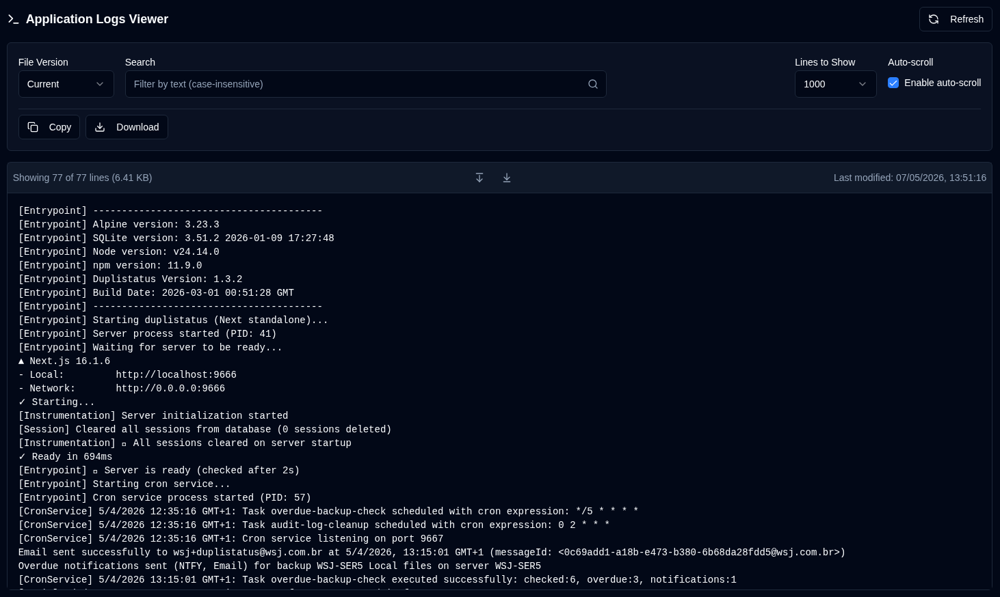

# 应用程序日志 {#application-logs}

应用程序日志查看器允许管理员在一个地方监控所有应用程序日志，并直接通过 Web 界面进行过滤、导出和实时更新。

 

## 可用操作 {#available-actions}

| 按钮                                                              | 描述                                                                                         |
|:--------------------------------------------------------------------|:----------------------------------------------------------------------------------------------------|
| <IconButton icon="lucide:refresh-cw" label="刷新" />            | 手动从选定文件重新加载日志。刷新时显示加载动画，并重置新行检测的跟踪。 |
| <IconButton icon="lucide:copy" label="复制到剪贴板" />         | 将所有过滤后的日志行复制到剪贴板。遵循当前的搜索过滤器。适用于快速共享或粘贴到其他工具中。 |
| <IconButton icon="lucide:download" label="导出" />               | 将日志下载为文本文件。从当前选定的文件版本导出，并应用当前的搜索过滤器（如果有）。文件名格式：`duplistatus-logs-YYYY-MM-DD.txt`（ISO 格式的日期）。 |
| <IconButton icon="lucide:arrow-down-from-line" />                   | 快速跳转到显示日志的开头。在禁用自动滚动或浏览长日志文件时非常有用。 |
| <IconButton icon="lucide:arrow-down-to-line" />                    | 快速跳转到显示日志的末尾。在禁用自动滚动或浏览长日志文件时非常有用。 |

 

## 控制和过滤器 {#controls-and-filters}

| 控制 | 描述 |
|:--------|:-----------|
| **文件版本** | 选择要查看的日志文件：**当前**（活动文件）或轮转文件（`.1`, `.2` 等，数字越大文件越旧）。 |
| **显示行数** | 从选定文件中显示最近的 **100**, **500**, **1000**（默认）, **5000** 或 **10000** 行。 |
| **自动滚动** | 启用时（当前文件的默认设置），会自动滚动到新的日志条目并每 2 秒刷新一次。仅适用于**当前**文件版本。 |
| **搜索** | 通过文本（不区分大小写）过滤日志行。过滤器应用于当前显示的行。 |

 

日志显示页眉显示过滤后的行数、总行数、文件大小和上次修改的时间戳。

 
