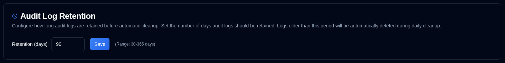

# 审计日志保留 {#audit-log-retention}

配置审计日志在自动清理前保留的时间长度。

| 设置 | 描述 | 默认值 |
|:-------|:-----------|:-------------|
| **保留时间（天）** | 自动删除前保留审计日志的数字天数 | **90 天** |

## 保留设置 {#retention-settings}

- **范围**：30 到 365 天
- **自动清理**：每天 02:00 UTC 运行（不可配置）
- **手动清理**：管理员可通过 API 进行操作（请参阅 [清理审计日志](../../api-reference/administration-apis.md#cleanup-audit-logs---apiaudit-logcleanup）)
